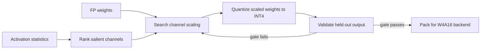

# Lesson 12 — AWQ: Protecting Salient Weights in W4A16

> **Puzzle:** Can activation statistics tell us which weight channels deserve more protection?

[← Chapter 01](../README.md) · [Project homepage](../../../README.md) · [Executed notebook](lab.ipynb) · [RTX 5090 result](artifacts/rtx5090-result.json)

## Why this puzzle matters

AWQ begins from the observation that a small subset of weights can dominate model
behavior when paired with large activation channels. Rather than minimizing average
weight error, it uses activation statistics to search a per-channel scaling that
protects salient weights while retaining a hardware-friendly weight-only layout.

## Predict before reading the result

1. Predict whether the largest weight magnitudes alone identify the best channels to protect.
2. Explain why AWQ evaluates layer outputs on held-out activations instead of only weight reconstruction.
3. Predict the shape of error as scaling strength increases from zero to one.

## 1. Start from concrete tensors and state

AWQ studies which weight channels are salient under observed activations and protects
them within a weight-only W4A16 deployment path.

### Three reasoning anchors

| # | Lesson-specific claim to keep visible |
|---:|---|
| 1 | AWQ identifies salient weights through activation-aware evidence. |
| 2 | Equivalent scaling can move quantization difficulty while leaving the original floating-point function unchanged. |
| 3 | W4A16 describes weight and activation precision; it does not mean the full graph is four-bit. |

## 2. Derive the mechanism

Channel scaling can preserve the floating-point linear transform while changing how
weight ranges are shared before INT4 rounding. Activation statistics guide the scale
search because frequently excited channels can amplify small weight errors.

For a linear layer, equivalent channel scaling can transform weights and
inverse-transform activations without changing the floating-point result. AWQ searches a
scaling strength informed by activation magnitudes so quantization gives more effective
resolution to salient channels. The W4A16 label means four-bit weight storage with
floating-point activations; accumulation and other layers still need explicit dtypes.

Scaling too little leaves salient weights exposed. Scaling too aggressively expands
other channels and makes their shared quantization ranges coarse. The optimum is
therefore empirical and depends on calibration coverage, group size, layer distribution,
and the held-out objective.

### Mechanism at a glance



### Walk it step by step

1. **Observe activation-aware salience.** A small weight can matter when it multiplies a consistently large activation channel.
2. **Search a scaling strength.** Rescale selected channels so important weights occupy more useful quantization levels.
3. **Fold the scale into adjacent operations.** Preserve the floating function before quantization and avoid adding an unexplained runtime transform.
4. **Judge the quantized output.** Use held-out layer or task error, not weight reconstruction error alone, to select the candidate.

## 3. Translate the theory into an experiment

**Experiment:** Search activation-aware per-channel scaling strengths for a toy W4A16 layer and compare output error with naive INT4.

| Experimental role | Frozen definition |
|---|---|
| Baseline | uniform W4A16 reference quantization at alpha 0 |
| Candidate | activation-aware channel scaling across alpha 0.25–1.0 |
| Held constant | same weights, calibration/held-out split, group quantizer, activation distribution |
| Measurements | held-out layer-output RMSE, MAE, cosine and selected alpha |
| Evidence label | `numerical-model` |

The notebook freezes calibration activations, searches scaling strength, and chooses by
held-out layer-output error rather than weight error.

### Code walk-through

The notebook freezes a calibration activation tensor, derives channel importance,
searches five scaling strengths, and evaluates every candidate on held-out activations.
The best alpha is chosen from output error, not weight error.

The code is an AWQ-inspired numerical model. It does not implement the paper's complete
search, protect exactly the same salient set, reorder or pack weights, or dispatch an
AWQ CUDA kernel. Those omissions are stated so the mechanism lesson is not confused with
backend reproduction.

## 4. Read the checked-in RTX 5090 result

**Recorded environment:** NVIDIA GeForce RTX 5090; compute capability 12.0; PyTorch 2.12.0; CUDA runtime 13.0.

| Measured field | Checked-in value |
|---|---:|
| Selected alpha | 0.250000 |
| Alpha 0 RMSE | 2.771756 |
| Alpha 0.25 RMSE | 2.273520 |
| Alpha 0.5 RMSE | 2.562305 |
| Alpha 1 RMSE | 5.898383 |

### What the numbers mean

Held-out RMSE improved from 2.771756 at alpha 0 to 2.273520 at alpha 0.25, then worsened
to 2.562305, 3.748475, and 5.898383 as alpha increased. Cosine similarity followed the
same pattern and peaked at 0.996096 for alpha 0.25.

The non-monotonic curve is the lesson: activation-aware protection can help, but more
scaling is not more protection once it transfers too much range pressure elsewhere. The
selected value is valid only for this frozen toy distribution.

Open [`artifacts/rtx5090-result.json`](artifacts/rtx5090-result.json) when you need
every repeated sample or a field not selected for the tutorial table.

## 5. Solve the puzzle and make a decision

> Activation-aware protection is a model-quality method; deployment speed still requires a compatible W4A16 kernel.

### Acceptance and rollback gate

Separate search/calibration from held-out evaluation, report protected fraction and
group size, and prove a W4A16 operator executed before making speed claims.

### How this conclusion can fail

Using one activation batch for both search and final evaluation can overfit the scale.
Reporting W4 storage without the higher-precision activation path misstates memory and
compute. And a numerical improvement does not imply latency improvement; the online
dequantization and packed GEMM path must exist for the chosen shape.

## Reproduce

From the repository root:

```bash
python3 -m venv .venv
source .venv/bin/activate
pip install -r requirements-notebook.txt
jupyter lab chapters/01-mixed-precision-int4/12-awq/lab.ipynb
```

Use **Run All** and compare the regenerated result with the checked-in artifact.

## Extend the experiment

Repeat the search across several calibration domains and report how stable the selected
alpha is. Compare magnitude-only, activation-only, and joint rankings at equal average
bit width. Then test an official AWQ checkpoint with operator evidence and
batch/sequence sweeps in a serving runtime.

## Evidence boundary

**Evidence label:** [`numerical-model`](../README.md#evidence-labels).

## References

- [AWQ paper](https://arxiv.org/abs/2306.00978)
- [AWQ reference implementation](https://github.com/mit-han-lab/llm-awq)
