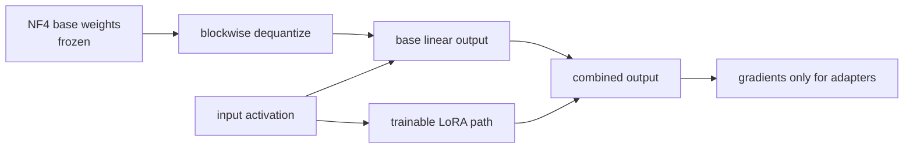

# Lesson 13 — NF4 and QLoRA: A 4-Bit Fine-Tuning Memory Ledger

> **Puzzle:** If the frozen base model is four-bit, where does fine-tuning memory still go?

[← Chapter 01](../README.md) · [Project homepage](../../../README.md) · [Executed notebook](lab.ipynb) · [RTX 5090 result](artifacts/rtx5090-result.json)

## Why this puzzle matters

QLoRA makes the base model cheap enough to keep frozen, but it does not make fine-tuning
free. Activations, adapter parameters, gradients, optimizer states, temporary
dequantization, and sequence length remain on the memory ledger. A useful feasibility
calculation names each object instead of multiplying parameter count by four bits and
stopping.

## Predict before reading the result

1. Estimate BF16 and ideal INT4 storage for seven billion parameters before opening the result.
2. Identify which tensors require gradients in a LoRA update and which remain frozen.
3. Explain why activation checkpointing can matter even when the base weights are four-bit.

## 1. Start from concrete tensors and state

QLoRA freezes a four-bit base, computes through a wider dtype, and trains LoRA matrices.
The memory ledger still includes adapters, gradients, optimizer states, activations,
temporary dequantization, and allocator reserve.

### Three reasoning anchors

| # | Lesson-specific claim to keep visible |
|---:|---|
| 1 | QLoRA freezes a quantized base and trains small low-rank adapters. |
| 2 | Optimizer state and gradients apply to trainable adapters, while activations remain a major runtime cost. |
| 3 | NF4 is a non-uniform codebook designed for normally distributed weights. |

## 2. Derive the mechanism

A rank-`r` adapter adds `ΔW = A·B` with roughly `r(in+out)` trainable parameters instead
of `in×out`. NF4 provides a non-uniform 16-value codebook suited to normally distributed
pretrained weights; double quantization compresses scale metadata.

A LoRA update writes `ΔW = BA`, where A and B have rank r much smaller than the full
matrix dimensions. QLoRA keeps W frozen in a quantized representation, dequantizes as
needed for compute, and backpropagates only into A and B. NF4 uses a non-uniform
codebook designed for roughly normal weight distributions; double quantization
compresses scale metadata, while paged optimizers address memory spikes.

The ledger separates persistent storage from training-time liveness. Ideal base bytes
are `P·4/8`, but adapter weights, adapter gradients, two Adam moments, activations, and
workspaces have their own dtype and multiplicity. Sequence length can dominate because
saved activations scale with tokens even though base storage does not.

### Mechanism at a glance



### Walk it step by step

1. **Freeze the quantized base.** The NF4 base weights are storage for forward computation, not trainable optimizer parameters.
2. **Dequantize for compute.** Blocks are reconstructed into the configured compute dtype as the layer executes.
3. **Train only adapters.** LoRA matrices, their gradients, and their optimizer states form the main trainable parameter budget.
4. **Keep a complete memory ledger.** Add quantized weights, scales, adapters, gradients, optimizer state, activations, and temporary workspace.

## 3. Translate the theory into an experiment

**Experiment:** Build a 7B-class memory ledger and run a CUDA low-rank adapter forward/backward over a frozen fake-quantized base matrix.

| Experimental role | Frozen definition |
|---|---|
| Baseline | 7B BF16 base-weight arithmetic plus a frozen CUDA reference layer |
| Candidate | ideal INT4 base ledger with trainable low-rank adapters |
| Held constant | parameter count, adapter rank assumption, optimizer-state rule, toy layer shape |
| Measurements | base GiB, LoRA/Adam MiB, gradient finiteness, frozen-base flag, toy loss |
| Evidence label | `pytorch-gpu` |

The lab combines a 7B-class arithmetic ledger with a real CUDA backward pass where only
low-rank adapter tensors receive gradients.

### Code walk-through

The notebook first computes a transparent 7B ledger. It then runs a small
forward/backward pass in which the fake-quantized base matrix has `requires_grad=False`
and only low-rank adapter matrices receive gradients. The finite-gradient check proves
the intended training path exists on CUDA.

The fake quantizer explains memory ownership but is not bitsandbytes NF4. The ledger
also excludes full-model activations because they depend on architecture, microbatch,
sequence length, checkpointing, and attention implementation.

## 4. Read the checked-in RTX 5090 result

**Recorded environment:** NVIDIA GeForce RTX 5090; compute capability 12.0; PyTorch 2.12.0; CUDA runtime 13.0.

| Measured field | Checked-in value |
|---|---:|
| 7B BF16 base | 13.039 GiB |
| 7B ideal INT4 base | 3.260 GiB |
| LoRA trainable state | 8.000 MiB |
| Adam states | 32.000 MiB |
| Base frozen | yes |
| Adapter gradients finite | yes |

### What the numbers mean

The arithmetic ledger placed a 7B BF16 base at 13.039 GiB and ideal four-bit storage at
3.260 GiB. Under the toy adapter assumptions, trainable LoRA weights occupied 8 MiB and
two Adam moments 32 MiB. The base stayed frozen and adapter gradients were finite.

Those small adapter lines explain QLoRA's appeal, but the missing activation line can
still be larger than the trainable state for long contexts. The result proves the
ownership pattern and a toy CUDA backward pass, not a 7B end-to-end fine-tuning capacity
number.

Open [`artifacts/rtx5090-result.json`](artifacts/rtx5090-result.json) when you need
every repeated sample or a field not selected for the tutorial table.

## 5. Solve the puzzle and make a decision

> Four-bit base weights reduce one ledger line; sequence activations and adapter training state still control feasibility.

### Acceptance and rollback gate

Reconcile theoretical and measured peak memory, confirm the base has no gradients, list
compute dtype and optimizer, and validate downstream quality against a frozen baseline.

### How this conclusion can fail

Calling the base 'four-bit' while materializing a full BF16 copy defeats the ledger.
Counting optimizer state for frozen weights overestimates memory, while omitting adapter
moments underestimates it. A memory fit based on parameters alone can OOM during
backward when saved activations and temporary buffers peak.

## Reproduce

From the repository root:

```bash
python3 -m venv .venv
source .venv/bin/activate
pip install -r requirements-notebook.txt
jupyter lab chapters/01-mixed-precision-int4/13-nf4-qlora/lab.ipynb
```

Use **Run All** and compare the regenerated result with the checked-in artifact.

## Extend the experiment

Run a real QLoRA step with bitsandbytes or another supported backend and measure
`max_memory_allocated` by sequence length, microbatch, rank, and checkpointing policy.
Compare predicted persistent bytes with observed peak, and explain the residual using
allocator snapshots and activation liveness.

## Evidence boundary

**Evidence label:** [`pytorch-gpu`](../README.md#evidence-labels).

## References

- [QLoRA paper](https://arxiv.org/abs/2305.14314)
- [Transformers bitsandbytes guide](https://huggingface.co/docs/transformers/main/quantization/bitsandbytes)
- [QLoRA reference implementation](https://github.com/artidoro/qlora)
