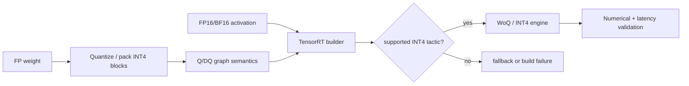

<!-- ai-infra-puzzles-header:start -->
<p align="center">
  
</p>

<h1 align="center">AI Infra Puzzles</h1>

<p align="center">
  <strong>Learn CUDA optimization and LLM inference through hands-on puzzles.</strong>
</p>
<!-- ai-infra-puzzles-header:end -->

# Lesson 16 — TensorRT INT4 Block Quantization: Q/DQ, Packing, and WoQ

> **Puzzle:** What must be present in a graph and serialized weight buffer before TensorRT can consume INT4 weights?

[← Chapter 01](../README.md) · [Project homepage](../../../README.md) · [Executed notebook](lab.ipynb) · [RTX 5090 result](artifacts/rtx5090-result.json)

## Why this puzzle matters

TensorRT INT4 is not merely a tensor cast. The graph must express quantize/dequantize
semantics, weights must use supported per-block scales, and signed four-bit codes must
be packed two per byte in the expected order. A correct reference packer is a
prerequisite, not evidence that an engine was built.

## Predict before reading the result

1. Write the signed INT4 code range and calculate packed bytes for a 512×1024 matrix.
2. Predict the metadata and error implications of block size 64.
3. Separate Q/DQ correctness, packing correctness, engine build, operator trace, and timing into distinct gates.

## 1. Start from concrete tensors and state

TensorRT explicit quantization represents quantization choices with Q/DQ semantics and
consumes packed low-bit weights plus scales under supported block/layout constraints.

### Three reasoning anchors

| # | Lesson-specific claim to keep visible |
|---:|---|
| 1 | Explicit quantization represents scale decisions with Quantize/Dequantize semantics. |
| 2 | Signed INT4 codes occupy two nibbles per byte when packed. |
| 3 | TensorRT support has specific block-size and placement rules that a generic fake-quant experiment cannot prove. |

## 2. Derive the mechanism

For signed INT4, two 4-bit two's-complement codes occupy one byte. Block Q/DQ applies
one scale to a supported group, reconstructing floating-point values for the consuming
operation or enabling a fused weight-only implementation.

For TensorRT-style symmetric INT4, codes lie in `[-8,7]` and dequantization multiplies
by a per-block scale. Two four-bit two's-complement nibbles fit in one byte; unpacking
must restore sign correctly. With 524,288 weights, ideal packed code storage is 262,144
bytes before scales and alignment.

Graph Q/DQ nodes preserve the scale decision across export and allow the compiler to
place quantized boundaries. TensorRT currently treats INT4 as weight-only and constrains
block sizes/axes. A Python Q/DQ tensor can test the math, but only a serialized engine
and inspected layer implementation establish TensorRT execution.

### Mechanism at a glance



### Walk it step by step

1. **Express quantization in the graph.** Q/DQ nodes and their axes, block sizes, and scales must describe the intended representation.
2. **Build for a named target.** TensorRT validates dtype, shape, hardware, and tactic constraints during engine construction.
3. **Inspect the selected implementation.** A successful build does not prove that the intended INT4 tactic was selected.
4. **Validate numerics and performance.** Compare the engine with the frozen baseline under the same inputs and timing protocol.

## 3. Translate the theory into an experiment

**Experiment:** Perform block INT4 Q/DQ and nibble packing on CUDA, verify exact unpacking, and separately probe the TensorRT package.

| Experimental role | Frozen definition |
|---|---|
| Baseline | floating-point 512×1024 weight tensor |
| Candidate | block-64 INT4 Q/DQ plus explicit nibble pack/unpack |
| Held constant | weight tensor, grouping axis, scale rule, code order, CUDA numerical reference |
| Measurements | packed bytes, exact code round-trip, RMSE/cosine, TensorRT package probe |
| Evidence label | `pytorch-gpu` |

The CUDA lab validates block Q/DQ and exact nibble round-trip while an independent
package probe prevents a false TensorRT-engine claim.

### Code walk-through

The notebook quantizes blocks, packs adjacent signed codes into low/high nibbles,
unpacks them, restores sign, and asserts exact equality with the original codes. It then
dequantizes for error measurement. A separate import probe records whether TensorRT is
available.

This ordering distinguishes serialization bugs from numerical loss. Exact code
round-trip is necessary even when dequantized RMSE looks plausible, because a
nibble-order or sign bug can be masked by aggregate statistics.

## 4. Read the checked-in RTX 5090 result

**Recorded environment:** NVIDIA GeForce RTX 5090; compute capability 12.0; PyTorch 2.12.0; CUDA runtime 13.0.

| Measured field | Checked-in value |
|---|---:|
| Weight shape | 512 × 1024 |
| Group size | 64 |
| Packed code bytes | 262,144 bytes |
| Exact pack/unpack | yes |
| Q/DQ RMSE | 0.107706 |
| TensorRT installed | no |

### What the numbers mean

The 512×1024 matrix produced exactly 262,144 packed bytes, and every code survived
pack/unpack. Block-64 Q/DQ yielded RMSE 0.107706 and cosine 0.994257. TensorRT was not
installed, so no engine, TensorRT layer, or latency result exists.

The outcome validates a semantic reference and serialized code layout. It does not
validate TensorRT's supported axis rules for a concrete ONNX graph or the performance of
an INT4 WoQ kernel.

Open [`artifacts/rtx5090-result.json`](artifacts/rtx5090-result.json) when you need
every repeated sample or a field not selected for the tutorial table.

## 5. Solve the puzzle and make a decision

> Validate graph semantics, packing, scales, engine inspection, and timing as separate gates.

### Acceptance and rollback gate

Round-trip every packed code, verify scale axis/block size and ONNX Q/DQ placement,
inspect the built engine, then benchmark the engine against the same baseline.

### How this conclusion can fail

Mistakes include treating unsigned nibbles as signed values, reversing low/high order,
dropping scale layout, or claiming 0.5 byte per weight without metadata and padding. A
successful engine build can still insert dequantize work that defeats the expected
benefit, so engine inspection is required.

## Reproduce

From the repository root:

```bash
python3 -m venv .venv
source .venv/bin/activate
pip install -r requirements-notebook.txt
jupyter lab chapters/01-mixed-precision-int4/16-tensorrt-int4/lab.ipynb
```

Use **Run All** and compare the regenerated result with the checked-in artifact.

## Extend the experiment

Export a minimal Q/DQ ONNX graph with block size 64, build it under a pinned TensorRT
version, inspect the engine layers, and compare outputs with the reference packer. Then
profile latency and memory for several M dimensions to find where WoQ becomes
beneficial.

## Evidence boundary

**Evidence label:** [`pytorch-gpu`](../README.md#evidence-labels).

## References

- [TensorRT quantization schemes](https://docs.nvidia.com/deeplearning/tensorrt/latest/inference-library/quantized-types-schemes.html)
- [TensorRT capabilities](https://docs.nvidia.com/deeplearning/tensorrt/latest/inference-library/capabilities.html)
- [TensorRT quantization workflows](https://docs.nvidia.com/deeplearning/tensorrt/latest/inference-library/quantized-types-workflows.html)
