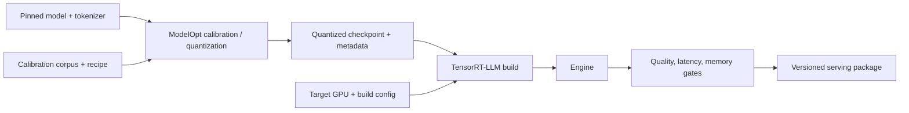

<!-- ai-infra-puzzles-header:start -->
<p align="center">
  
</p>

<h1 align="center">AI Infra Puzzles</h1>

<p align="center">
  <strong>Learn CUDA optimization and LLM inference through hands-on puzzles.</strong>
</p>
<!-- ai-infra-puzzles-header:end -->

# Lesson 17 — ModelOpt to TensorRT-LLM Quantization Pipelines

> **Puzzle:** Which evidence is lost when a quantized checkpoint is handed from one tool to another?

[← Chapter 01](../README.md) · [Project homepage](../../../README.md) · [Executed notebook](lab.ipynb) · [RTX 5090 result](artifacts/rtx5090-result.json)

## Why this puzzle matters

Quantization pipelines cross tool boundaries: calibration may happen in ModelOpt,
checkpoint export in one schema, and engine build in TensorRT-LLM. If model revision,
recipe, scales, build flags, and rollback identity are not carried together, a fast
engine cannot be reproduced or safely compared with its baseline.

## Predict before reading the result

1. List the fields required to reproduce a quantized checkpoint-to-engine handoff.
2. Explain why a scale checksum is useful but insufficient for engine identity.
3. Predict the decision when neither ModelOpt nor TensorRT-LLM is installed.

## 1. Start from concrete tensors and state

A ModelOpt-to-TensorRT-LLM handoff includes base revision, calibration corpus, recipe,
per-layer exclusions, quantized tensor metadata, tokenizer, builder/runtime versions,
engine flags, and rollback target.

### Three reasoning anchors

| # | Lesson-specific claim to keep visible |
|---:|---|
| 1 | A pipeline needs immutable model revision, calibration recipe, quantization metadata, build flags, and engine identity. |
| 2 | FP8, INT4, and FP4 are different recipes, not interchangeable compression levels. |
| 3 | Package availability is only the first compatibility gate. |

## 2. Derive the mechanism

Model optimization chooses and serializes a numerical representation; the engine builder
lowers it to hardware tactics. Losing group axes, scale dtype, or recipe version at the
boundary can change semantics even when files load.

A pipeline artifact is a directed chain: base model revision → calibration sample
manifest → quantization recipe and scales → exported checkpoint → builder version/flags
→ engine → quality and performance report. Hashes establish byte identity at a boundary;
semantic fields establish how those bytes should be interpreted.

FP8, INT4, and FP4 are different graph and scaling recipes, not points on one
interchangeable slider. The manifest should therefore make format, group/block size,
calibration, handoff status, and rollback target explicit. Missing stages remain false
rather than being inferred from a numerical probe.

### Mechanism at a glance



### Walk it step by step

1. **Pin the source model.** Record model revision, tokenizer, and baseline quality before conversion.
2. **Calibrate or optimize.** ModelOpt produces scales, recipes, or a quantized checkpoint tied to calibration data and target format.
3. **Build the runtime engine.** TensorRT-LLM consumes the supported artifact for a named GPU, shape range, and parallel configuration.
4. **Carry provenance into serving.** The final package must preserve every revision and command needed to reproduce quality and performance.

## 3. Translate the theory into an experiment

**Experiment:** Generate and validate a quantization handoff manifest seeded by a CUDA numerical probe, while checking ModelOpt and TensorRT-LLM availability independently.

| Experimental role | Frozen definition |
|---|---|
| Baseline | versioned BF16 rollback revision |
| Candidate | INT4 handoff manifest with scale fingerprint |
| Held constant | fixed synthetic scale tensor, schema requirements, base/rollback identifiers |
| Measurements | manifest completeness, SHA-256 fingerprint, package availability, numerical Q/DQ error |
| Evidence label | `compatibility-probe` |

The notebook creates a complete handoff manifest and a CUDA numerical fingerprint while
explicitly marking ModelOpt and TensorRT-LLM availability.

### Code walk-through

The notebook generates a small CUDA quantization fingerprint, hashes the scale bytes,
and builds a manifest with required fields. It independently probes ModelOpt and
TensorRT-LLM and records both handoff flags. Validation checks schema completeness, not
engine success.

This is intentionally a pipeline-contract lab. The synthetic Q/DQ error catches
accidental recipe changes, while the hash catches byte changes; neither substitutes for
loading the exported checkpoint or building an engine.

## 4. Read the checked-in RTX 5090 result

**Recorded environment:** NVIDIA GeForce RTX 5090; compute capability 12.0; PyTorch 2.12.0; CUDA runtime 13.0.

| Measured field | Checked-in value |
|---|---:|
| Manifest complete | yes |
| Format / group | INT4 |
| Group size | 64 |
| ModelOpt handoff | no |
| TensorRT-LLM handoff | no |
| Numerical RMSE | 0.107446 |

### What the numbers mean

The manifest passed its required-field check and recorded scale SHA-256 `4fc993…d117e`.
The numerical probe had RMSE 0.107446 and cosine 0.994265. Both ModelOpt and
TensorRT-LLM handoff flags were false because the packages were unavailable.

That combination is a valid reproducibility artifact and an explicit stop. It supports
preparing the handoff schema, not claims about FP8/INT4/FP4 engine quality or
throughput.

Open [`artifacts/rtx5090-result.json`](artifacts/rtx5090-result.json) when you need
every repeated sample or a field not selected for the tutorial table.

## 5. Solve the puzzle and make a decision

> Treat every tool boundary as a versioned artifact handoff with explicit validation and rollback metadata.

### Acceptance and rollback gate

Validate a schema and hashes at each handoff, run a deterministic smoke sample, inspect
engine layers, and keep quality and performance gates separate.

### How this conclusion can fail

Using `latest` model or container tags makes a manifest non-reproducible. Hashing scales
but omitting the grouping axis can preserve bytes while changing meaning. Another
failure is comparing engines built with different scheduler, tensor-parallel, or plugin
settings and attributing the difference to quantization alone.

## Reproduce

From the repository root:

```bash
python3 -m venv .venv
source .venv/bin/activate
pip install -r requirements-notebook.txt
jupyter lab chapters/01-mixed-precision-int4/17-modelopt-tensorrt-llm/lab.ipynb
```

Use **Run All** and compare the regenerated result with the checked-in artifact.

## Extend the experiment

Run ModelOpt calibration in an isolated pinned container, export a checkpoint plus
manifest, build a TensorRT-LLM engine, and add engine hash, builder flags, layer
inspection, quality suite, and SLO report. Test that the rollback artifact loads under
the same serving interface.

## Evidence boundary

**Evidence label:** [`compatibility-probe`](../README.md#evidence-labels).

## References

- [TensorRT quantization schemes](https://docs.nvidia.com/deeplearning/tensorrt/latest/inference-library/quantized-types-schemes.html)
- [NVIDIA Transformer Engine documentation](https://docs.nvidia.com/deeplearning/transformer-engine/user-guide/index.html)
- [NVIDIA Model Optimizer documentation](https://nvidia.github.io/Model-Optimizer/)
- [TensorRT-LLM documentation](https://nvidia.github.io/TensorRT-LLM/)
