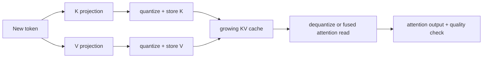

# Lesson 19 — KV-Cache Quantization for Long Contexts

> **Puzzle:** When context length doubles, why can KV cache dominate even after weight quantization?

[← Chapter 01](../README.md) · [Project homepage](../../../README.md) · [Executed notebook](lab.ipynb) · [RTX 5090 result](artifacts/rtx5090-result.json)

## Why this puzzle matters

Once weights are compressed, KV cache can become the dominant memory term for long
contexts and concurrent requests. Quantizing it changes more than capacity: scales must
be stored or computed, keys and values are reconstructed inside attention, and small
perturbations can change softmax-weighted outputs.

## Predict before reading the result

1. Compute BF16 bytes for K and V with shape `[1,4096,8,128]` before reading the artifact.
2. Predict the ideal INT8 reduction and identify why the measured reduction is smaller than 50%.
3. Choose an output-level metric that is more informative than K/V tensor RMSE alone.

## 1. Start from concrete tensors and state

The KV cache stores keys and values per layer and request. Quantized cache additionally
stores scales (and sometimes zero points) at a chosen token/head/block granularity.

### Three reasoning anchors

| # | Lesson-specific claim to keep visible |
|---:|---|
| 1 | KV bytes scale linearly with batch, layers, sequence, KV heads, head dimension, and two tensors. |
| 2 | Cache quantization needs scales and often changes attention input error. |
| 3 | More cache capacity may increase concurrency even when single-request latency does not improve. |

## 2. Derive the mechanism

Cache bytes follow `2LBTHD·bytes`, while attention uses `softmax(QKᵀ/√D)V`; quantization
error can perturb both logits through `K` and the weighted sum through `V`.

Cache storage is `2·B·S·Hkv·D·bytes`, multiplied by layers in a full model. Quantization
adds scale metadata whose granularity may be per tensor, head, token, or block.
Attention consumes `softmax(QKᵀ/√D)V`; errors in K affect logits and softmax weights,
while errors in V affect the weighted sum. Their consequences are therefore not captured
by one raw cache-error number.

Capacity improves only if the backend stores the quantized form persistently rather than
dequantizing a full copy. Latency may improve, stay flat, or worsen depending on fused
attention support and scale handling.

### Mechanism at a glance



### Walk it step by step

1. **Write the cache shape.** Account for layers, batch, sequence length, KV heads, head dimension, K and V, and bytes per element.
2. **Choose a scale lifetime.** Per-token, per-head, or per-block scales trade metadata and kernel work against error.
3. **Quantize live cache tensors.** Include scale bytes and any staging buffers rather than reporting the nominal element width only.
4. **Test attention and service behavior.** Validate attention-output error, long-context quality, latency, and concurrency capacity.

## 3. Translate the theory into an experiment

**Experiment:** Quantize representative KV tensors to INT8 on CUDA, compare bytes and attention-output error, and project capacity across context lengths.

| Experimental role | Frozen definition |
|---|---|
| Baseline | BF16 K and V tensors for one representative long-context attention slice |
| Candidate | INT8 K/V plus explicit scale storage |
| Held constant | batch, sequence 4096, 8 KV heads, head dimension 128, queries, attention computation |
| Measurements | total bytes including scales and attention-output RMSE/cosine |
| Evidence label | `pytorch-gpu` |

The notebook quantizes real CUDA K/V tensors, includes scale bytes, and compares
attention outputs rather than reporting compression alone.

### Code walk-through

The notebook creates real CUDA K/V tensors, quantizes them, counts code and scale bytes,
and evaluates attention outputs against the BF16 reference using the same query tensor.
Measuring after the softmax/value path ties numerical error to the consumer of the
cache.

This remains a reference implementation. It does not exercise vLLM's FP8 cache format,
paged block allocator, per-head scaling, or a fused quantized attention kernel, so
service latency is outside the claim.

## 4. Read the checked-in RTX 5090 result

**Recorded environment:** NVIDIA GeForce RTX 5090; compute capability 12.0; PyTorch 2.12.0; CUDA runtime 13.0.

| Measured field | Checked-in value |
|---|---:|
| BF16 cache | 16,777,216 bytes |
| INT8 cache plus scales | 8,650,752 bytes |
| Memory reduction | 48.4375% |
| Attention-output RMSE | 0.000231 |
| Attention-output cosine | 0.999958 |

### What the numbers mean

BF16 cache storage was 16,777,216 bytes. INT8 codes plus scales used 8,650,752 bytes, a
48.4375% reduction rather than an ideal 50% because metadata remained. Attention-output
RMSE was 0.00023131 with cosine 0.999958 and max absolute error 0.00070267.

The error is small for this random slice, but it is not a language-model quality result.
The useful conclusion is that metadata-aware capacity and consumer-level numerical error
were both measured; end-to-end quality and fused-kernel cost remain open.

Open [`artifacts/rtx5090-result.json`](artifacts/rtx5090-result.json) when you need
every repeated sample or a field not selected for the tutorial table.

## 5. Solve the puzzle and make a decision

> KV quantization is primarily a capacity decision until end-to-end latency and quality are measured.

### Acceptance and rollback gate

Measure actual cache allocation, metadata, context-dependent attention or task error,
quant/dequant cost, long-context quality, and end-to-end serving metrics.

### How this conclusion can fail

Ignoring scale bytes overstates capacity, while comparing cache tensors without
attention can understate behavioral impact. A single random context misses
layer-dependent and long-range sensitivity. Another failure is to count extra capacity
as throughput without testing whether scheduler concurrency and attention latency
actually improve.

## Reproduce

From the repository root:

```bash
python3 -m venv .venv
source .venv/bin/activate
pip install -r requirements-notebook.txt
jupyter lab chapters/01-mixed-precision-int4/19-kv-cache-quantization/lab.ipynb
```

Use **Run All** and compare the regenerated result with the checked-in artifact.

## Extend the experiment

Repeat by layer/head and context length, compare per-tensor versus per-head scales, and
evaluate logit/sequence quality in a small model. Then run a supported vLLM FP8 KV-cache
configuration and measure maximum tokens, concurrent requests, TTFT, ITL, and accuracy
under the same request set.

## Evidence boundary

**Evidence label:** [`pytorch-gpu`](../README.md#evidence-labels).

## References

- [vLLM quantization documentation](https://docs.vllm.ai/en/latest/features/quantization/)
- [vLLM quantized KV cache](https://docs.vllm.ai/en/latest/features/quantization/quantized_kvcache/)
- [LLM Compressor KV-cache example](https://docs.vllm.ai/projects/llm-compressor/en/latest/examples/quantization_kv_cache/)
