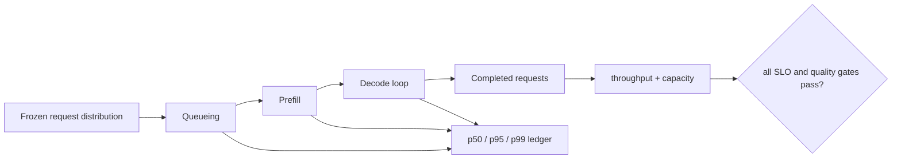

<!-- ai-infra-puzzles-header:start -->
<p align="center">
  
</p>

<h1 align="center">AI Infra Puzzles</h1>

<p align="center">
  <strong>Learn CUDA optimization and LLM inference through hands-on puzzles.</strong>
</p>
<!-- ai-infra-puzzles-header:end -->

# Lesson 24 — Benchmark Design: Throughput, Latency, Concurrency, and Memory

> **Puzzle:** How can the same GPU path improve throughput while worsening latency?

[← Chapter 01](../README.md) · [Project homepage](../../../README.md) · [Executed notebook](lab.ipynb) · [RTX 5090 result](artifacts/rtx5090-result.json)

## Why this puzzle matters

Throughput, latency, concurrency, and memory are coupled but not interchangeable. A
larger batch can raise examples per second while increasing per-request waiting time and
peak memory. A useful benchmark starts from an SLO and a request distribution, then
reports enough axes to explain why one configuration wins.

## Predict before reading the result

1. Predict how operator latency, examples per second, and peak allocation change from batch 1 to 128.
2. Explain why this operator benchmark cannot report time to first token or queueing latency.
3. Choose percentile and load information required for a serving comparison.

## 1. Start from concrete tensors and state

Benchmark outputs include latency distribution, throughput, concurrency, queueing, TTFT,
token latency, memory, power/cost, and workload shape. They cannot be collapsed into one
number.

### Three reasoning anchors

| # | Lesson-specific claim to keep visible |
|---:|---|
| 1 | Latency is per request; throughput is completed work per unit time. |
| 2 | Batching amortizes overhead but increases queueing and memory demand. |
| 3 | Median alone hides tail behavior; warm-up and repeated samples must be recorded. |

## 2. Derive the mechanism

For a fixed operator, throughput is `batch / latency`; batching can raise throughput
while each item waits longer. In a service, arrival rate and queueing add latency beyond
GPU execution.

For a synchronous batch B with measured operator time T, idealized throughput is `B/T`.
That calculation excludes arrivals, batching delay, scheduler overhead, token-by-token
Decode, and response streaming. In a service, increasing concurrency can improve GPU
utilization until queueing and memory pressure drive tail latency or rejection.

Latency distributions also matter: median describes a typical warm request, while
p95/p99 expose interference and queueing. Peak CUDA allocation is not total process
memory and should be paired with reserved memory and cache capacity when deployment fit
is evaluated.

### Mechanism at a glance



### Walk it step by step

1. **Freeze the service workload.** Specify prompt/output lengths, arrival pattern, concurrency, batching policy, and cache state.
2. **Measure latency as phases.** Separate queueing, Prefill, inter-token Decode, and total request latency.
3. **Report distributions and throughput together.** A throughput gain is incomplete when p95 or p99 violates the service objective.
4. **Attribute the result.** Pair end-to-end metrics with memory and operator evidence so a bottleneck shift is visible.

## 3. Translate the theory into an experiment

**Experiment:** Benchmark a CUDA MLP over several batch sizes, recording median, p90, examples per second, and peak allocated memory.

| Experimental role | Frozen definition |
|---|---|
| Baseline | batch-1 BF16 two-layer MLP operator workload |
| Candidate | the same operator at batches 8, 32, and 128 |
| Held constant | model, hidden sizes, dtype, GPU, warm-up five, repeats twenty |
| Measurements | median/p90 operator latency, derived examples/s, peak allocated MiB |
| Evidence label | `pytorch-gpu` |

The lab sweeps batch size and reports median, p90, examples/s, and peak allocated
memory; it labels the result as an operator workload, not a server test.

### Code walk-through

The notebook constructs one fixed BF16 MLP, allocates each batch input, resets
peak-memory statistics, and records twenty CUDA-event samples after warm-up. Throughput
is derived from batch divided by median device time, making its simplified assumptions
explicit.

No request scheduler, tokenizer, KV cache, network, or output loop is present. The
evidence is an operator batching curve that teaches metric relationships, not an online
service benchmark.

## 4. Read the checked-in RTX 5090 result

**Recorded environment:** NVIDIA GeForce RTX 5090; compute capability 12.0; PyTorch 2.12.0; CUDA runtime 13.0.

| Measured field | Checked-in value |
|---|---:|
| Batch 1 median | 0.046176 ms |
| Batch 1 throughput | 21,656.27 examples/s |
| Batch 32 median | 0.045968 ms |
| Batch 32 throughput | 696,136.44 examples/s |
| Batch 128 median | 0.049024 ms |
| Batch 128 throughput | 2,610,966.06 examples/s |
| Batch 128 peak allocation | 67.000 MiB |

### What the numbers mean

Median operator latency stayed near 0.046 ms from batch 1 through 32, so derived
throughput rose from 21,656 to 696,136 examples/s. Batch 128 increased median to
0.049024 ms but still reached 2.61 million examples/s. Peak allocated memory grew from
64.023 to 67.000 MiB.

The table shows why throughput can improve dramatically while latency barely changes and
memory rises. It does not include the time a request waits to join that batch, which may
dominate an interactive SLO.

Open [`artifacts/rtx5090-result.json`](artifacts/rtx5090-result.json) when you need
every repeated sample or a field not selected for the tutorial table.

## 5. Solve the puzzle and make a decision

> Choose a candidate against a service-level objective, not the single largest throughput number.

### Acceptance and rollback gate

Declare workload distribution, warm-up, repetitions, synchronization, concurrency,
percentile method, precision, and SLO before seeing the candidate.

### How this conclusion can fail

Comparing tokens/s at different output lengths or latency percentiles is unfair.
Deriving service throughput from a single operator omits non-quantized layers and
scheduling. Another trap is reporting only the best concurrency before OOM or rejection,
without a safety margin and sustained-load duration.

## Reproduce

From the repository root:

```bash
python3 -m venv .venv
source .venv/bin/activate
pip install -r requirements-notebook.txt
jupyter lab chapters/01-mixed-precision-int4/24-benchmark-design/lab.ipynb
```

Use **Run All** and compare the regenerated result with the checked-in artifact.

## Extend the experiment

Run a real serving workload with a frozen prompt/output-length distribution and arrival
process. Record TTFT, inter-token latency, end-to-end p50/p95/p99, tokens/s, requests/s,
queue depth, rejection, power, and peak/reserved memory for each concurrency level.

## Evidence boundary

**Evidence label:** [`pytorch-gpu`](../README.md#evidence-labels).

## References

- [vLLM quantization documentation](https://docs.vllm.ai/en/latest/features/quantization/)
- [vLLM benchmark CLI](https://docs.vllm.ai/en/latest/cli/bench/serve.html)
- [CUDA event timing API](https://docs.nvidia.com/cuda/cuda-runtime-api/group__CUDART__EVENT.html)
