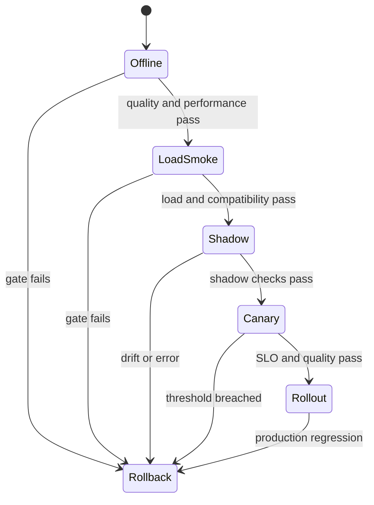

# Lesson 27 — Production Deployment, Versioning, and Rollback

> **Puzzle:** What makes a quantized release safely reversible?

[← Chapter 01](../README.md) · [Project homepage](../../../README.md) · [Executed notebook](lab.ipynb) · [RTX 5090 result](artifacts/rtx5090-result.json)

## Why this puzzle matters

A quantized artifact is not ready when conversion finishes; it is ready when a versioned
candidate passes frozen gates and a tested rollback path exists. Release decisions
should be deterministic from evidence, so the same manifest produces the same
promote-or-rollback result rather than depending on operator optimism.

## Predict before reading the result

1. Predict whether the candidate passes a 10% latency gate and an RMSE≤0.5 gate.
2. Explain why both gates are required even when latency improves.
3. List the additional evidence needed before changing `rollback` to a live canary.

## 1. Start from concrete tensors and state

A release unit includes immutable model/tokenizer/recipe/runtime/container identities,
metrics, canary policy, observability, and an already verified rollback target.

### Three reasoning anchors

| # | Lesson-specific claim to keep visible |
|---:|---|
| 1 | Model, tokenizer, quantization recipe, runtime, and GPU compatibility form one release unit. |
| 2 | Canary gates need quality, latency, error-rate, and capacity thresholds. |
| 3 | Rollback must reference an already verified immutable baseline. |

## 2. Derive the mechanism

Promotion is a state machine: offline gates -> load/smoke -> shadow -> canary -> broader
rollout. Every transition consumes fixed evidence and has an automatic stop/rollback
condition.

A release manifest binds candidate and baseline revisions, environment, quantization
recipe, quality thresholds, performance SLOs, owners, observability, canary fraction,
and rollback target. Each gate evaluates a named artifact; the decision is the
conjunction for critical gates, not an average score.

Rollback must restore a loadable, compatible baseline and be rehearsed before promotion.
A local synthetic decision can validate the gate machinery while remaining explicit that
no container, traffic, or service health signal was exercised.

### Mechanism at a glance



### Walk it step by step

1. **Bind immutable artifacts.** Model, tokenizer, recipe, runtime, container, and GPU compatibility form one release unit.
2. **Pass offline gates.** Quality, numerical, load, and performance checks run before any traffic exposure.
3. **Increase exposure in stages.** Shadow and canary stages consume predeclared health and quality thresholds.
4. **Make rollback executable.** Every stage points to a load-tested baseline and has an automatic or operator-triggered stop condition.

## 3. Translate the theory into an experiment

**Experiment:** Evaluate a synthetic candidate against frozen gates and emit a release decision plus rollback manifest from measured CUDA output error and timing.

| Experimental role | Frozen definition |
|---|---|
| Baseline | versioned BF16 matrix path `bf16-v1` |
| Candidate | reference INT4-dequantized path `reference-int4-v1` |
| Held constant | same tensors, fifteen timing samples, fixed RMSE/latency thresholds |
| Measurements | baseline/candidate median and p90, output error, individual gate booleans, release decision |
| Evidence label | `capacity-model` |

The notebook converts measured CUDA error and timing into a deterministic synthetic
release decision and rollback manifest, without claiming live traffic.

### Code walk-through

The notebook measures both paths, computes error, evaluates two predeclared booleans,
and writes a manifest whose decision is `promote_to_canary` only if all gates pass. The
rollback target is stored even when the candidate fails.

This is a deterministic release-policy test. It is not a container build, model-card
audit, shadow deployment, or canary against live traffic.

## 4. Read the checked-in RTX 5090 result

**Recorded environment:** NVIDIA GeForce RTX 5090; compute capability 12.0; PyTorch 2.12.0; CUDA runtime 13.0.

| Measured field | Checked-in value |
|---|---:|
| Baseline median | 0.019360 ms |
| Candidate median | 0.018848 ms |
| Candidate RMSE | 5.317538 |
| Latency gate | yes |
| Quality gate | no |
| Decision | rollback |

### What the numbers mean

Candidate median latency was 0.018848 ms versus 0.019360 ms for the baseline, so the
≤10% regression gate passed. But output RMSE was 5.317538, far above the 0.5 threshold,
so the quality gate failed and the manifest selected `rollback`.

A small speed improvement cannot compensate for a failed critical quality gate. The
result illustrates why release criteria must be conjunctive and frozen before the
candidate is observed.

Open [`artifacts/rtx5090-result.json`](artifacts/rtx5090-result.json) when you need
every repeated sample or a field not selected for the tutorial table.

## 5. Solve the puzzle and make a decision

> Automate the decision and rollback metadata before exposing traffic; never improvise rollback after a regression.

### Acceptance and rollback gate

Version every artifact, define quality/latency/error/capacity thresholds, monitor
slices, and test the rollback command before canary traffic.

### How this conclusion can fail

Changing thresholds after seeing the result converts a gate into a justification. A
rollback identifier without a verified artifact is not a rollback plan. Production
promotion also needs sustained load, error rates, GPU health, output monitoring, and a
human/operator decision path.

## Reproduce

From the repository root:

```bash
python3 -m venv .venv
source .venv/bin/activate
pip install -r requirements-notebook.txt
jupyter lab chapters/01-mixed-precision-int4/27-production-rollout/lab.ipynb
```

Use **Run All** and compare the regenerated result with the checked-in artifact.

## Extend the experiment

Package baseline and candidate into pinned containers, validate cold load and warm
restart, run an offline quality suite and shadow traffic, then perform a small canary
with automated rollback triggers. Rehearse the rollback and record recovery time before
expanding traffic.

## Evidence boundary

**Evidence label:** [`capacity-model`](../README.md#evidence-labels).

## References

- [vLLM quantization documentation](https://docs.vllm.ai/en/latest/features/quantization/)
- [Hugging Face model cards](https://huggingface.co/docs/hub/model-cards)
- [NVIDIA Triton model management](https://docs.nvidia.com/deeplearning/triton-inference-server/user-guide/docs/user_guide/model_management.html)
