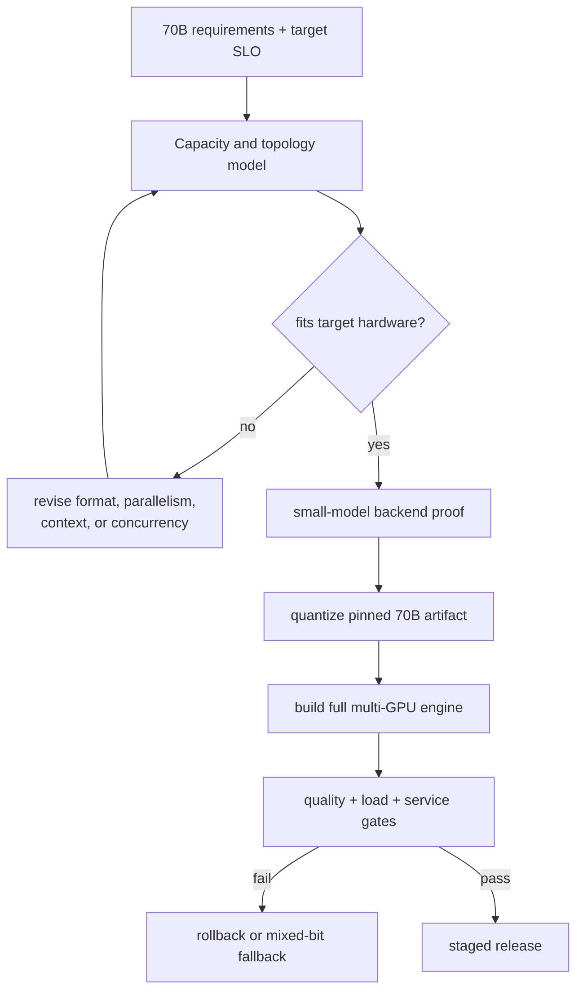

# Lesson 30 — End-to-End Project: A Serviceable INT4 Plan for a 70B-Class Model

> **Puzzle:** What evidence is required to move from a four-bit checkpoint to a serviceable 70B deployment plan?

[← Chapter 01](../README.md) · [Project homepage](../../../README.md) · [Executed notebook](lab.ipynb) · [RTX 5090 result](artifacts/rtx5090-result.json)

## Why this puzzle matters

A serviceable 70B INT4 project is a sequence of gates, not a conversion command. Weight
fit enables engine work; engine identity enables quality and load testing; passing
quality, SLO, capacity, observability, canary, and rollback gates enables production.
Any unexecuted critical gate keeps the decision at `not ready`.

## Predict before reading the result

1. Predict whether ideal 70B INT4 weights fit after reserve on the recorded RTX 5090.
2. Evaluate which deployment gates can be answered by a toy mixed-bit matrix and which require a real engine.
3. Write the minimum reversal conditions that would move the final decision toward canary.

## 1. Start from concrete tensors and state

A serviceable 70B plan joins model revision, quantization/calibration, hardware
topology, engine, cache policy, quality suite, workload/SLO, capacity/cost,
observability, ownership, and rollback.

### Three reasoning anchors

| # | Lesson-specific claim to keep visible |
|---:|---|
| 1 | The plan joins memory feasibility, backend compatibility, quality gates, performance SLOs, observability, and rollback. |
| 2 | A 70B arithmetic ledger is not a successful model load. |
| 3 | Every unsupported or unmeasured gate remains explicit rather than being filled with optimism. |

## 2. Derive the mechanism

The project is a gate graph rather than one conversion command: memory feasibility
enables engine build; engine evidence enables quality/performance tests; only passing
all critical gates enables canary.

The gate graph begins with immutable model/recipe identity and capacity arithmetic. It
then requires a supported backend build and operator trace, frozen quality suite,
representative service load, cost/capacity margin, observability, owner, canary plan,
and tested rollback. Dependencies matter: service SLO is undefined before a loadable
engine exists.

A toy mixed-bit probe can validate the idea of fallback and a numeric threshold, but it
cannot answer 70B task quality. Likewise, ideal `P/2` bytes ignores scale metadata and
unquantized layers. Marking those distinctions in the final decision is part of the
deliverable.

### Mechanism at a glance



### Walk it step by step

1. **Reject impossible capacity plans early.** Estimate weight, KV-cache, runtime, and concurrency memory before choosing a quantizer.
2. **Build a representative smaller proof.** Validate the exact format, backend, quality suite, and workload on a model that fits the available hardware.
3. **Create the full-model artifact.** Quantize the pinned 70B checkpoint with reproducible calibration and packaging metadata.
4. **Promote only with full-system evidence.** Require multi-GPU engine, load, quality, long-context, throughput, and rollback results from the target topology.

## 3. Translate the theory into an experiment

**Experiment:** Combine live GPU capacity, a small CUDA mixed-bit quality probe, and a gate matrix to produce a bounded 70B deployment decision.

| Experimental role | Frozen definition |
|---|---|
| Baseline | BF16 rollback concept and unexecuted production gates |
| Candidate | ideal 70B INT4 capacity plus a toy mixed-bit numerical probe |
| Held constant | live GPU memory, 70B parameter count, 10% reserve, fixed toy threshold |
| Measurements | ideal weight GiB, fit boolean, toy RMSE/cosine, six gate booleans, final decision |
| Evidence label | `capacity-model` |

The final lab combines live capacity arithmetic and a small mixed-bit CUDA probe, then
returns `not_ready_for_service` because the 70B engine, quality, and service gates were
not executed.

### Code walk-through

The notebook reads live capacity, computes ideal INT4 bytes, runs a small CUDA mixed-bit
matrix probe, and builds a gate dictionary. It sets engine, quality-suite, and
service-SLO gates false because those experiments were not run. The final decision is
derived from all gates rather than written optimistically.

This makes the notebook an executable deployment-plan skeleton. It is not a 70B load
test, quantized checkpoint, or cost benchmark.

## 4. Read the checked-in RTX 5090 result

**Recorded environment:** NVIDIA GeForce RTX 5090; compute capability 12.0; PyTorch 2.12.0; CUDA runtime 13.0.

| Measured field | Checked-in value |
|---|---:|
| Live GPU total | 31.358 GiB |
| Ideal INT4 weights | 32.596 GiB |
| Single-GPU ideal fit | no |
| Toy mixed-bit RMSE | 3.720175 |
| Quality suite passed | no |
| Service SLO passed | no |
| Decision | not_ready_for_service |

### What the numbers mean

Ideal INT4 weights were 32.596 GiB versus 31.358 GiB total GPU memory, so single-GPU
weight fit failed before metadata or reserve. The toy mixed-bit probe produced RMSE
3.720175, above its threshold of 2, although cosine was 0.993368. Rollback identity was
defined, but engine build, quality suite, and service SLO were all false. The derived
decision was `not_ready_for_service`.

This is the correct outcome: arithmetic compression and one toy probe cannot fill
missing production evidence. The gate matrix tells the next engineer exactly what
remains rather than converting absence into a success claim.

Open [`artifacts/rtx5090-result.json`](artifacts/rtx5090-result.json) when you need
every repeated sample or a field not selected for the tutorial table.

## 5. Solve the puzzle and make a decision

> A defensible plan exposes every gate, owner, artifact, and reversal condition before production optimization begins.

### Acceptance and rollback gate

Leave every unexecuted gate visibly false. Require a real 70B load, native operator
trace, frozen quality suite, service-load SLO, capacity margin, cost model, canary plan,
and tested rollback before deployment.

### How this conclusion can fail

Calling ideal weight fit a successful load ignores the largest uncertainty. Allowing one
high cosine score to override task failures also weakens the gate graph. A plan without
owners, artifacts, deadlines, observability, and rollback rehearsal may be complete on
paper but unusable during an incident.

## Reproduce

From the repository root:

```bash
python3 -m venv .venv
source .venv/bin/activate
pip install -r requirements-notebook.txt
jupyter lab chapters/01-mixed-precision-int4/30-end-to-end-70b-plan/lab.ipynb
```

Use **Run All** and compare the regenerated result with the checked-in artifact.

## Extend the experiment

Select a feasible multi-GPU or larger-memory target, build a pinned native engine, and
capture layer/operator evidence. Run the frozen quality suite and representative load,
fill capacity/cost margins, define monitoring and owners, then rehearse rollback. Only
all-passing critical gates should change the decision to canary-ready.

## Evidence boundary

**Evidence label:** [`capacity-model`](../README.md#evidence-labels).

## References

- [TensorRT quantization schemes](https://docs.nvidia.com/deeplearning/tensorrt/latest/inference-library/quantized-types-schemes.html)
- [vLLM quantization documentation](https://docs.vllm.ai/en/latest/features/quantization/)
- [NVIDIA Transformer Engine documentation](https://docs.nvidia.com/deeplearning/transformer-engine/user-guide/index.html)
- [NVIDIA Model Optimizer documentation](https://nvidia.github.io/Model-Optimizer/)
- [TensorRT-LLM documentation](https://nvidia.github.io/TensorRT-LLM/)
- [vLLM benchmark CLI](https://docs.vllm.ai/en/latest/cli/bench/serve.html)
