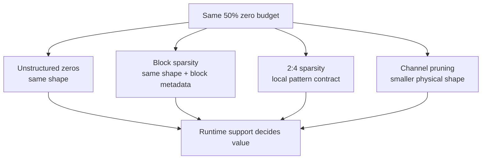

# Lesson 02 — The Sparsity Granularity Spectrum: Weights, Channels, Blocks, and N:M

> **Puzzle:** Can two tensors with exactly 50% zeros demand different kernels and deployment formats?

[← Chapter 02](../README.md) · [Project homepage](../../../README.md) · [Executed notebook](lab.ipynb) · [RTX 5090 result](artifacts/rtx5090-result.json)

## Why this puzzle matters

The word sparsity hides a layout contract. Unstructured zeros, contiguous blocks,
removed channels, and 2:4 groups can share the same global nonzero rate while exposing
very different metadata, vectorization, and library opportunities. Choosing a
granularity is therefore a joint algorithm-runtime decision, not a cosmetic choice made
after training.

## Predict before reading the result

1. Predict which 50% mask will pass an exact 2:4 compliance check.
2. Predict whether ordinary dense matmul notices unstructured or block zeros.
3. Choose a granularity when custom kernels are forbidden.

## 1. Start from concrete tensors and state

The lab uses one weight matrix and derives four representations: unstructured magnitude
zeros, block zeros, exact 2:4 groups, and a physically narrowed matrix. It tracks global
sparsity, 2:4 compliance, shape, and dense-path latency.

### Three reasoning anchors

| # | Lesson-specific claim to keep visible |
|---:|---|
| 1 | Equal nonzero counts do not imply equal layouts. |
| 2 | N:M compliance is a local invariant, not a global percentage. |
| 3 | Channel removal can use a smaller dense operator without sparse metadata. |

## 2. Derive the mechanism

A global rate `1 - nnz/numel` discards where the nonzeros live. For 2:4 sparsity, every
consecutive group of four along the contracted dimension must contain exactly two
retained values; 50% zeros placed elsewhere are non-compliant. Block sparsity adds a
block shape and index structure. Channel pruning removes a complete axis and can reuse
dense kernels at a smaller dimension. Runtime value comes from matching one of these
contracts to an implementation.

### Mechanism at a glance



### Walk it step by step

1. **Hold the zero budget fixed.** Compare layouts at the same global sparsity so granularity is the independent variable.
2. **Check the local contract.** Block and N:M layouts require local grouping rules that a global percentage cannot express.
3. **Check physical shape.** Channel removal changes dimensions and can reuse ordinary dense kernels at a smaller size.
4. **Match the target runtime.** Choose only among formats with an implemented loader, operator, and supported shapes on the deployment stack.

## 3. Translate the theory into an experiment

**Experiment:** Construct four 50%-budget representations and compare compliance, shape, and ordinary dense CUDA timing.

| Experimental role | Frozen definition |
|---|---|
| Baseline | original dense matrix and unstructured 50% magnitude mask |
| Candidate | block mask, exact 2:4 mask, and a physically narrowed dense matrix |
| Held constant | source weights, input batch, dtype, target zero budget, and timing method |
| Measurements | global sparsity, 2:4 compliance, physical shape, and median latency |
| Evidence label | `pytorch-gpu` |

### Code walk-through

Each mask is generated explicitly so its local structure can be inspected. The
experiment intentionally multiplies masked tensors through the ordinary dense PyTorch
path; it does not claim cuSPARSELt dispatch. The narrow candidate changes the contracted
work and provides a useful control for the claim that structure, not zero count, is what
the kernel sees.

## 4. Read the checked-in RTX 5090 result

**Recorded environment:** NVIDIA GeForce RTX 5090; compute capability 12.0; PyTorch 2.12.0; CUDA runtime 13.0.

| Measured field | Checked-in value |
|---|---:|
| Unstructured sparsity | 50.00% |
| 2:4 compliance | 100.00% |
| Dense median | 0.017920 ms |
| Unstructured median | 0.017888 ms |
| 2:4 dense-path median | 0.018384 ms |
| Narrow median | 0.018480 ms |

### What the numbers mean

All three masks were near 50% sparse, but exact 2:4 compliance was 100.0% versus 37.5%
for the unstructured mask. The ordinary dense path measured 0.017920 ms for dense,
0.017888 ms for unstructured, and 0.018384 ms for compliant values. Only the narrow
control changed the matrix shape; no sparse-kernel dispatch is inferred from these
timings.

## 5. Solve the puzzle and make a decision

> Sparsity granularity is an interface between optimization and execution; a global zero rate is only one field of that interface.

### Acceptance and rollback gate

Select a granularity only after the target runtime's supported patterns and the model's
accuracy sensitivity are both written down.

### How this conclusion can fail

A 2:4-compliant tensor can still use a dense tactic when it is not compressed into the
required backend format, dtype, alignment, or build flag. A channel-pruned tensor can
also be slower at awkward widths. Compliance is necessary for some paths, never
sufficient for speed.

## Reproduce

From the repository root:

```bash
python3 -m venv .venv
source .venv/bin/activate
pip install torch jupyterlab nbclient nbformat
jupyter lab chapters/02-sparsity-structured-pruning/02-sparsity-granularity/lab.ipynb
```

## Extend the experiment

Run the compliant matrix through cuSPARSELt or TensorRT, capture its tactic log, and
sweep dimensions around alignment boundaries while holding the nonzero budget fixed.

## Evidence boundary

**Evidence label:** [`pytorch-gpu`](../README.md#evidence-labels).

## References

- [NVIDIA cuSPARSELt documentation](https://docs.nvidia.com/cuda/cusparselt/)
- [PyTorch pruning tutorial](https://docs.pytorch.org/tutorials/intermediate/pruning_tutorial.html)
