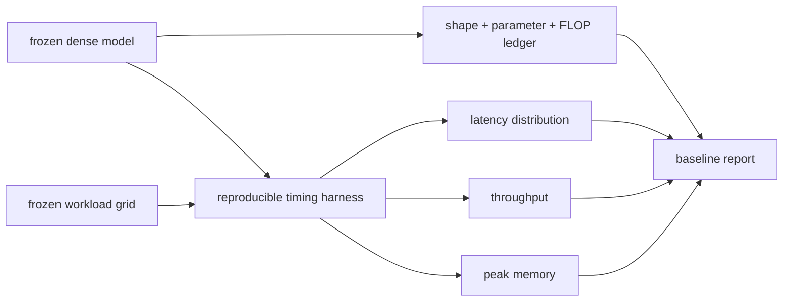

<!-- ai-infra-puzzles-header:start -->
<p align="center">
  
</p>

<h1 align="center">AI Infra Puzzles</h1>

<p align="center">
  <strong>Learn CUDA optimization and LLM inference through hands-on puzzles.</strong>
</p>
<!-- ai-infra-puzzles-header:end -->

# Lesson 03 — Baseline Measurement: Parameters, FLOPs, Latency, and Throughput

> **Puzzle:** Which baseline numbers are required before a pruning result can be interpreted?

[← Chapter 02](../README.md) · [Project homepage](../../../README.md) · [Executed notebook](lab.ipynb) · [RTX 5090 result](artifacts/rtx5090-result.json)

## Why this puzzle matters

A pruning percentage without a baseline is not a comparison. Parameters and analytical
FLOPs describe model structure; median and tail latency describe a workload on one
stack; throughput and peak memory answer still different questions. A useful baseline
freezes all of them before changing the model.

## Predict before reading the result

1. Predict how batch 1 and batch 64 change latency and examples per second.
2. Explain why lower FLOPs does not mathematically guarantee lower p95 latency.
3. List every environment field required to compare a later pruned run.

## 1. Start from concrete tensors and state

The concrete system is a three-layer CUDA MLP, two batch sizes, a known dtype, a fixed
random input, a parameter counter, an analytical linear-FLOP ledger, repeated CUDA-event
samples, and peak allocated memory.

### Three reasoning anchors

| # | Lesson-specific claim to keep visible |
|---:|---|
| 1 | Structural metrics are deterministic for a frozen graph. |
| 2 | Latency and throughput depend on the workload and timing protocol. |
| 3 | Tail statistics require repeated samples, not one synchronized call. |

## 2. Derive the mechanism

For linear layers, parameters are `in_features × out_features` plus bias and leading
multiply-add work is `2 × batch × in × out`. These values are deterministic properties
of the chosen shape. Latency is a distribution affected by warm-up, synchronization, and
batch; throughput is `batch / elapsed_time` and cannot be inferred from a single-request
timing. Peak allocated memory must be reset and sampled over the same measurement
window.

### Mechanism at a glance



### Walk it step by step

1. **Freeze the graph before measuring.** Record every layer shape, dtype, parameter count, and analytical operation count before changing the model.
2. **Define workload points.** Batch size, input shape, sequence length, and concurrency belong to the baseline identity rather than to a footnote.
3. **Measure a distribution.** Warm the stack, synchronize device work, retain repeated latency samples, and reset the memory window.
4. **Keep metric meanings separate.** Parameters and FLOPs describe structure; latency, throughput, and peak memory describe one execution path.

## 3. Translate the theory into an experiment

**Experiment:** Record a complete dense MLP baseline at batch 1 and batch 64 with structural and runtime metrics.

| Experimental role | Frozen definition |
|---|---|
| Baseline | the same dense MLP evaluated at batch 1 |
| Candidate | the same dense MLP evaluated at batch 64 |
| Held constant | model weights, hidden sizes, dtype, GPU, warm-up, repetitions, and input distribution |
| Measurements | parameters, analytical FLOPs, median/p95 latency, throughput, and peak allocated memory |
| Evidence label | `pytorch-gpu` |

### Code walk-through

The notebook computes the structural ledger directly from module shapes, then uses the
same timing helper for both batches. CUDA synchronization happens after the event pair,
and the result retains every sample so p95 can be recomputed. The batch comparison is
not a candidate victory; it demonstrates why service workload belongs in the baseline
identity.

## 4. Read the checked-in RTX 5090 result

**Recorded environment:** NVIDIA GeForce RTX 5090; compute capability 12.0; PyTorch 2.12.0; CUDA runtime 13.0.

| Measured field | Checked-in value |
|---|---:|
| Parameters | 4,459,776 |
| Batch-1 FLOPs | 8,912,896 |
| Batch-1 median | 0.056288 ms |
| Batch-1 p95 | 0.059221 ms |
| Batch-64 median | 0.056608 ms |
| Batch-64 throughput | 1,130,582.3/s |
| Peak memory | 41.133 MiB |

### What the numbers mean

The frozen MLP contains 4,459,776 parameters and 8,912,896 leading linear FLOPs at batch
1. Batch 1 measured median/p95 0.056288/0.059221 ms, while batch 64 measured 0.056608 ms
and 1130582.3 examples/s. The batch field therefore changes the meaning of the
performance baseline even though the parameters are identical.

## 5. Solve the puzzle and make a decision

> Parameters, FLOPs, latency, throughput, and memory are complementary baseline fields, not interchangeable compression scores.

### Acceptance and rollback gate

Reject any pruning comparison that cannot reproduce the dense baseline within a
predefined tolerance on the same hardware and software stack.

### How this conclusion can fail

Timing before warm-up can include allocator and kernel initialization. Dividing batch by
host wall time without synchronization can overstate throughput. Peak memory from an
earlier operation can contaminate the window. A baseline report should make each of
these failure modes auditable.

## Reproduce

From the repository root:

```bash
python3 -m venv .venv
source .venv/bin/activate
pip install torch jupyterlab nbclient nbformat
jupyter lab chapters/02-sparsity-structured-pruning/03-baseline-measurement/lab.ipynb
```

## Extend the experiment

Add power, cold-start, and operator traces, then repeat across a batch/sequence grid.
Use confidence intervals or repeated runs when the acceptance margin is close to noise.

## Evidence boundary

**Evidence label:** [`pytorch-gpu`](../README.md#evidence-labels).

## References

- [PyTorch profiler documentation](https://docs.pytorch.org/docs/stable/profiler.html)
- [PyTorch benchmark utilities](https://docs.pytorch.org/docs/stable/benchmark_utils.html)
