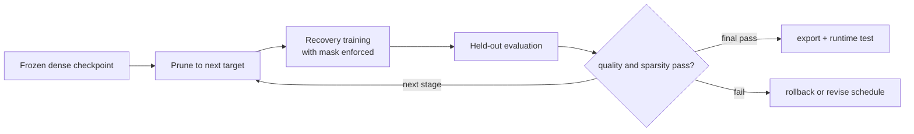

# Lesson 04 — Closing the Loop: Train, Prune, Recover, and Re-evaluate

> **Puzzle:** Why does a one-shot 70% mask often fail when the same target reached gradually can recover?

[← Chapter 02](../README.md) · [Project homepage](../../../README.md) · [Executed notebook](lab.ipynb) · [RTX 5090 result](artifacts/rtx5090-result.json)

## Why this puzzle matters

Pruning changes an optimization problem, not just a checkpoint file. The model must
absorb a perturbation while the remaining weights adapt. A closed loop records the dense
state, pruning event, recovery budget, best recovered metric, final mask, and rollback
decision instead of reporting only the target sparsity.

## Predict before reading the result

1. Predict the immediate accuracy drop after one-shot 70% pruning.
2. Predict whether staged pruning will finish with a smaller or larger recovery gap.
3. Name the artifact needed to prove that zeros did not regrow.

## 1. Start from concrete tensors and state

A synthetic but separable classification dataset, a small MLP, one dense initialization,
one-shot and staged pruning schedules, optimizer steps, masks reapplied after every
update, and held-out accuracy form the experiment.

### Three reasoning anchors

| # | Lesson-specific claim to keep visible |
|---:|---|
| 1 | Pruning is a state transition followed by constrained optimization. |
| 2 | Masks must remain enforced during recovery. |
| 3 | One-shot and gradual routes need equal initialization and declared budgets. |

## 2. Derive the mechanism

Magnitude pruning projects weights onto a sparse support. An abrupt 70% projection can
remove several co-adapted paths at once and move the loss far from the local basin. A
staged schedule introduces smaller support changes followed by recovery. Because
optimizers can regrow masked weights, the mask must be enforced after updates unless the
parameterization guarantees zeros. Fairness requires both routes to begin from the
identical dense checkpoint and consume a declared recovery budget.

### Mechanism at a glance



### Walk it step by step

1. **Freeze the dense checkpoint.** All schedules start from identical weights, data order, and optimizer conditions.
2. **Apply a declared support change.** Record which weights or structures are removed at each event.
3. **Recover under the constraint.** Reapply masks or structural constraints after updates so pruned values cannot silently regrow.
4. **Re-evaluate and decide.** Check quality, sparsity, export, and runtime gates before continuing or rolling back.

## 3. Translate the theory into an experiment

**Experiment:** Train one dense toy classifier, then compare one-shot and staged 70% pruning with equal recovery steps.

| Experimental role | Frozen definition |
|---|---|
| Baseline | one-shot 70% magnitude pruning from the frozen dense checkpoint |
| Candidate | three-stage pruning to the same target with interleaved recovery |
| Held constant | initial checkpoint, dataset, split, optimizer family, total recovery steps, seed, and final sparsity |
| Measurements | dense accuracy, immediate drop, recovered accuracy, final sparsity, and best recovery step |
| Evidence label | `pytorch-gpu` |

### Code walk-through

The lab trains one baseline and clones it before either pruning route. A mask helper
chooses the global threshold and a recovery helper reapplies the mask after every
optimizer step. Both routes consume the same total number of updates; the staged route
only changes when support is removed. This makes schedule the independent variable.

## 4. Read the checked-in RTX 5090 result

**Recorded environment:** NVIDIA GeForce RTX 5090; compute capability 12.0; PyTorch 2.12.0; CUDA runtime 13.0.

| Measured field | Checked-in value |
|---|---:|
| Dense accuracy | 93.15% |
| One-shot immediate | 90.48% |
| One-shot recovered | 91.37% |
| Gradual recovered | 91.37% |
| Final sparsity | 69.97% |

### What the numbers mean

The dense toy classifier reached 93.2%. One-shot 70% pruning changed validation accuracy
immediately to 90.5% and recovered to 91.4% after 36 updates. The staged route finished
at 91.4% with 70.0% zeros under the same update budget. This isolates the support
trajectory on one synthetic task; it is not a universal schedule ranking.

## 5. Solve the puzzle and make a decision

> A pruning result is a trajectory with a support constraint and recovery budget, not a mask applied once.

### Acceptance and rollback gate

Accept the pruned checkpoint only when held-out accuracy and sparsity both pass and the
exact dense checkpoint remains available for rollback.

### How this conclusion can fail

A toy separable dataset can favor either schedule and does not predict ImageNet
recovery. Comparing unequal training steps, learning rates, or data order also
invalidates the causal claim. The lab establishes the control-loop mechanics, not a
universal schedule ranking.

## Reproduce

From the repository root:

```bash
python3 -m venv .venv
source .venv/bin/activate
pip install torch jupyterlab nbclient nbformat
jupyter lab chapters/02-sparsity-structured-pruning/04-prune-finetune-loop/lab.ipynb
```

## Extend the experiment

Repeat with several seeds and recovery budgets, plot accuracy immediately before and
after each pruning event, and add a distillation term as a separately controlled
intervention.

## Evidence boundary

**Evidence label:** [`pytorch-gpu`](../README.md#evidence-labels).

## References

- [To Prune, or Not to Prune](https://arxiv.org/abs/1710.01878)
- [Deep Compression](https://arxiv.org/abs/1510.00149)
