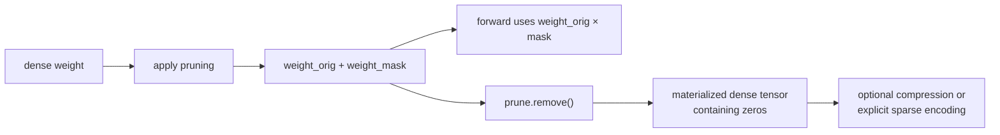

# Lesson 05 — Unstructured Magnitude Pruning Without Storage Myths

> **Puzzle:** Why can a model contain 80% zeros while its ordinary state_dict grows?

[← Chapter 02](../README.md) · [Project homepage](../../../README.md) · [Executed notebook](lab.ipynb) · [RTX 5090 result](artifacts/rtx5090-result.json)

## Why this puzzle matters

Unstructured magnitude pruning is easy to apply and useful for studying redundancy, but
PyTorch's training-time reparameterization stores the original parameter and a mask.
Logical zeros, raw checkpoint bytes, compressed bytes, and physical sparse storage are
four distinct quantities.

## Predict before reading the result

1. Predict the state_dict keys immediately after PyTorch pruning.
2. Predict whether the raw serialized bytes shrink after `prune.remove`.
3. Predict which representation gzip compresses most effectively.

## 1. Start from concrete tensors and state

The experiment uses one linear module before pruning, after `l1_unstructured`, after
`prune.remove`, and after gzip compression. It inspects parameter names, buffers, zero
rate, forward equivalence, and serialized byte counts.

### Three reasoning anchors

| # | Lesson-specific claim to keep visible |
|---:|---|
| 1 | A mask changes parameterization before it changes storage format. |
| 2 | Removing the reparameterization materializes zeros but keeps a dense tensor. |
| 3 | Raw and compressed checkpoint sizes answer different deployment questions. |

## 2. Derive the mechanism

PyTorch pruning replaces `weight` with `weight_orig` and computes `weight_orig ×
weight_mask` through a pre-hook. The dense tensors still occupy dense storage, and the
additional mask can make an uncompressed state_dict larger. `prune.remove` materializes
the masked weight and deletes the reparameterization but does not convert it to CSR or
pack nonzeros. General-purpose compression can exploit repeated zero bytes, which
explains why compressed file size may fall while raw tensor storage does not.

### Mechanism at a glance



### Walk it step by step

1. **Apply the mask.** PyTorch stores the original parameter and a mask, then computes their product through a hook.
2. **Audit logical sparsity.** Count zeros and verify forward behavior without making a storage claim.
3. **Remove the reparameterization.** Materialize the masked dense tensor and confirm state_dict keys and load behavior.
4. **Choose an actual storage format.** Compression, CSR, and backend-specific packing answer different deployment questions.

## 3. Translate the theory into an experiment

**Experiment:** Trace an 80% magnitude mask through apply, save, remove, and compressed serialization stages.

| Experimental role | Frozen definition |
|---|---|
| Baseline | the original dense linear layer state_dict |
| Candidate | PyTorch pruning reparameterization and the materialized masked weight |
| Held constant | same weight values, pruning amount, serializer, compression level, and module shape |
| Measurements | zero rate, state_dict keys, raw bytes, gzip bytes, and forward equivalence |
| Evidence label | `pytorch-gpu` |

### Code walk-through

BytesIO keeps the serialization experiment inside memory and avoids path-dependent
artifacts. The notebook records keys before and after `remove`, evaluates the module
around the transition, and compresses the same byte payload. It does not call the
resulting file a sparse runtime format.

## 4. Read the checked-in RTX 5090 result

**Recorded environment:** NVIDIA GeForce RTX 5090; compute capability 12.0; PyTorch 2.12.0; CUDA runtime 13.0.

| Measured field | Checked-in value |
|---|---:|
| Logical sparsity | 80.00% |
| Dense raw bytes | 4,195,945 bytes |
| Pruned-hook raw bytes | 8,390,501 bytes |
| Removed raw bytes | 4,195,945 bytes |
| Removed gzip bytes | 1,120,583 bytes |
| Remove max output drift | 0.000000 |

### What the numbers mean

The effective weight reached 80.0% sparsity. The hook checkpoint used keys
['weight_mask', 'weight_orig'] and occupied 8,390,501 raw bytes, while `remove` restored
a single key ['weight'] and 4,195,945 raw bytes. Gzip reduced the materialized payload
to 1,120,583 bytes. Forward drift across `remove` was 0.000e+00, proving lifecycle
equivalence but not sparse storage.

## 5. Solve the puzzle and make a decision

> Magnitude pruning creates zeros; storage compression and runtime acceleration require additional explicit representations.

### Acceptance and rollback gate

Accept the mask lifecycle only when the saved keys, zero rate, load path, and intended
deployment representation are explicitly tested.

### How this conclusion can fail

File systems and zip serialization can introduce version-dependent overhead, so tiny
tensors exaggerate metadata. Gzip size is not resident GPU memory and says nothing about
kernel speed. A deployment claiming sparse storage must identify the actual sparse
encoding and loader.

## Reproduce

From the repository root:

```bash
python3 -m venv .venv
source .venv/bin/activate
pip install torch jupyterlab nbclient nbformat
jupyter lab chapters/02-sparsity-structured-pruning/05-unstructured-magnitude-pruning/lab.ipynb
```

## Extend the experiment

Convert the materialized matrix to CSR and compare metadata plus supported operations;
then load every saved variant into a fresh process and verify outputs before
benchmarking.

## Evidence boundary

**Evidence label:** [`pytorch-gpu`](../README.md#evidence-labels).

## References

- [PyTorch pruning tutorial](https://docs.pytorch.org/tutorials/intermediate/pruning_tutorial.html)
- [Deep Compression](https://arxiv.org/abs/1510.00149)
