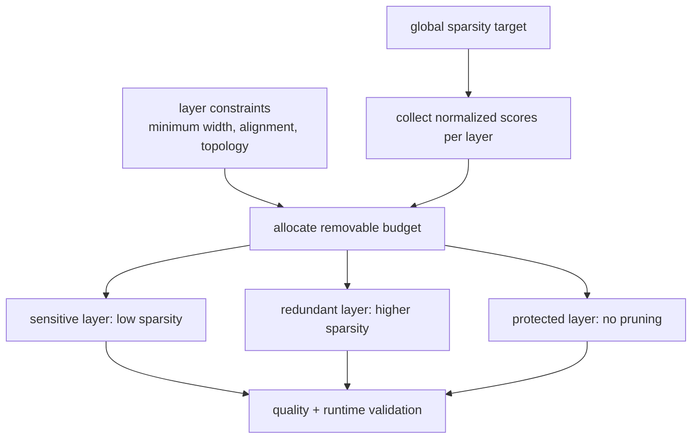

# Lesson 06 — Global Sparsity and Layer-wise Budget Allocation

> **Puzzle:** Should a fixed 50% global budget prune every layer by 50%?

[← Chapter 02](../README.md) · [Project homepage](../../../README.md) · [Executed notebook](lab.ipynb) · [RTX 5090 result](artifacts/rtx5090-result.json)

## Why this puzzle matters

Layers transform different signals and have different redundancy. A global threshold
spends zeros where weights are small, while a uniform per-layer target ignores
sensitivity. A budget table should preserve the total constraint and show why protected
or aggressive allocations were assigned.

## Predict before reading the result

1. Predict which layer will be protected by the calibration sweep.
2. Predict whether uniform and global magnitude masks use the same per-layer rates.
3. Name the quality metric and total-budget invariant required for fairness.

## 1. Start from concrete tensors and state

A three-layer MLP, calibration inputs, one global magnitude mask, a uniform 50% mask,
and a sensitivity-aware allocation are compared at equal total nonzero count using
held-out output reconstruction.

### Three reasoning anchors

| # | Lesson-specific claim to keep visible |
|---:|---|
| 1 | Global sparsity is a constraint across tensors, not a uniform policy. |
| 2 | Layer sensitivity must be measured on representative inputs. |
| 3 | Budget comparisons require equal total nonzeros. |

## 2. Derive the mechanism

For network output `f(x; W)`, a layer's pruning cost depends on downstream amplification
and the input distribution, not only its weight histogram. A first-order sensitivity
sweep can mask a small fraction in one layer at a time and measure output change.
Budgets can then be allocated inversely to observed sensitivity while solving the global
nonzero constraint. The experiment keeps total zeros equal so quality differences come
from allocation rather than extra capacity.

### Mechanism at a glance



### Walk it step by step

1. **Choose a global target.** The total zero budget is a constraint on the whole model, not a requirement that every layer reach the same rate.
2. **Normalize comparable scores.** Collect importance values under one calibration protocol and account for layer scale before ranking globally.
3. **Protect constrained layers.** Apply minimum width, divisibility, first/last-layer, residual, and hardware-alignment rules before allocating the rest.
4. **Validate the allocation.** Compare the resulting per-layer budget with uniform pruning on quality, physical structure, and the target runtime.

## 3. Translate the theory into an experiment

**Experiment:** Compare uniform, global-magnitude, and sensitivity-aware masks at the same 50% global zero budget.

| Experimental role | Frozen definition |
|---|---|
| Baseline | uniform 50% magnitude pruning in every layer |
| Candidate | global thresholding and sensitivity-aware per-layer allocation |
| Held constant | dense weights, calibration/held-out tensors, global zero count, dtype, and seed |
| Measurements | per-layer sparsity, total sparsity, held-out RMSE, cosine similarity, and calibration sensitivity |
| Evidence label | `numerical-model` |

### Code walk-through

The notebook first perturbs each layer separately to obtain a small calibration
sensitivity score. It then constructs three cloned models and checks exact total
sparsity before measuring held-out output error. The allocation heuristic is
intentionally simple; the evidence target is the budget principle, not a claim of
optimal pruning.

## 4. Read the checked-in RTX 5090 result

**Recorded environment:** NVIDIA GeForce RTX 5090; compute capability 12.0; PyTorch 2.12.0; CUDA runtime 13.0.

| Measured field | Checked-in value |
|---|---:|
| Uniform RMSE | 0.067273 |
| Global RMSE | 0.062327 |
| Aware RMSE | 0.061447 |
| Total sparsity | 50.00% |
| Most sensitive layer | 4.weight |

### What the numbers mean

All candidates used approximately 50.0% global sparsity. Held-out RMSE was 0.067273 for
uniform, 0.062327 for global magnitude, and 0.061447 for the sensitivity-adjusted
allocation. The calibration sweep identified `4.weight` as most sensitive. This
validates the budget experiment, not optimality of the heuristic.

## 5. Solve the puzzle and make a decision

> A global target needs a measured allocation rule; uniform layer rates are merely one candidate.

### Acceptance and rollback gate

Accept a layer budget only when the total constraint is exact and the ranking remains
stable on held-out data or multiple calibration slices.

### How this conclusion can fail

Using the held-out set to allocate budgets leaks evaluation. Very small calibration
batches make sensitivity noisy, and equal zero counts do not ensure equal metadata or
runtime cost across layers. Hardware-aware costs may need a different budget unit than
parameters.

## Reproduce

From the repository root:

```bash
python3 -m venv .venv
source .venv/bin/activate
pip install torch jupyterlab nbclient nbformat
jupyter lab chapters/02-sparsity-structured-pruning/06-global-layerwise-budgets/lab.ipynb
```

## Extend the experiment

Repeat the sweep across domains, optimize budgets in latency-weighted channel units, and
test whether protected early layers remain protected after recovery training.

## Evidence boundary

**Evidence label:** [`numerical-model`](../README.md#evidence-labels).

## References

- [To Prune, or Not to Prune](https://arxiv.org/abs/1710.01878)
- [PyTorch pruning tutorial](https://docs.pytorch.org/tutorials/intermediate/pruning_tutorial.html)
