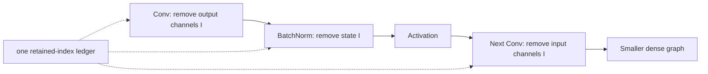

<!-- ai-infra-puzzles-header:start -->
<p align="center">
  
</p>

<h1 align="center">AI Infra Puzzles</h1>

<p align="center">
  <strong>Learn CUDA optimization and LLM inference through hands-on puzzles.</strong>
</p>
<!-- ai-infra-puzzles-header:end -->

# Lesson 07 — Filter Pruning: Making Convolution Physically Narrower

> **Puzzle:** Why does zeroing filters differ from deleting them?

[← Chapter 02](../README.md) · [Project homepage](../../../README.md) · [Executed notebook](lab.ipynb) · [RTX 5090 result](artifacts/rtx5090-result.json)

## Why this puzzle matters

A dense convolution library receives input/output channel counts, kernel size, stride,
and dtype. Setting complete filters to zero preserves those dimensions. Physical filter
pruning constructs a smaller convolution and propagates the selected channels to the
next layer, allowing ordinary dense kernels to execute less work.

## Predict before reading the result

1. Predict the output shapes of masked and physically pruned blocks.
2. Predict which candidate reduces analytical convolution work.
3. Identify the exact slice that must be applied to the second convolution.

## 1. Start from concrete tensors and state

Two consecutive convolutions form the concrete dependency. One candidate masks half of
the first layer's output filters; another physically copies the retained filters and the
matching input-channel slices of the second convolution.

### Three reasoning anchors

| # | Lesson-specific claim to keep visible |
|---:|---|
| 1 | Filter zeros preserve the dense convolution descriptor. |
| 2 | Physical pruning changes two coupled channel dimensions. |
| 3 | Equivalence should be checked before a latency claim. |

## 2. Derive the mechanism

For a convolution, leading work scales with `N × Hout × Wout × Cout × Cin × Kh × Kw`. A
zeroed filter leaves Cout unchanged in the operator descriptor. Deleting it halves the
first layer's Cout and the next layer's Cin when dependencies are propagated. Copying
the same retained weights provides an equivalence check between masked and narrowed
functions before timing.

### Mechanism at a glance



### Walk it step by step

1. **Rank output channels.** A filter score selects complete output channels, not isolated scalar weights.
2. **Slice the producer.** Remove matching Conv output filters and their bias entries.
3. **Propagate the index set.** Slice normalization state and every consuming layer's corresponding input channels.
4. **Rebuild and benchmark.** Verify graph shapes and outputs before comparing the physically narrower dense convolution.

## 3. Translate the theory into an experiment

**Experiment:** Mask and physically remove the same convolution filters, then compare equivalence, parameters, FLOPs, and CUDA latency.

| Experimental role | Frozen definition |
|---|---|
| Baseline | same-shape filter-masked two-convolution block |
| Candidate | physically narrowed block with propagated second-layer input channels |
| Held constant | input tensor, retained filter indices, copied weights, batch, spatial shape, dtype, and timing |
| Measurements | output max error, parameters, analytical FLOPs, median latency, and channel shapes |
| Evidence label | `pytorch-gpu` |

### Code walk-through

The physical model is rebuilt with smaller module dimensions and receives exact weight
slices from the masked model. Summing the retained first-layer channels into the second
layer is not approximated: the matching input-channel axis is sliced. Near-zero output
drift verifies the dependency before speed and parameter numbers are interpreted.

## 4. Read the checked-in RTX 5090 result

**Recorded environment:** NVIDIA GeForce RTX 5090; compute capability 12.0; PyTorch 2.12.0; CUDA runtime 13.0.

| Measured field | Checked-in value |
|---|---:|
| Masked parameters | 11,520 |
| Narrow parameters | 5,760 |
| FLOP reduction | 50.00% |
| Equivalence max error | 0.001953 |
| Masked median | 0.056320 ms |
| Narrow median | 0.044656 ms |

### What the numbers mean

Masking retained 11,520 parameters, while physical propagation reduced the block to
5,760 and analytical convolution work by 50.0%. The copied narrow block matched the
masked control within 1.953e-03. Median latency changed from 0.056320 to 0.044656 ms on
this shape.

## 5. Solve the puzzle and make a decision

> Filter pruning accelerates ordinary dense convolution only after channel dimensions are physically rebuilt and propagated.

### Acceptance and rollback gate

Accept structural filter pruning only when all consumer shapes are updated, functional
drift is understood, and the target runtime improves under representative spatial sizes.

### How this conclusion can fail

Selecting channels independently in adjacent convolutions breaks equivalence. BatchNorm,
residual adds, groups, and concatenations introduce additional dependencies not present
in this two-layer probe. Awkward channel counts can also reduce kernel efficiency
despite lower FLOPs.

## Reproduce

From the repository root:

```bash
python3 -m venv .venv
source .venv/bin/activate
pip install torch jupyterlab nbclient nbformat
jupyter lab chapters/02-sparsity-structured-pruning/07-filter-pruning/lab.ipynb
```

## Extend the experiment

Insert BatchNorm and a residual branch, then use a dependency graph to enumerate every
coupled slice. Sweep retained widths that align and misalign with the target convolution
backend.

## Evidence boundary

**Evidence label:** [`pytorch-gpu`](../README.md#evidence-labels).

## References

- [DepGraph paper](https://arxiv.org/abs/2301.12900)
- [Torch-Pruning reference implementation](https://github.com/VainF/Torch-Pruning)
