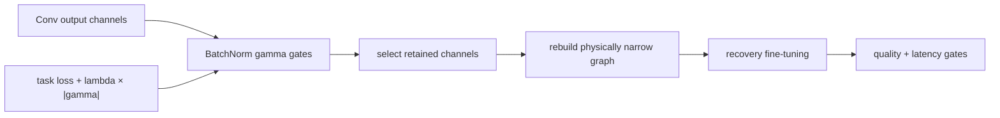

<!-- ai-infra-puzzles-header:start -->
<p align="center">
  
</p>

<h1 align="center">AI Infra Puzzles</h1>

<p align="center">
  <strong>Learn CUDA optimization and LLM inference through hands-on puzzles.</strong>
</p>
<!-- ai-infra-puzzles-header:end -->

# Lesson 08 — BatchNorm Scale Factors and Network Slimming

> **Puzzle:** When does a small BatchNorm gamma become a removable channel rather than merely a small multiplier?

[← Chapter 02](../README.md) · [Project homepage](../../../README.md) · [Executed notebook](lab.ipynb) · [RTX 5090 result](artifacts/rtx5090-result.json)

## Why this puzzle matters

Network Slimming creates a train-time ranking signal by regularizing BatchNorm scale
factors. The scale does not remove a channel by itself. Deployment still requires
selecting indices, rebuilding the producing convolution, slicing BatchNorm state, and
propagating the same indices into every consumer.

## Predict before reading the result

1. Predict whether simply zeroing gamma matches physical deletion when beta is nonzero.
2. List every BatchNorm tensor that must be sliced.
3. Predict the output drift between a properly masked control and narrowed model.

## 1. Start from concrete tensors and state

A Conv-BN-ReLU-Conv block supplies convolution filters, BatchNorm gamma/beta/running
statistics, retained channel indices, a gamma-masked control, and a physically narrowed
copy.

### Three reasoning anchors

| # | Lesson-specific claim to keep visible |
|---:|---|
| 1 | Gamma is an importance signal, not a structural deletion. |
| 2 | BatchNorm affine and running-state tensors share the channel axis. |
| 3 | Consumer weights must receive the identical retained indices. |

## 2. Derive the mechanism

BatchNorm output per channel is `y_c = gamma_c (x_c - mu_c)/sqrt(var_c+eps) + beta_c`. A
small gamma suppresses normalized variation, but beta can still contribute a constant
and downstream weights can amplify it. Ranking by `|gamma|` is therefore a pruning
heuristic learned under a sparsity regularizer. Physical removal is valid only when the
chosen channel and all coupled parameters are sliced consistently and the resulting
function is evaluated.

### Mechanism at a glance



### Walk it step by step

1. **Train channel gates.** BatchNorm gamma values receive a sparsity penalty while the network still trains with its original physical shape.
2. **Rank channels after convergence.** Use the learned gate magnitudes with minimum-width and dependency constraints, not an arbitrary mid-training snapshot.
3. **Rebuild the narrow network.** Slice convolution weights, BatchNorm state, residual partners, and consumers using one retained-index ledger.
4. **Recover and compare.** Fine-tune the physical candidate, then test quality and dense-kernel latency at the new shapes.

## 3. Translate the theory into an experiment

**Experiment:** Rank channels by gamma, create a semantics-preserving masked control, and rebuild the block at half width.

| Experimental role | Frozen definition |
|---|---|
| Baseline | gamma-masked full-width Conv-BN-ReLU-Conv block |
| Candidate | physically narrowed block using the same retained gamma-ranked channels |
| Held constant | input, retained indices, all copied Conv/BN parameters, eval mode, dtype, and timing protocol |
| Measurements | gamma threshold, retained channels, output max error, parameters, and median latency |
| Evidence label | `numerical-model` |

### Code walk-through

The notebook sets the removed channels to a neutral post-BN value in the control before
copying the retained convolution filters, BN state, and second-layer input slices. Eval
mode freezes running statistics. The equivalence check isolates structural bookkeeping
from the separate question of whether gamma ranking preserves task quality.

## 4. Read the checked-in RTX 5090 result

**Recorded environment:** NVIDIA GeForce RTX 5090; compute capability 12.0; PyTorch 2.12.0; CUDA runtime 13.0.

| Measured field | Checked-in value |
|---|---:|
| Retained channels | 12 |
| Gamma threshold | 0.635652 |
| Output max error | 0.000244 |
| Full parameters | 4,368 |
| Narrow parameters | 2,184 |
| Narrow median | 0.044560 ms |

### What the numbers mean

The gamma ranking retained 12 channels above an absolute threshold of 0.635652. After
slicing convolution and every BatchNorm state tensor, the narrow output matched the
gamma-masked control within 2.438e-04. Parameters fell from 4,368 to 2,184; ranking
quality on a real task remains unmeasured.

## 5. Solve the puzzle and make a decision

> Network Slimming turns BatchNorm scales into a ranking mechanism; deployment benefit begins only after consistent structural removal.

### Acceptance and rollback gate

Accept the ranking only after held-out quality, coupled slicing, physical width, and
runtime evidence all pass.

### How this conclusion can fail

Small gamma values can be scale-invariant with neighboring weights, and nonzero beta
breaks naive zero-gamma reasoning. Training without the intended L1 pressure may produce
an uninformative ranking. Residual and concatenation consumers need a dependency graph
beyond this local block.

## Reproduce

From the repository root:

```bash
python3 -m venv .venv
source .venv/bin/activate
pip install torch jupyterlab nbclient nbformat
jupyter lab chapters/02-sparsity-structured-pruning/08-network-slimming/lab.ipynb
```

## Extend the experiment

Train gamma with an explicit sparsity penalty, compare rankings across seeds, and
propagate selected channels through a residual model with a graph-level pruning tool.

## Evidence boundary

**Evidence label:** [`numerical-model`](../README.md#evidence-labels).

## References

- [Network Slimming](https://arxiv.org/abs/1708.06519)
- [DepGraph paper](https://arxiv.org/abs/2301.12900)
