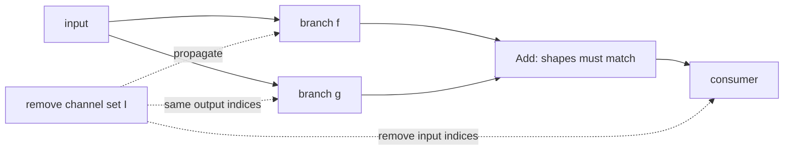

<!-- ai-infra-puzzles-header:start -->
<p align="center">
  
</p>

<h1 align="center">AI Infra Puzzles</h1>

<p align="center">
  <strong>Learn CUDA optimization and LLM inference through hands-on puzzles.</strong>
</p>
<!-- ai-infra-puzzles-header:end -->

# Lesson 09 — Residual, Concat, and Dependency-Graph Pruning

> **Puzzle:** Which tensors must change together when one residual branch loses channels?

[← Chapter 02](../README.md) · [Project homepage](../../../README.md) · [Executed notebook](lab.ipynb) · [RTX 5090 result](artifacts/rtx5090-result.json)

## Why this puzzle matters

Structural pruning becomes a graph problem at merges. Addition requires shape equality;
concatenation changes downstream channel offsets; normalization and projections carry
the same channel semantics. A local low-importance decision therefore expands into a
coupled pruning group.

## Predict before reading the result

1. Predict the exception produced by pruning only one additive branch.
2. Enumerate the tensors coupled to one output-channel deletion.
3. Explain how concat propagation differs from addition.

## 1. Start from concrete tensors and state

A two-branch residual block with Conv-BN paths, an addition, and a consumer convolution
is used. The lab records the failure from pruning one branch alone, then constructs a
synchronized narrower group.

### Three reasoning anchors

| # | Lesson-specific claim to keep visible |
|---:|---|
| 1 | Merge semantics determine dependency rules. |
| 2 | A root channel decision propagates through producers, normalization, and consumers. |
| 3 | A valid group must be checked for shape and over-pruning before mutation. |

## 2. Derive the mechanism

For `z = f(x) + g(x)`, both branch outputs must have identical shapes. Removing output
indices I from f requires a compatible transformation in g and changes the consumer's
input dimension. With concatenation, the retained index mapping is an offset union
rather than equality. Dependency graphs encode these propagation rules so one root
operation yields a complete group and can be rejected before it removes every channel.

### Mechanism at a glance



### Walk it step by step

1. **Choose a root pruning operation.** Start from one producer and a concrete retained-channel index set.
2. **Follow merge semantics.** Addition requires aligned branch outputs; concatenation requires offset-aware index mapping.
3. **Update coupled state.** Propagate through Conv, BatchNorm, residual branches, and downstream consumers as one group.
4. **Reject invalid groups before mutation.** Check dimensionality, divisibility, and over-pruning constraints, then run a forward shape audit.

## 3. Translate the theory into an experiment

**Experiment:** Trigger and capture an unsynchronized residual-shape failure, then build a synchronized narrow residual block.

| Experimental role | Frozen definition |
|---|---|
| Baseline | an invalid one-branch channel deletion caught as a diagnostic |
| Candidate | a coupled deletion across both branches, BatchNorm state, and the consumer |
| Held constant | source block, retained indices, input, eval mode, dtype, and copied parameters |
| Measurements | captured mismatch, synchronized output shape, output drift, parameters, and latency |
| Evidence label | `pytorch-gpu` |

### Code walk-through

The invalid path is wrapped in a try/except so the notebook remains successfully
executed while preserving the error message as evidence. The valid path rebuilds both
branches with the same retained indices and slices the consumer input channels. This is
a manual miniature of a dependency group.

## 4. Read the checked-in RTX 5090 result

**Recorded environment:** NVIDIA GeForce RTX 5090; compute capability 12.0; PyTorch 2.12.0; CUDA runtime 13.0.

| Measured field | Checked-in value |
|---|---:|
| Mismatch captured | yes |
| Retained channels | 8 |
| Valid output channels | 12 |
| Valid max error | 0.000460 |
| Full parameters | 1,536 |
| Narrow parameters | 768 |

### What the numbers mean

Pruning only one additive branch produced a captured shape failure: `The size of tensor
a (8) must match the size of tensor b (16) at non-singleton dimension 1`. The
synchronized group retained 8 channels across both branches, normalization state, and
the consumer; it produced 12 output channels with 4.603e-04 control drift.

## 5. Solve the puzzle and make a decision

> Structural pruning at graph merges is a coupled group operation, never an isolated tensor slice.

### Acceptance and rollback gate

Accept a structural mutation only when a graph-level forward check, group-size guard,
and downstream shape audit pass.

### How this conclusion can fail

Matching shapes does not prove semantic correctness: different branches may require
coordinated importance scores, grouped-convolution divisibility, or static attribute
updates. Dynamic control flow can also escape a trace-based dependency graph.

## Reproduce

From the repository root:

```bash
python3 -m venv .venv
source .venv/bin/activate
pip install torch jupyterlab nbclient nbformat
jupyter lab chapters/02-sparsity-structured-pruning/09-dependency-graph-pruning/lab.ipynb
```

## Extend the experiment

Install Torch-Pruning, print the group details for an equivalent block, compare them
with the manual ledger, and add a concat branch to test offset mappings.

## Evidence boundary

**Evidence label:** [`pytorch-gpu`](../README.md#evidence-labels).

## References

- [DepGraph paper](https://arxiv.org/abs/2301.12900)
- [Torch-Pruning reference implementation](https://github.com/VainF/Torch-Pruning)
