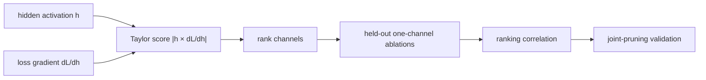

<!-- ai-infra-puzzles-header:start -->
<p align="center">
  
</p>

<h1 align="center">AI Infra Puzzles</h1>

<p align="center">
  <strong>Learn CUDA optimization and LLM inference through hands-on puzzles.</strong>
</p>
<!-- ai-infra-puzzles-header:end -->

# Lesson 10 — Taylor Importance: Ranking Channels by Loss Change

> **Puzzle:** Can a small-norm channel still have a large effect on the loss?

[← Chapter 02](../README.md) · [Project homepage](../../../README.md) · [Executed notebook](lab.ipynb) · [RTX 5090 result](artifacts/rtx5090-result.json)

## Why this puzzle matters

Magnitude sees the parameter but not the data or objective. Taylor pruning uses the
local product of an activation and its loss gradient to estimate how much removing a
channel changes the loss. The approximation is cheap enough to rank many structures
without a full retraining run for each one.

## Predict before reading the result

1. Predict whether L1 and Taylor produce identical rankings.
2. Write the first-order term for zeroing one activation channel.
3. Choose the correlation that validates each ranking against actual ablations.

## 1. Start from concrete tensors and state

A small classifier exposes one hidden activation tensor, its retained gradient,
per-channel L1 weight scores, Taylor scores, and actual held-out loss increases from
channel ablation.

### Three reasoning anchors

| # | Lesson-specific claim to keep visible |
|---:|---|
| 1 | Taylor scores are objective- and data-dependent. |
| 2 | Ablation loss change is the validation target for an importance ranking. |
| 3 | First-order scores ignore interactions and distribution shift. |

## 2. Derive the mechanism

If channel activation `h_c` is replaced by zero, first-order expansion gives `Delta L_c
≈ |∂L/∂h_c · (-h_c)|`, aggregated across samples and positions. Weight L1 instead ranks
`sum |W_c|`. Taylor incorporates the current data and loss but remains local:
interactions between channels and higher-order curvature are omitted. Correlation with
actual one-channel ablation is the direct diagnostic for this toy problem.

### Mechanism at a glance



### Walk it step by step

1. **Capture the relevant activation.** Retain the hidden channel h and its gradient under a representative calibration loss.
2. **Compute the first-order score.** Aggregate the magnitude of h times dL/dh for each channel, with the sign policy stated explicitly.
3. **Validate the ranking.** Ablate channels one at a time on held-out data and compare predicted importance with actual loss increase.
4. **Recheck after joint pruning.** Independent first-order scores can fail when several interacting channels are removed together.

## 3. Translate the theory into an experiment

**Experiment:** Compare L1 and Taylor channel rankings with exhaustive one-channel loss ablations on a held-out batch.

| Experimental role | Frozen definition |
|---|---|
| Baseline | channel ranking by outgoing/associated weight L1 magnitude |
| Candidate | channel ranking by absolute activation-gradient product |
| Held constant | trained toy classifier, calibration batch, held-out ablation batch, channel set, and loss |
| Measurements | Spearman correlation with actual loss increase, top-ranked channel, and loss deltas |
| Evidence label | `numerical-model` |

### Code walk-through

The notebook retains gradients on the hidden activation, performs one calibration
backward pass, and aggregates `|h × grad|` per channel. It then runs controlled
ablations on held-out inputs to construct the target ranking. The comparison measures
ranking agreement rather than claiming a production pruning algorithm.

## 4. Read the checked-in RTX 5090 result

**Recorded environment:** NVIDIA GeForce RTX 5090; compute capability 12.0; PyTorch 2.12.0; CUDA runtime 13.0.

| Measured field | Checked-in value |
|---|---:|
| L1 Spearman | 0.867133 |
| Taylor Spearman | 0.895105 |
| L1 top channel | 5 |
| Taylor top channel | 5 |
| Actual top channel | 7 |
| Baseline loss | 0.126262 |

### What the numbers mean

Against exhaustive held-out ablations, L1 ranking had Spearman 0.8671 and Taylor had
0.8951. Their top channels were 5 and 5, while the largest actual loss increase came
from channel 7. The result tests one local ranking on one calibration batch.

## 5. Solve the puzzle and make a decision

> Taylor importance estimates local loss sensitivity; its value is established by held-out ablation agreement, not by the formula alone.

### Acceptance and rollback gate

Accept an importance metric only if its ranking is stable across representative batches
and improves the declared quality-cost objective after pruning.

### How this conclusion can fail

One calibration batch can reverse scores, negative and positive first-order terms can
cancel depending on aggregation, and simultaneous removal invalidates
independent-channel estimates. Correlation on a tiny network does not establish ImageNet
behavior.

## Reproduce

From the repository root:

```bash
python3 -m venv .venv
source .venv/bin/activate
pip install torch jupyterlab nbclient nbformat
jupyter lab chapters/02-sparsity-structured-pruning/10-taylor-importance/lab.ipynb
```

## Extend the experiment

Repeat across batches, compare signed, absolute, and second-order approximations, then
prune several channels jointly and measure how ranking quality degrades with sparsity.

## Evidence boundary

**Evidence label:** [`numerical-model`](../README.md#evidence-labels).

## References

- [Pruning CNNs for Resource Efficient Inference](https://arxiv.org/abs/1611.06440)
- [PyTorch pruning tutorial](https://docs.pytorch.org/tutorials/intermediate/pruning_tutorial.html)
