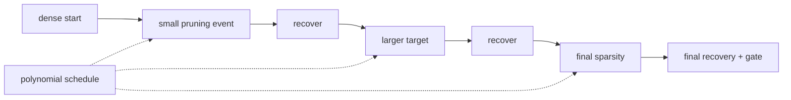

<!-- ai-infra-puzzles-header:start -->
<p align="center">
  
</p>

<h1 align="center">AI Infra Puzzles</h1>

<p align="center">
  <strong>Learn CUDA optimization and LLM inference through hands-on puzzles.</strong>
</p>
<!-- ai-infra-puzzles-header:end -->

# Lesson 11 — Gradual Pruning Schedules and Recovery Training

> **Puzzle:** What does a polynomial sparsity schedule control that a final target does not?

[← Chapter 02](../README.md) · [Project homepage](../../../README.md) · [Executed notebook](lab.ipynb) · [RTX 5090 result](artifacts/rtx5090-result.json)

## Why this puzzle matters

A target sparsity says where training should end; a schedule says how abruptly the
feasible parameter set changes. With a fixed 15% recovery budget, pruning events compete
with optimization steps, so the begin step, end step, update frequency, and
learning-rate trajectory become part of the result.

## Predict before reading the result

1. Compute the target sparsity halfway through a cubic schedule.
2. Predict which route has the largest immediate loss shock.
3. Name the schedule fields needed to reproduce a recovery trajectory.

## 1. Start from concrete tensors and state

The experiment uses one frozen dense classifier, an immediate target mask, a polynomial
target function, periodic magnitude-mask updates, identical recovery updates, and a
held-out accuracy trajectory.

### Three reasoning anchors

| # | Lesson-specific claim to keep visible |
|---:|---|
| 1 | Final sparsity does not identify the support trajectory. |
| 2 | Pruning frequency trades adaptation time against ranking refresh. |
| 3 | Learning-rate and sparsity schedules interact. |

## 2. Derive the mechanism

A common cubic schedule is `s(t)=s_f+(s_i-s_f)(1-(t-t0)/(t1-t0))^3` within the pruning
window. Early updates remove few weights and later changes taper as the target is
approached. The schedule does not guarantee recovery; it bounds the size and timing of
support shocks. Reapplying a newly ranked mask can remove previously useful weights,
while a fixed mask only trains survivors. Those policy choices must be frozen.

### Mechanism at a glance



### Walk it step by step

1. **Define the pruning window.** The begin step, end step, update frequency, and final target are part of the experiment.
2. **Compute each intermediate target.** A polynomial schedule controls how large each support shock is, not only the final sparsity.
3. **Update and enforce the mask.** Re-rank only at declared events and prevent later optimizer steps from regrowing removed weights.
4. **Read quality as a trajectory.** Compare accuracy immediately before pruning, immediately after, and after recovery—not only at the end.

## 3. Translate the theory into an experiment

**Experiment:** Compare one-shot and cubic gradual schedules under one initialization and equal optimizer-step budget.

| Experimental role | Frozen definition |
|---|---|
| Baseline | one-shot jump to 80% sparsity at the first recovery step |
| Candidate | cubic updates from 0% to 80% over the same recovery window |
| Held constant | dense checkpoint, data order, optimizer, learning rate, total steps, target rate, and mask rule |
| Measurements | target/actual sparsity trajectory, immediate loss, final accuracy, and best accuracy |
| Evidence label | `pytorch-gpu` |

### Code walk-through

The notebook records a row at each schedule update rather than only the endpoint. Both
routes clone the same baseline and execute the same number of optimizer steps. Mask
refresh and reapplication are explicit, making it possible to distinguish a schedule
failure from silent weight regrowth.

## 4. Read the checked-in RTX 5090 result

**Recorded environment:** NVIDIA GeForce RTX 5090; compute capability 12.0; PyTorch 2.12.0; CUDA runtime 13.0.

| Measured field | Checked-in value |
|---|---:|
| Dense accuracy | 88.67% |
| One-shot final accuracy | 72.67% |
| Gradual final accuracy | 74.00% |
| Target sparsity | 80.00% |
| Schedule updates | 11 |

### What the numbers mean

Both routes used 40 optimizer updates and finished near 80% sparsity. One-shot
validation accuracy ended at 72.7%, while the cubic route ended at 74.0% after 11
recorded mask updates. The retained trajectories show when each support shock occurred.

## 5. Solve the puzzle and make a decision

> Gradual pruning controls the sequence of support changes; its endpoint is insufficient to reproduce or judge recovery.

### Acceptance and rollback gate

Accept a schedule only when its complete trajectory, final support, quality recovery,
and training budget are recorded and meet the target card.

### How this conclusion can fail

A schedule can appear better simply because it prunes later and spends more steps near
the dense model. Comparing endpoints without integrating the actual sparsity trajectory
hides that advantage. Small synthetic data also makes recovery unusually cheap.

## Reproduce

From the repository root:

```bash
python3 -m venv .venv
source .venv/bin/activate
pip install torch jupyterlab nbclient nbformat
jupyter lab chapters/02-sparsity-structured-pruning/11-gradual-pruning-schedule/lab.ipynb
```

## Extend the experiment

Match candidates by area under the sparsity-time curve, sweep update frequency and
learning-rate restarts, and repeat on a downstream task metric rather than toy accuracy
alone.

## Evidence boundary

**Evidence label:** [`pytorch-gpu`](../README.md#evidence-labels).

## References

- [To Prune, or Not to Prune](https://arxiv.org/abs/1710.01878)
- [TensorFlow Model Optimization pruning guide](https://www.tensorflow.org/model_optimization/guide/pruning)
