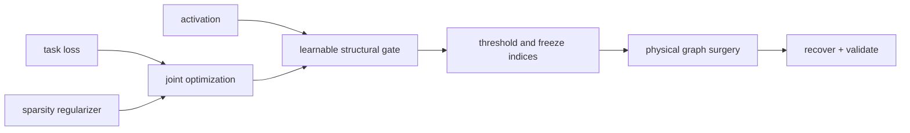

<!-- ai-infra-puzzles-header:start -->
<p align="center">
  
</p>

<h1 align="center">AI Infra Puzzles</h1>

<p align="center">
  <strong>Learn CUDA optimization and LLM inference through hands-on puzzles.</strong>
</p>
<!-- ai-infra-puzzles-header:end -->

# Lesson 12 — Sparse Regularization and Learnable Structural Gates

> **Puzzle:** Can training produce a reproducible structural ranking instead of choosing a threshold after the fact?

[← Chapter 02](../README.md) · [Project homepage](../../../README.md) · [Executed notebook](lab.ipynb) · [RTX 5090 result](artifacts/rtx5090-result.json)

## Why this puzzle matters

Learnable gates attach a continuous variable to each channel and optimize it with the
task. A sparsity penalty can separate useful and dispensable structures, but
thresholding still creates a discrete architecture and must be evaluated. Gate values,
penalty strength, temperature, and threshold belong in the artifact.

## Predict before reading the result

1. Predict whether sigmoid gates reach exact zero under an L1 penalty.
2. Predict how increasing lambda changes active channels and task loss.
3. Choose a threshold using a frozen validation objective rather than the training batch.

## 1. Start from concrete tensors and state

A frozen feature tensor, a trainable gated linear predictor, per-channel sigmoid gates,
a task loss, an L1 gate penalty, and a threshold sweep form the lab.

### Three reasoning anchors

| # | Lesson-specific claim to keep visible |
|---:|---|
| 1 | Regularization shapes a ranking but does not physically remove channels. |
| 2 | Continuous and thresholded objectives must both be reported. |
| 3 | Lambda and threshold define different parts of the sparsity trade-off. |

## 2. Derive the mechanism

With gate `g_c=sigmoid(a_c)`, a hidden feature becomes `g_c h_c`. Optimizing `L_task +
lambda sum(g_c)` trades fit against active width. Sigmoid gates rarely become exact
zeros, so deployment selects a threshold or top-k budget and physically rebuilds the
layer. The continuous optimum and discrete candidate are different models; both losses
must be measured. Gate scale can also trade with neighboring weights unless those
degrees of freedom are controlled.

### Mechanism at a glance



### Walk it step by step

1. **Attach a learnable gate.** Place one gate on the structural unit to be selected, such as a channel, head, or block.
2. **Optimize task and sparsity objectives together.** Track the task loss, regularization pressure, and gate distribution rather than only the final zero count.
3. **Freeze a discrete structure.** Choose and record a threshold, then convert soft gates into an explicit retained-index set.
4. **Remove the gated structure physically.** Rebuild and recover the model so the runtime sees smaller tensors instead of multiplying by near-zero gates.

## 3. Translate the theory into an experiment

**Experiment:** Train channel gates under two regularization strengths and evaluate a frozen threshold sweep.

| Experimental role | Frozen definition |
|---|---|
| Baseline | weak gate regularization with a mostly dense effective width |
| Candidate | stronger regularization plus discrete threshold candidates |
| Held constant | features, targets, predictor initialization, optimizer steps, thresholds, seed, and validation split |
| Measurements | gate distribution, active channels, continuous loss, thresholded loss, and selected threshold |
| Evidence label | `numerical-model` |

### Code walk-through

The feature generator deliberately makes only a subset of channels predictive. Two gate
models begin from identical logits, and the threshold sweep evaluates held-out loss
without further fitting. This isolates whether the learned ranking exposes the known
sparse structure.

## 4. Read the checked-in RTX 5090 result

**Recorded environment:** NVIDIA GeForce RTX 5090; compute capability 12.0; PyTorch 2.12.0; CUDA runtime 13.0.

| Measured field | Checked-in value |
|---|---:|
| Weak active channels | 6 |
| Strong active channels | 6 |
| Weak gate mean | 0.468424 |
| Strong gate mean | 0.259656 |
| Selected threshold | 0.200000 |
| Thresholded validation MSE | 0.019543 |

### What the numbers mean

Weak regularization left 6 gates above 0.5 with mean 0.4684; strong regularization left
6 with mean 0.2597. The frozen threshold sweep selected 0.2, 6 active channels, and
validation MSE 0.019543. Continuous gates still require physical rebuilding.

## 5. Solve the puzzle and make a decision

> Learnable gates turn structure selection into optimization, but deployment still requires a separately validated discrete architecture.

### Acceptance and rollback gate

Accept a gate-derived architecture only when threshold selection is frozen, held-out
quality passes, and the physical model reproduces the gated candidate.

### How this conclusion can fail

Jointly trainable downstream weights can absorb inverse gate scaling, making raw gates
misleading. Selecting lambda or threshold on the final test set leaks evaluation. Hard
thresholding may also remove interacting channels that looked individually small.

## Reproduce

From the repository root:

```bash
python3 -m venv .venv
source .venv/bin/activate
pip install torch jupyterlab nbclient nbformat
jupyter lab chapters/02-sparsity-structured-pruning/12-sparse-regularization-gates/lab.ipynb
```

## Extend the experiment

Add hard-concrete or top-k gates, rebuild a physical narrow layer, and test ranking
stability across seeds and task slices.

## Evidence boundary

**Evidence label:** [`numerical-model`](../README.md#evidence-labels).

## References

- [Network Slimming](https://arxiv.org/abs/1708.06519)
- [To Prune, or Not to Prune](https://arxiv.org/abs/1710.01878)
