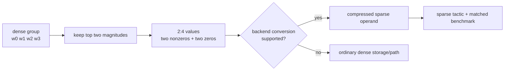

# Lesson 13 — N:M Semi-structured Sparsity and the 2:4 Contract

> **Puzzle:** Does a tensor with 50% zeros qualify for Sparse Tensor Core execution?

[← Chapter 02](../README.md) · [Project homepage](../../../README.md) · [Executed notebook](lab.ipynb) · [RTX 5090 result](artifacts/rtx5090-result.json)

## Why this puzzle matters

NVIDIA's 2:4 path imposes a local pattern: within each group of four values along the
required dimension, at least two are zero and the representation must be compressed for
a supported sparse GEMM. Global sparsity, pattern compliance, backend conversion, and
selected tactic are separate gates.

## Predict before reading the result

1. Predict the compliance of a random 50% mask.
2. Prove that top-2-of-4 masking reaches exactly 50% sparsity.
3. List the evidence needed after compliance before claiming acceleration.

## 1. Start from concrete tensors and state

A BF16 weight matrix, a random 50% mask, a magnitude-based exact 2:4 mask, a local
compliance checker, ordinary dense timing, and an optional PyTorch semi-structured
conversion probe are recorded.

### Three reasoning anchors

| # | Lesson-specific claim to keep visible |
|---:|---|
| 1 | 2:4 is checked per local group, not over the whole tensor. |
| 2 | Pattern compliance precedes backend compression and tactic selection. |
| 3 | Dense-path timing cannot establish sparse Tensor Core execution. |

## 2. Derive the mechanism

Partition the contracted dimension into groups of four and retain the two largest
magnitudes per group. This guarantees exactly 2 nonzeros per group while preserving 50%
globally. A random half mask only satisfies a fraction of groups. Even a compliant
tensor remains dense storage until converted into the backend's compressed format, and
the hardware/library combination must support its shape and dtype.

### Mechanism at a glance



### Walk it step by step

1. **Group along the contracted axis.** Reshape the supported weight dimension into consecutive groups of four.
2. **Keep exactly two values.** Top-2 magnitude selection creates 50% global sparsity and 100% local 2:4 compliance.
3. **Convert to the backend representation.** A compliant dense tensor is not yet a cuSPARSELt or TensorRT sparse operand.
4. **Prove the selected tactic.** Validate output, capture the sparse operator or tactic, and compare with a matched dense baseline.

## 3. Translate the theory into an experiment

**Experiment:** Compare random and exact 2:4 masks, then attempt a native semi-structured conversion without hiding incompatibility.

| Experimental role | Frozen definition |
|---|---|
| Baseline | random global 50% sparsity executed through ordinary dense matmul |
| Candidate | exact magnitude 2:4 sparsity plus an optional native conversion probe |
| Held constant | source weights, shape, dtype, input, zero budget, GPU, and timing protocol |
| Measurements | global sparsity, local compliance, dense-path latency, conversion availability, and conversion error |
| Evidence label | `compatibility-probe` |

### Code walk-through

The compliance function reshapes the K dimension into groups of four and counts
nonzeros. The native conversion attempt is wrapped and stores either a successful sparse
result or the exact exception text. Ordinary dense timing remains a control and is never
relabeled as a sparse-kernel benchmark.

## 4. Read the checked-in RTX 5090 result

**Recorded environment:** NVIDIA GeForce RTX 5090; compute capability 12.0; PyTorch 2.12.0; CUDA runtime 13.0.

| Measured field | Checked-in value |
|---|---:|
| Random-mask compliance | 37.45% |
| 2:4 compliance | 100.00% |
| 2:4 sparsity | 50.00% |
| Dense baseline median | 0.018544 ms |
| 2:4 dense-path median | 0.018512 ms |
| Native conversion | no |

### What the numbers mean

Random 50% masking achieved 37.4% local compliance, while top-2-of-4 reached 100.0% at
50.0% sparsity. Ordinary dense-path medians were 0.018544 and 0.018512 ms. Native
semi-structured conversion success was False; the retained probe message is
`RuntimeError: cuSPARSELt not supported on your machine.`.

## 5. Solve the puzzle and make a decision

> Exact 2:4 values are a necessary data invariant; native representation and tactic evidence complete the execution claim.

### Acceptance and rollback gate

Accept a 2:4 speed claim only after compliance, supported compression, a sparse operator
trace, numerical validation, and a matched dense baseline all pass.

### How this conclusion can fail

Zeros can be arranged along the wrong axis, shapes can violate alignment, and a library
can fall back to dense tactics. A failed PyTorch conversion on one stack does not imply
the GPU lacks all 2:4 support; it bounds only that API path.

## Reproduce

From the repository root:

```bash
python3 -m venv .venv
source .venv/bin/activate
pip install torch jupyterlab nbclient nbformat
jupyter lab chapters/02-sparsity-structured-pruning/13-nm-2-4-sparsity/lab.ipynb
```

## Extend the experiment

Run the same compliant weights through cuSPARSELt or TensorRT, retain build logs and
kernel names, and sweep supported shapes and FP16/BF16/INT8 dtypes.

## Evidence boundary

**Evidence label:** [`compatibility-probe`](../README.md#evidence-labels).

## References

- [NVIDIA cuSPARSELt documentation](https://docs.nvidia.com/cuda/cusparselt/)
- [TensorRT sparsity requirements](https://docs.nvidia.com/deeplearning/tensorrt/latest/inference-library/data-formats-tensors.html)
