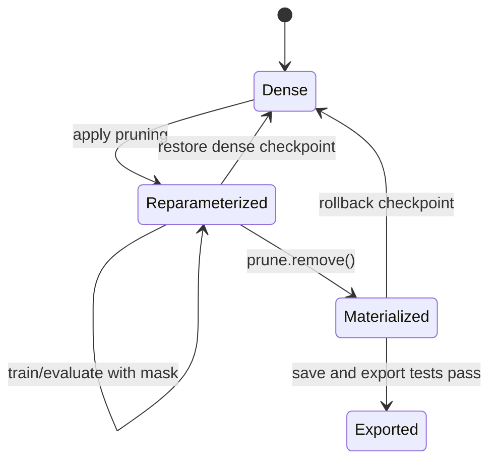

# Lesson 14 — PyTorch Pruning API and the Complete Mask Lifecycle

> **Puzzle:** What changes in a module before and after `prune.remove`, and what must a rollback loader know?

[← Chapter 02](../README.md) · [Project homepage](../../../README.md) · [Executed notebook](lab.ipynb) · [RTX 5090 result](artifacts/rtx5090-result.json)

## Why this puzzle matters

PyTorch pruning is a reparameterization lifecycle: apply a method, combine or update
masks, train while preserving the mask, serialize the expected keys, optionally
materialize with `remove`, and verify loading. Confusing a hook-based checkpoint with a
materialized one breaks reproducibility.

## Predict before reading the result

1. Predict parameter and buffer names after the first mask.
2. Predict sparsity after two iterative 25% pruning calls.
3. Predict whether `remove` restores the deleted weights.

## 1. Start from concrete tensors and state

One CUDA linear layer is inspected at five points: dense, first mask, iterated mask,
optimizer update, and removal. Named parameters, buffers, forward pre-hooks, sparsity,
and output drift are captured.

### Three reasoning anchors

| # | Lesson-specific claim to keep visible |
|---:|---|
| 1 | Parameter and buffer names encode the checkpoint lifecycle stage. |
| 2 | Iterative masks compose rather than reset by default. |
| 3 | Removal makes pruning permanent in a dense parameter. |

## 2. Derive the mechanism

After pruning, `weight_orig` is a parameter and `weight_mask` a buffer; the visible
`weight` is computed before forward. Iterative pruning combines masks through a pruning
container. Gradients update `weight_orig`, so effective masked values remain zero at
forward even when underlying values change. `remove` replaces this pair with a
materialized `weight` parameter and deletes the hook; it does not undo pruning.

### Mechanism at a glance



### Walk it step by step

1. **Inspect the module before pruning.** Record parameter names, buffers, hooks, and the exact checkpoint identity.
2. **Apply a pruning method.** The API installs weight_orig, weight_mask, and a forward pre-hook.
3. **Train or evaluate with the mask active.** Audit optimizer behavior and ensure the effective weight preserves the intended zeros.
4. **Finalize deliberately.** Use prune.remove when a materialized dense zero tensor is desired, then separately test save, load, export, and rollback.

## 3. Translate the theory into an experiment

**Experiment:** Apply iterative PyTorch masks, take a training step, remove the reparameterization, and audit every state transition.

| Experimental role | Frozen definition |
|---|---|
| Baseline | dense module and single-mask state |
| Candidate | iteratively pruned, trained, and materialized module |
| Held constant | module, optimizer rule, input/target, pruning calls, seed, and inspection points |
| Measurements | effective sparsity, parameter names, buffer names, hook count, loss, and removal drift |
| Evidence label | `pytorch-gpu` |

### Code walk-through

The notebook queries public module inspection APIs rather than inferring state from
printed tensors. It records the effective weight before and after an optimizer step,
then compares forward output immediately around `remove`. This produces a
loader-oriented lifecycle trace.

## 4. Read the checked-in RTX 5090 result

**Recorded environment:** NVIDIA GeForce RTX 5090; compute capability 12.0; PyTorch 2.12.0; CUDA runtime 13.0.

| Measured field | Checked-in value |
|---|---:|
| First-mask sparsity | 25.00% |
| Iterated sparsity | 43.75% |
| Parameters before remove | bias,weight_orig |
| Buffers before remove | weight_mask |
| Hooks before remove | 1 |
| Remove max drift | 0.000000 |

### What the numbers mean

The first call produced 25.0% sparsity and the second composed to 43.8%. Before removal,
parameters were `bias,weight_orig`, buffers were `weight_mask`, and 1 pre-hook was
active. `remove` left drift 0.000e+00 and restored a materialized `weight` parameter.

## 5. Solve the puzzle and make a decision

> PyTorch masks are auditable training state; `remove` materializes them but does not create a sparse runtime format.

### Acceptance and rollback gate

Accept a checkpoint only when its expected lifecycle stage, key schema, load procedure,
mask policy, and rollback artifact are documented and tested.

### How this conclusion can fail

Loading a hook checkpoint into a plain module yields missing or unexpected keys.
Optimizer state can point at reparameterized objects. Removing too early can allow zeros
to regrow during later unconstrained training. These are state-management failures, not
pruning-score failures.

## Reproduce

From the repository root:

```bash
python3 -m venv .venv
source .venv/bin/activate
pip install torch jupyterlab nbclient nbformat
jupyter lab chapters/02-sparsity-structured-pruning/14-pytorch-mask-lifecycle/lab.ipynb
```

## Extend the experiment

Save and reload both lifecycle variants in fresh modules, test optimizer resume, and add
a schema version to the structured artifact.

## Evidence boundary

**Evidence label:** [`pytorch-gpu`](../README.md#evidence-labels).

## References

- [PyTorch pruning tutorial](https://docs.pytorch.org/tutorials/intermediate/pruning_tutorial.html)
- [PyTorch reproducibility notes](https://docs.pytorch.org/docs/stable/notes/randomness.html)
