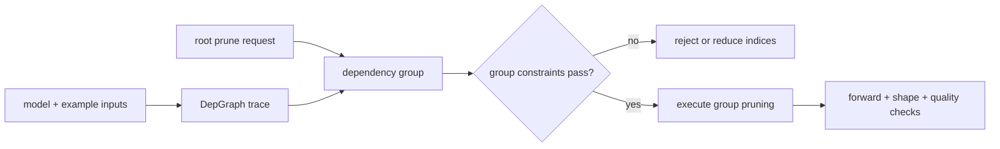

# Lesson 15 — Torch-Pruning DepGraph: A Structured-Pruning Compatibility Lab

> **Puzzle:** Can a dependency graph identify every tensor coupled to one channel deletion on this environment?

[← Chapter 02](../README.md) · [Project homepage](../../../README.md) · [Executed notebook](lab.ipynb) · [RTX 5090 result](artifacts/rtx5090-result.json)

## Why this puzzle matters

DepGraph turns a local root operation into a pruning group. That is precisely the
bookkeeping manual structural pruning tends to miss. A credible lab must distinguish the
graph concept, a manual CUDA control, and whether the optional Torch-Pruning package
executed successfully on the recorded stack.

## Predict before reading the result

1. Predict which modules join a group rooted at the first convolution.
2. Predict the result when the optional package is absent.
3. State what must be saved after module shapes are mutated.

## 1. Start from concrete tensors and state

A residual mini-network, one channel index set, a manually synchronized narrow copy, an
import/version probe, and—when available—a real `DependencyGraph` group are the concrete
objects.

### Three reasoning anchors

| # | Lesson-specific claim to keep visible |
|---:|---|
| 1 | DepGraph groups coupled pruning operations from a root decision. |
| 2 | Example inputs and enabled autograd define the traced dependency path. |
| 3 | Package compatibility evidence is distinct from manual structural correctness. |

## 2. Derive the mechanism

Torch-Pruning traces an example forward with autograd enabled, then maps a root pruning
function through module and tensor dependencies. Group validation prevents deleting an
entire dimension. The package mutates module structure, so saving a plain
dense-definition state_dict is insufficient unless architecture metadata is
reconstructed. The manual control proves expected shape propagation independently of
package availability.

### Mechanism at a glance



### Walk it step by step

1. **Trace with representative inputs.** Dependency discovery must see the operators, merges, and shapes used by the intended execution path.
2. **Request one root pruning action.** Choose a layer, pruning function, and concrete index set rather than editing tensors directly.
3. **Inspect the generated group.** Review every coupled operation and reject a group that violates minimum channels, grouping, or model interfaces.
4. **Execute and validate the mutation.** Run forward, parameter, shape, export, and quality checks before treating the DepGraph result as usable.

## 3. Translate the theory into an experiment

**Experiment:** Build a real DepGraph group when available and always execute a manual CUDA structural-control path.

| Experimental role | Frozen definition |
|---|---|
| Baseline | manual synchronized pruning ledger for a residual mini-network |
| Candidate | Torch-Pruning dependency group and mutation when the package is available |
| Held constant | model, example input, root module, channel indices, eval mode, and GPU |
| Measurements | package availability/version, group validity/size, output shape, parameters, and caught exception |
| Evidence label | `compatibility-probe` |

### Code walk-through

The notebook first runs the manual control so the lesson remains informative on a
minimal PyTorch installation. It then probes `torch_pruning`, builds the graph without
`no_grad`, requests a pruning group, validates it, and records group detail instead of
converting import failure into a successful backend claim.

## 4. Read the checked-in RTX 5090 result

**Recorded environment:** NVIDIA GeForce RTX 5090; compute capability 12.0; PyTorch 2.12.0; CUDA runtime 13.0.

| Measured field | Checked-in value |
|---|---:|
| Torch-Pruning available | no |
| Group built | no |
| Group valid | no |
| Manual output channels | 6 |
| Manual parameters | 368 |
| Probe message | torch_pruning not installed |

### What the numbers mean

The manual dependency control reduced the model from 552 to 368 parameters and produced
6 output channels. Torch-Pruning availability was False; group built/valid were
False/False. This is a bounded compatibility result when the optional package is absent.

## 5. Solve the puzzle and make a decision

> A dependency graph is valuable when its real group, mutation, and save/load path are observed—not when its name appears in a plan.

### Acceptance and rollback gate

Accept the automated route only when the group is valid, forward and quality checks
pass, and the mutated architecture has a tested save/load contract.

### How this conclusion can fail

A successful trace can miss data-dependent control flow or static attributes used
outside tensor operations. A package import proves nothing about a specific model group.
Conversely, package absence does not falsify the DepGraph method; it only leaves that
native path unexecuted.

## Reproduce

From the repository root:

```bash
python3 -m venv .venv
source .venv/bin/activate
pip install torch jupyterlab nbclient nbformat
jupyter lab chapters/02-sparsity-structured-pruning/15-depgraph-structured-pruning/lab.ipynb
```

This lesson's optional/native backend path requires:

```bash
pip install torch-pruning
```

## Extend the experiment

Install the pinned Torch-Pruning version, run the notebook again, compare printed group
operations with the manual ledger, and test whole-model serialization and reload.

## Evidence boundary

**Evidence label:** [`compatibility-probe`](../README.md#evidence-labels).

## References

- [Torch-Pruning reference implementation](https://github.com/VainF/Torch-Pruning)
- [DepGraph paper](https://arxiv.org/abs/2301.12900)
