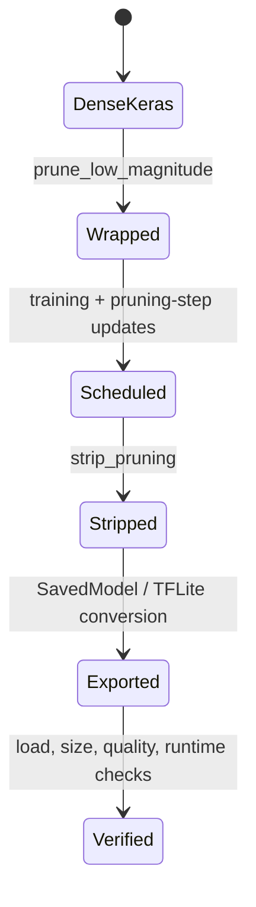

<!-- ai-infra-puzzles-header:start -->
<p align="center">
  
</p>

<h1 align="center">AI Infra Puzzles</h1>

<p align="center">
  <strong>Learn CUDA optimization and LLM inference through hands-on puzzles.</strong>
</p>
<!-- ai-infra-puzzles-header:end -->

# Lesson 16 — TensorFlow MOT and the Keras Pruning/Export Lifecycle

> **Puzzle:** Why can training-time Keras sparsity fail to reduce a deployable TFLite artifact?

[← Chapter 02](../README.md) · [Project homepage](../../../README.md) · [Executed notebook](lab.ipynb) · [RTX 5090 result](artifacts/rtx5090-result.json)

## Why this puzzle matters

TensorFlow Model Optimization wraps Keras layers with masks, thresholds, and
pruning-step state. Export requires updating the pruning step during training, reaching
the schedule, stripping wrappers, converting, and checking the final representation.
This environment may not provide TensorFlow, so availability is an explicit result
rather than an excuse for invented output.

## Predict before reading the result

1. Predict the target sparsity before, during, and after a polynomial window.
2. Predict what `strip_pruning` removes and what it retains.
3. List the artifacts required before claiming a TFLite size benefit.

## 1. Start from concrete tensors and state

The lab records TensorFlow and TFMOT package availability, evaluates the polynomial
schedule formula on CUDA, constructs the required lifecycle state machine, and runs a
tiny native strip/export probe only when dependencies exist.

### Three reasoning anchors

| # | Lesson-specific claim to keep visible |
|---:|---|
| 1 | Schedule progress depends on optimizer steps and update callbacks. |
| 2 | Stripping removes training wrappers, not necessarily dense storage. |
| 3 | TensorFlow/TFMOT availability is part of reproducible backend evidence. |

## 2. Derive the mechanism

Polynomial decay controls target sparsity by optimizer step. Wrappers contain
training-only variables and callbacks update their step. `strip_pruning` removes
wrappers while retaining sparse weights; it does not guarantee a smaller uncompressed
format or a sparse-accelerated runtime. TFLite conversion and optional compression are
separate gates. A native experiment must therefore preserve versions, wrapper state,
stripped model, converted bytes, and output parity.

### Mechanism at a glance



### Walk it step by step

1. **Wrap the model before training.** The pruning wrapper owns masks and schedule state; it is not equivalent to a permanently smaller Keras layer.
2. **Advance the pruning step.** Callbacks or explicit updates must keep the schedule synchronized with optimizer steps.
3. **Strip training-only wrappers.** After training, materialize the masked weights and remove wrapper state before export.
4. **Verify the deployment artifact.** Load the stripped model, convert to the target format, and measure compressed size and runtime behavior separately.

## 3. Translate the theory into an experiment

**Experiment:** Probe the Keras pruning stack and execute the schedule/lifecycle contract without fabricating a missing native backend.

| Experimental role | Frozen definition |
|---|---|
| Baseline | CUDA-evaluated polynomial schedule and an unstripped lifecycle state |
| Candidate | native TFMOT wrapper/strip probe when available, otherwise a bounded compatibility result |
| Held constant | environment, schedule endpoints, steps, target rate, lifecycle transitions, and seed |
| Measurements | package availability, schedule values, native probe status, and lifecycle gates |
| Evidence label | `compatibility-probe` |

### Code walk-through

The notebook uses the published polynomial form to produce deterministic target rates
and checks that strip/export cannot be marked complete before training and wrapper
removal. Conditional imports keep missing packages in a structured field. No Keras
latency or TFLite size number is synthesized when the stack is absent.

## 4. Read the checked-in RTX 5090 result

**Recorded environment:** NVIDIA GeForce RTX 5090; compute capability 12.0; PyTorch 2.12.0; CUDA runtime 13.0.

| Measured field | Checked-in value |
|---|---:|
| TensorFlow available | no |
| TFMOT available | no |
| Mid-schedule sparsity | 70.00% |
| Final schedule sparsity | 80.00% |
| Native probe executed | no |
| Lifecycle ready | no |

### What the numbers mean

The cubic schedule moved from 0.0% at step 10 to 70.0% at step 30 and 80.0% at step 50.
TensorFlow/TFMOT availability was False/False, so native wrapper stripping
executed=False. Missing native stages remain false rather than inferred.

## 5. Solve the puzzle and make a decision

> Keras pruning is a versioned train-strip-convert lifecycle; a missing native stack must remain visibly unexecuted.

### Acceptance and rollback gate

Accept a Keras pruning delivery only after native training, `UpdatePruningStep`,
`strip_pruning`, TFLite conversion, output parity, and target-device measurement all
pass.

### How this conclusion can fail

A numerical schedule is not a TensorFlow execution. Installing TensorFlow without a
compatible GPU stack may move compute to CPU. A stripped model can retain dense tensors
with zeros, and zip compression can be confused with runtime memory savings.

## Reproduce

From the repository root:

```bash
python3 -m venv .venv
source .venv/bin/activate
pip install torch jupyterlab nbclient nbformat
jupyter lab chapters/02-sparsity-structured-pruning/16-keras-pruning-lifecycle/lab.ipynb
```

This lesson's optional/native backend path requires:

```bash
pip install tensorflow tensorflow-model-optimization
```

## Extend the experiment

Run the notebook in a pinned TensorFlow/TFMOT environment, retain wrapper and stripped
summaries, convert to TFLite, and benchmark the exact target device.

## Evidence boundary

**Evidence label:** [`compatibility-probe`](../README.md#evidence-labels).

## References

- [TensorFlow Model Optimization pruning guide](https://www.tensorflow.org/model_optimization/guide/pruning)
- [TensorFlow strip_pruning API](https://www.tensorflow.org/model_optimization/api_docs/python/tfmot/sparsity/keras/strip_pruning)
