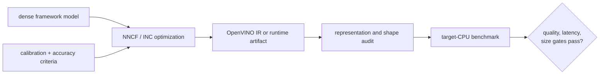

# Lesson 17 — OpenVINO, NNCF, and Intel Runtime Sparsity

> **Puzzle:** Why can a generic sparse checkpoint miss the optimized CPU path?

[← Chapter 02](../README.md) · [Project homepage](../../../README.md) · [Executed notebook](lab.ipynb) · [RTX 5090 result](artifacts/rtx5090-result.json)

## Why this puzzle matters

CPU deployment benefit depends on a pattern, graph transformation, precision, and
operator implementation supported by the target OpenVINO/oneDNN stack. NNCF or Intel
Neural Compressor configuration is part of the executable artifact; a PyTorch zero rate
alone is not.

## Predict before reading the result

1. Predict which package probes succeed in the recorded GPU environment.
2. Explain why physically narrower shapes remain useful without a sparse CPU kernel.
3. List the CPU-specific fields needed for a fair benchmark.

## 1. Start from concrete tensors and state

The notebook probes OpenVINO, NNCF, and Neural Compressor packages, creates unstructured
and filter-pruned controls on CUDA, and records a deployment gate matrix without
asserting CPU speed from GPU evidence.

### Three reasoning anchors

| # | Lesson-specific claim to keep visible |
|---:|---|
| 1 | Framework zeros are not an OpenVINO execution plan. |
| 2 | Filter removal and unstructured encoding expose different CPU opportunities. |
| 3 | GPU control results cannot substitute for CPU runtime measurements. |

## 2. Derive the mechanism

Unstructured zeros preserve dense tensor dimensions unless a sparse encoding and sparse
operator are selected. NNCF filter pruning can propagate structural changes and export a
smaller graph, while post-training sparsity tools may target runtime-specific patterns.
CPU SIMD utilization, threading, cache behavior, and quantization interact with width.
Therefore the correct handoff includes model format, pattern, runtime version, thread
settings, and operator log.

### Mechanism at a glance



### Walk it step by step

1. **Choose the CPU runtime first.** OpenVINO, NNCF, and Intel Neural Compressor support different models, sparsity patterns, and optimization workflows.
2. **Optimize with representative data.** Calibration or accuracy-aware tuning must use the same preprocessing and task contract as the baseline.
3. **Inspect the exported representation.** Verify IR or serialized size, shapes, precision, and whether the runtime preserved a useful sparse pattern.
4. **Benchmark on the target CPU.** Pin threads, cores, batch, warm-up, and latency mode; a GPU-side zero pattern is not CPU performance evidence.

## 3. Translate the theory into an experiment

**Experiment:** Probe Intel compression/runtime packages and contrast value sparsity with physical width under a bounded evidence label.

| Experimental role | Frozen definition |
|---|---|
| Baseline | same-shape unstructured zero mask represented as a dense PyTorch tensor |
| Candidate | physically narrower dense control and optional OpenVINO/NNCF native path |
| Held constant | source tensor, zero budget, input, environment, package names, and decision gates |
| Measurements | package availability, logical sparsity, physical width, output drift, and native-run status |
| Evidence label | `compatibility-probe` |

### Code walk-through

The experiment keeps its CUDA numerical control separate from the package matrix.
Conditional imports record exact availability; the conclusion remains `not_run` for
OpenVINO performance unless a native model conversion and CPU workload execute. This
prevents a generic pruning result from being laundered into an Intel deployment claim.

## 4. Read the checked-in RTX 5090 result

**Recorded environment:** NVIDIA GeForce RTX 5090; compute capability 12.0; PyTorch 2.12.0; CUDA runtime 13.0.

| Measured field | Checked-in value |
|---|---:|
| OpenVINO available | no |
| NNCF available | no |
| Neural Compressor available | no |
| Logical sparsity | 75.00% |
| Physical width reduction | 75.00% |
| Native CPU run | no |

### What the numbers mean

The dense-value control reached 75.0% logical sparsity without changing its 1024-wide
output; the physical control changed width to 256. OpenVINO/NNCF/Neural Compressor
availability was False/False/False. No CPU latency is reported because no native CPU
path executed.

## 5. Solve the puzzle and make a decision

> Intel sparsity is a runtime-specific graph and kernel decision; CUDA zeros provide only a numerical control.

### Acceptance and rollback gate

Accept an Intel deployment only after conversion, graph inspection, CPU thread pinning,
quality parity, and repeated target-CPU latency/throughput evidence.

### How this conclusion can fail

Package presence is weaker than operator support, and a laptop CPU result may not
transfer to the production SKU. A narrow channel count can hurt vector alignment, while
unstructured compression can reduce disk size without runtime benefit.

## Reproduce

From the repository root:

```bash
python3 -m venv .venv
source .venv/bin/activate
pip install torch jupyterlab nbclient nbformat
jupyter lab chapters/02-sparsity-structured-pruning/17-cpu-runtime-sparsity/lab.ipynb
```

This lesson's optional/native backend path requires:

```bash
pip install openvino nncf neural-compressor
```

## Extend the experiment

Create a pinned OpenVINO/NNCF environment, export both candidates, inspect IR dimensions
and operators, then benchmark several thread and batch settings on the actual CPU
target.

## Evidence boundary

**Evidence label:** [`compatibility-probe`](../README.md#evidence-labels).

## References

- [OpenVINO model optimization guide](https://docs.openvino.ai/2023.3/openvino_docs_model_optimization_guide.html)
- [NNCF reference implementation](https://github.com/openvinotoolkit/nncf)
