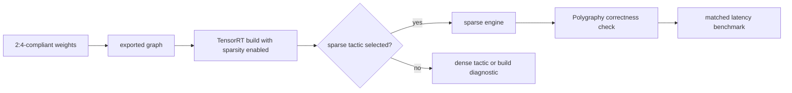

<!-- ai-infra-puzzles-header:start -->
<p align="center">
  
</p>

<h1 align="center">AI Infra Puzzles</h1>

<p align="center">
  <strong>Learn CUDA optimization and LLM inference through hands-on puzzles.</strong>
</p>
<!-- ai-infra-puzzles-header:end -->

# Lesson 18 — TensorRT Sparse Deployment and Polygraphy Evidence

> **Puzzle:** What must the build log show before `--sparsity=enable` becomes an acceleration claim?

[← Chapter 02](../README.md) · [Project homepage](../../../README.md) · [Executed notebook](lab.ipynb) · [RTX 5090 result](artifacts/rtx5090-result.json)

## Why this puzzle matters

TensorRT evaluates structured-sparsity eligibility and tactic profitability. A
2:4-compliant ONNX weight plus a sparsity flag makes a layer eligible; the builder can
still select a dense tactic. Polygraphy can help inspect and transform models, but only
engine logs and matched benchmarks establish execution.

## Predict before reading the result

1. Predict whether a compliant weight alone proves a sparse tactic ran.
2. List the log lines and numerical checks required for acceptance.
3. Explain why forced pruning must be treated as a new model candidate.

## 1. Start from concrete tensors and state

The lab creates a compliant convolution/linear-style weight, checks pattern and dtype
gates, probes TensorRT and Polygraphy packages plus `trtexec`, and produces an
eligibility-versus-selection matrix.

### Three reasoning anchors

| # | Lesson-specific claim to keep visible |
|---:|---|
| 1 | Eligibility and tactic selection are separate log events. |
| 2 | Forcing a pattern is a model mutation that needs quality validation. |
| 3 | The engine version, flags, profiles, and timing cache identify the build. |

## 2. Derive the mechanism

TensorRT's structured sparsity requires the documented local weight pattern and
supported FP16 or INT8 execution. The builder reports eligible layers separately from
layers for which sparse tactics are chosen. `--sparsity=force` style mutation changes
weights and therefore quality; enable mode should consume already compliant weights.
Strong typing, shapes, workspace, and version influence tactic search.

### Mechanism at a glance



### Walk it step by step

1. **Validate the source weights.** Prove 2:4 compliance on the correct axis before engine construction.
2. **Export without destroying the contract.** Retain the supported dtype, shape, and weight layout through ONNX or the builder input.
3. **Inspect build evidence.** Capture TensorRT and Polygraphy logs, tactic selection, and any dense fallback reason.
4. **Benchmark the built engine.** Compare numerical outputs and latency against an engine built from the frozen dense baseline.

## 3. Translate the theory into an experiment

**Experiment:** Build the full pre-engine eligibility ledger and probe native TensorRT/Polygraphy tools on the RTX 5090 host.

| Experimental role | Frozen definition |
|---|---|
| Baseline | 2:4-compliant BF16/FP16 weight and dense PyTorch numerical control |
| Candidate | native TensorRT build/tactic path when packages and `trtexec` are available |
| Held constant | weight, grouping axis, dtype gate, environment, package probes, and required build fields |
| Measurements | 2:4 compliance, dtype eligibility, TensorRT/Polygraphy/trtexec availability, and native engine status |
| Evidence label | `compatibility-probe` |

### Code walk-through

The notebook can prove the data-side invariant on CUDA and can prove whether native
tools exist. It cannot infer a TensorRT engine from PyTorch timing. The gate dictionary
leaves engine build and sparse-tactic selection false unless those events actually
occur.

## 4. Read the checked-in RTX 5090 result

**Recorded environment:** NVIDIA GeForce RTX 5090; compute capability 12.0; PyTorch 2.12.0; CUDA runtime 13.0.

| Measured field | Checked-in value |
|---|---:|
| 2:4 compliance | 100.00% |
| Dtype eligible | yes |
| TensorRT available | no |
| Polygraphy available | no |
| trtexec available | no |
| Sparse engine built | no |

### What the numbers mean

The weight passed 100.0% of exact 2:4 groups at 50.0% sparsity and used an eligible
dtype=True. TensorRT/Polygraphy/trtexec availability was False/False/False. Because no
engine was built, sparse tactic selection remains false.

## 5. Solve the puzzle and make a decision

> TensorRT sparsity is proven by eligibility, selected tactic, correctness, and benchmark evidence—not by a flag.

### Acceptance and rollback gate

Accept TensorRT sparsity only with a valid engine, explicit eligible and selected
sparse-tactic logs, output parity, and matched dense/sparse engine benchmarks.

### How this conclusion can fail

A builder flag can be ignored by ineligible layers or lose tactic search to a faster
dense kernel. Dynamic profiles may select different tactics, and a successful build on
A100 does not establish behavior on RTX 5090.

## Reproduce

From the repository root:

```bash
python3 -m venv .venv
source .venv/bin/activate
pip install torch jupyterlab nbclient nbformat
jupyter lab chapters/02-sparsity-structured-pruning/18-tensorrt-sparsity-gates/lab.ipynb
```

This lesson's optional/native backend path requires:

```bash
pip install tensorrt polygraphy
```

## Extend the experiment

Use a TensorRT-enabled container, export the compliant model, retain Polygraphy
inspection plus verbose build logs, and benchmark every production optimization profile.

## Evidence boundary

**Evidence label:** [`compatibility-probe`](../README.md#evidence-labels).

## References

- [TensorRT sparsity requirements](https://docs.nvidia.com/deeplearning/tensorrt/latest/inference-library/data-formats-tensors.html)
- [NVIDIA cuSPARSELt documentation](https://docs.nvidia.com/cuda/cusparselt/)
