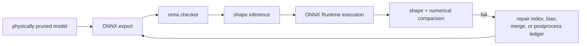

# Lesson 19 — ONNX Export, Graph Repair, and Shape Consistency

> **Puzzle:** Can a pruned PyTorch model run correctly while its exported graph carries inconsistent channel metadata?

[← Chapter 02](../README.md) · [Project homepage](../../../README.md) · [Executed notebook](lab.ipynb) · [RTX 5090 result](artifacts/rtx5090-result.json)

## Why this puzzle matters

Physical pruning changes dimensions across weights, bias, normalization, reshape,
concat, and post-processing nodes. ONNX export success only serializes the traced path;
checker, shape inference, ONNX Runtime parity, and explicit dimension audits establish a
deployable graph.

## Predict before reading the result

1. Predict the output channel dimension after the physical slice.
2. Explain what ONNX shape inference can and cannot establish.
3. Choose a parity tolerance for the independent runtime output.

## 1. Start from concrete tensors and state

A small physically pruned multi-input model is exported in memory/on disk, checked with
ONNX, passed through shape inference, executed with ONNX Runtime when available, and
compared with CUDA/PyTorch output.

### Three reasoning anchors

| # | Lesson-specific claim to keep visible |
|---:|---|
| 1 | Export, checker, inference, and runtime parity are distinct gates. |
| 2 | Physical channel changes must reach initializers and consumer shapes. |
| 3 | Dynamic symbols do not excuse inconsistent known dimensions. |

## 2. Derive the mechanism

Static tensor shapes encode known dimensions while dynamic axes use symbolic parameters.
Shape inference propagates what operator schemas can prove but cannot resolve every
data-dependent reshape. `onnx.checker.check_model(..., full_check=True)` validates graph
structure and types; ONNX Runtime supplies an independent execution path. After channel
deletion, every initializer and consumer dimension must agree with the new graph
contract.

### Mechanism at a glance



### Walk it step by step

1. **Build an index ledger.** For every removed channel, record the affected weight, bias, normalization, merge, and consumer dimensions.
2. **Export the structural candidate.** Use representative inputs and explicit dynamic-axis rules instead of treating export success as validation.
3. **Run graph checks in order.** Apply ONNX checker, shape inference, and a runtime execution with known inputs.
4. **Compare semantics.** Match output names, shapes, and numerical values with the framework candidate before accepting the graph.

## 3. Translate the theory into an experiment

**Experiment:** Export a physically pruned CUDA model, run ONNX checker and shape inference, and compare ONNX Runtime output.

| Experimental role | Frozen definition |
|---|---|
| Baseline | PyTorch output and declared pruned shape ledger |
| Candidate | checked/inferred ONNX graph plus ONNX Runtime execution |
| Held constant | weights, retained indices, inputs, opset, dynamic-axis policy, dtype, and tolerance |
| Measurements | export status, checker status, inferred shapes, initializer dimensions, runtime status, and max error |
| Evidence label | `native-backend` |

### Code walk-through

The notebook writes the ONNX model into the lesson artifact directory, invokes full
checking, records inferred value shapes, and runs the same inputs through ONNX Runtime.
Exceptions are caught into structured fields, but success requires every gate and
numerical parity rather than export alone.

## 4. Read the checked-in RTX 5090 result

**Recorded environment:** NVIDIA GeForce RTX 5090; compute capability 12.0; PyTorch 2.12.0; CUDA runtime 13.0.

| Measured field | Checked-in value |
|---|---:|
| ONNX available | yes |
| Export succeeded | yes |
| Checker passed | yes |
| Shape inference passed | yes |
| ORT executed | yes |
| ORT max error | 0.000000 |
| ONNX bytes | 1,722 bytes |

### What the numbers mean

ONNX export/checker/shape-inference gates were True/True/True; ONNX Runtime
executed=True with max error 5.960e-08. The graph occupied 1,722 bytes and retained the
physical width 7 through both input projections and the output consumer.

## 5. Solve the puzzle and make a decision

> A pruned ONNX graph is deliverable only after structural checks and independent runtime parity confirm the new shape contract.

### Acceptance and rollback gate

Accept the exported graph only when checker, shape inference audit, initializer
dimensions, and target-runtime parity all pass.

### How this conclusion can fail

Tracer warnings and constant folding can hide data-dependent behavior. Shape inference
may remain partial, and ONNX Runtime success does not guarantee TensorRT support.
Multi-profile production shapes must be tested separately.

## Reproduce

From the repository root:

```bash
python3 -m venv .venv
source .venv/bin/activate
pip install torch jupyterlab nbclient nbformat
jupyter lab chapters/02-sparsity-structured-pruning/19-onnx-shape-consistency/lab.ipynb
```

This lesson's optional/native backend path requires:

```bash
pip install onnx onnxruntime
```

## Extend the experiment

Add dynamic batch and sequence axes, deliberately corrupt one initializer to verify the
audit fails, then test the repaired graph in the final deployment runtime.

## Evidence boundary

**Evidence label:** [`native-backend`](../README.md#evidence-labels).

## References

- [ONNX checker API](https://onnx.ai/onnx/api/checker.html)
- [ONNX shape inference](https://onnx.ai/onnx/repo-docs/ShapeInference.html)
