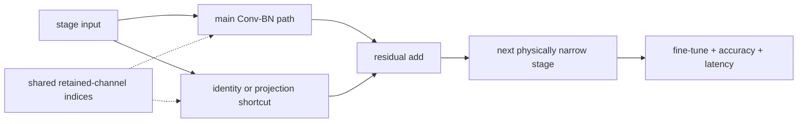

# Lesson 20 — CNN Case Study: ResNet Channel Pruning

> **Puzzle:** Why can a ResNet-like block lose parameters without reaching the expected throughput?

[← Chapter 02](../README.md) · [Project homepage](../../../README.md) · [Executed notebook](lab.ipynb) · [RTX 5090 result](artifacts/rtx5090-result.json)

## Why this puzzle matters

Residual networks tie channel width to additions and projection shortcuts. A safe case
study must rebuild a whole stage-compatible block, preserve the add contract, update the
classifier or downstream consumer, and benchmark several batches. The percentage of
removed channels is only the starting point.

## Predict before reading the result

1. Predict every module dimension changed by halving the stage width.
2. Predict whether the percentage FLOP and latency reductions match exactly.
3. Choose batch-specific gates for interactive and throughput services.

## 1. Start from concrete tensors and state

A compact ResNet-style stem, residual block with projection, global pooling, and
classifier is built in full and narrow variants. Weights are copied by retained indices
where functions align, and structural FLOPs, parameters, output error, and latency are
measured.

### Three reasoning anchors

| # | Lesson-specific claim to keep visible |
|---:|---|
| 1 | Residual additions impose equal output widths. |
| 2 | Stage pruning propagates into later layers and the classifier. |
| 3 | FLOP reduction and throughput gain need separate measurements. |

## 2. Derive the mechanism

Within a basic residual block, both the main path's final convolution and shortcut
projection produce the same channel count. Narrowing the stage changes subsequent
convolutions and classifier input. FLOPs fall roughly with channel products, but latency
also depends on convolution algorithm, memory layout, launch overhead, and batch. A
batch-1 result and a batch-64 throughput result answer different deployment questions.

### Mechanism at a glance



### Walk it step by step

1. **Select channels per residual stage.** A ResNet channel decision must respect main-path and shortcut output compatibility at every addition.
2. **Propagate indices through the block.** Slice Conv, BatchNorm, projection shortcuts, and downstream input channels as a coupled transformation.
3. **Rebuild from the retained-index ledger.** Update module dimensions explicitly so parameter and FLOP reductions are physical and inspectable.
4. **Recover and benchmark end to end.** Fine-tune from the dense checkpoint, evaluate accuracy, and time the target image workload rather than one convolution only.

## 3. Translate the theory into an experiment

**Experiment:** Construct full and half-width ResNet-like models and compare structure, parity control, batch-1 latency, and batch-64 throughput.

| Experimental role | Frozen definition |
|---|---|
| Baseline | full-width ResNet-style stage |
| Candidate | physically half-width stage with synchronized main, shortcut, and classifier dimensions |
| Held constant | input resolution, stem, depth, retained indices, dtype, GPU, warm-up, repetitions, and batches |
| Measurements | parameters, analytical convolution/linear FLOPs, batch-1 latency, batch-64 throughput, and output drift |
| Evidence label | `pytorch-gpu` |

### Code walk-through

The model is intentionally small enough for a repeatable notebook while preserving the
dependency pattern that makes ResNet pruning nonlocal. Structural counters read actual
module shapes. Timing uses the same CUDA-event helper at both batches; the notebook does
not project ImageNet Top-1 or ResNet-50 speed from this mini-network.

## 4. Read the checked-in RTX 5090 result

**Recorded environment:** NVIDIA GeForce RTX 5090; compute capability 12.0; PyTorch 2.12.0; CUDA runtime 13.0.

| Measured field | Checked-in value |
|---|---:|
| Full parameters | 20,650 |
| Narrow parameters | 5,466 |
| FLOP reduction | 73.94% |
| Batch-1 full median | 0.121744 ms |
| Batch-1 narrow median | 0.095600 ms |
| Batch-64 speedup | 1.007x |

### What the numbers mean

Halving stage width reduced parameters from 20,650 to 5,466 and analytical work by
73.9%. Batch-1 medians were 0.121744 versus 0.095600 ms; batch-64 measured a 1.007x
ratio. Random weights make this a systems/shape case study, not a Top-1 result.

## 5. Solve the puzzle and make a decision

> ResNet channel pruning is a stage-level graph transformation whose benefit must be measured at each target workload.

### Acceptance and rollback gate

Accept a ResNet pruning candidate only when stage dependencies, task quality, target
batches, and end-to-end runtime all pass against the exact baseline revision.

### How this conclusion can fail

Toy random weights make output drift a bookkeeping signal rather than a quality score.
Widths can cross library-alignment thresholds, and data loading or post-processing can
dominate a production service. A small block cannot prove ResNet-50 throughput.

## Reproduce

From the repository root:

```bash
python3 -m venv .venv
source .venv/bin/activate
pip install torch jupyterlab nbclient nbformat
jupyter lab chapters/02-sparsity-structured-pruning/20-resnet-channel-pruning/lab.ipynb
```

## Extend the experiment

Apply the same ledger to a pretrained torchvision ResNet, calibrate importance on real
data, fine-tune, and profile operator shapes at production batches.

## Evidence boundary

**Evidence label:** [`pytorch-gpu`](../README.md#evidence-labels).

## References

- [Deep Residual Learning for Image Recognition](https://arxiv.org/abs/1512.03385)
- [DepGraph paper](https://arxiv.org/abs/2301.12900)
