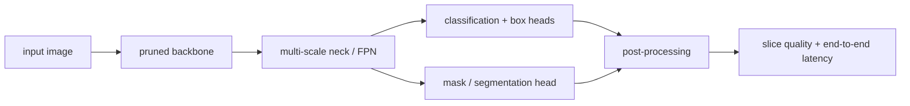

<!-- ai-infra-puzzles-header:start -->
<p align="center">
  
</p>

<h1 align="center">AI Infra Puzzles</h1>

<p align="center">
  <strong>Learn CUDA optimization and LLM inference through hands-on puzzles.</strong>
</p>
<!-- ai-infra-puzzles-header:end -->

# Lesson 21 — Safe Pruning for Detection and Segmentation

> **Puzzle:** Can an unchanged average metric hide a large regression on small objects or a rare mask class?

[← Chapter 02](../README.md) · [Project homepage](../../../README.md) · [Executed notebook](lab.ipynb) · [RTX 5090 result](artifacts/rtx5090-result.json)

## Why this puzzle matters

Detection and segmentation heads consume multi-scale features, and business risk is
rarely uniform across sizes and classes. A pruning candidate can preserve an aggregate
proxy while degrading the feature-pyramid level responsible for small objects. Safety
therefore requires slice metrics and per-branch budgets.

## Predict before reading the result

1. Predict which pyramid branch is most sensitive for the small-object proxy.
2. Construct an example where mean error falls but worst-slice error rises.
3. Choose both aggregate and slice-level rollback gates.

## 1. Start from concrete tensors and state

A three-scale feature-pyramid toy head, synthetic large/medium/small targets, a
uniform-pruning candidate, a protected-high-resolution candidate, and per-slice
reconstruction errors form the controlled lab.

### Three reasoning anchors

| # | Lesson-specific claim to keep visible |
|---:|---|
| 1 | Multi-scale branches have different semantic responsibilities. |
| 2 | Aggregate quality can pass while a protected slice fails. |
| 3 | Risk-weighted budgets require explicit slice thresholds. |

## 2. Derive the mechanism

High-resolution pyramid features carry more spatial positions and often serve small
objects. If aggregate loss weights every tensor element or sample uniformly, a large
branch can dominate or a rare slice can disappear in the mean. Define `E_slice`
separately and an acceptance rule such as `max slice regression <= tau` in addition to
aggregate change. Budget allocation then becomes risk-weighted rather than purely
parameter-weighted.

### Mechanism at a glance



### Walk it step by step

1. **Map the whole task graph.** Detection and segmentation couple backbone features to neck scales, heads, anchors, masks, and post-processing dimensions.
2. **Protect task-sensitive interfaces.** Keep feature pyramid channel agreements, spatial resolutions, class outputs, and mask geometry valid.
3. **Evaluate task slices.** Measure small, medium, and large objects or class and boundary slices—not only an aggregate score.
4. **Include pre- and post-processing.** The deployment gate uses end-to-end latency because NMS, resizing, and mask decoding may dominate after pruning.

## 3. Translate the theory into an experiment

**Experiment:** Compare uniform channel pruning with a high-resolution-protected budget at equal total retained channels.

| Experimental role | Frozen definition |
|---|---|
| Baseline | uniform pruning across three feature-pyramid branches |
| Candidate | risk-weighted pruning that protects the high-resolution/small-object branch |
| Held constant | feature tensors, targets, total retained-channel budget, head weights, seed, and slice definitions |
| Measurements | aggregate error, large/medium/small slice error, worst-slice regression, and retained channels |
| Evidence label | `numerical-model` |

### Code walk-through

The notebook constructs target outputs so each slice depends most strongly on its
corresponding scale. Both candidates spend the same total channel budget, but allocate
it differently. Reporting every slice next to the aggregate exposes whether the
protected policy trades average error for a safer worst case.

## 4. Read the checked-in RTX 5090 result

**Recorded environment:** NVIDIA GeForce RTX 5090; compute capability 12.0; PyTorch 2.12.0; CUDA runtime 13.0.

| Measured field | Checked-in value |
|---|---:|
| Uniform aggregate RMSE | 3.688635 |
| Protected aggregate RMSE | 2.925958 |
| Uniform small-slice RMSE | 5.187524 |
| Protected small-slice RMSE | 2.448860 |
| Worst uniform slice | small |
| Total retained channels | 36 |

### What the numbers mean

Both policies retained 36 channels across three branches. Uniform allocation produced
aggregate RMSE 3.688635 and small-slice RMSE 5.187524; protecting the high-resolution
branch produced 2.925958 and 2.448860, respectively. The per-slice table—not the
aggregate alone—determines whether the risk trade is acceptable.

## 5. Solve the puzzle and make a decision

> Safe pruning treats the worst critical slice as a first-class constraint rather than trusting an aggregate metric.

### Acceptance and rollback gate

Accept only when aggregate detection/segmentation quality and every business-critical
size/class slice stay within frozen thresholds.

### How this conclusion can fail

A synthetic reconstruction proxy is not COCO AP, mask AP, recall, or calibration. Slice
definitions chosen after observing failures can overfit the report. Feature channels
also interact across the neck and head in real architectures.

## Reproduce

From the repository root:

```bash
python3 -m venv .venv
source .venv/bin/activate
pip install torch jupyterlab nbclient nbformat
jupyter lab chapters/02-sparsity-structured-pruning/21-detection-segmentation-safety/lab.ipynb
```

## Extend the experiment

Run the policy on a real detector with COCO `AP`, `AP_S`, `AP_M`, `AP_L`, class recall,
and mask metrics, then bind each gate to a rollback action.

## Evidence boundary

**Evidence label:** [`numerical-model`](../README.md#evidence-labels).

## References

- [COCO evaluation](https://cocodataset.org/#detection-eval)
- [DepGraph paper](https://arxiv.org/abs/2301.12900)
