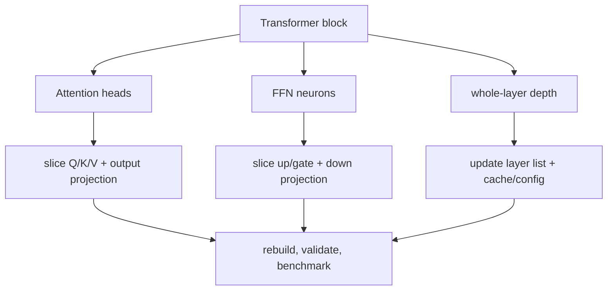

<!-- ai-infra-puzzles-header:start -->
<p align="center">
  
</p>

<h1 align="center">AI Infra Puzzles</h1>

<p align="center">
  <strong>Learn CUDA optimization and LLM inference through hands-on puzzles.</strong>
</p>
<!-- ai-infra-puzzles-header:end -->

# Lesson 22 — Pruning Transformer Heads, FFN Neurons, and Layers

> **Puzzle:** Which structural unit changes Transformer compute rather than only masking values?

[← Chapter 02](../README.md) · [Project homepage](../../../README.md) · [Executed notebook](lab.ipynb) · [RTX 5090 result](artifacts/rtx5090-result.json)

## Why this puzzle matters

Attention heads, FFN intermediate neurons, hidden dimensions, and whole layers are
different dependency units. Masking a head preserves the packed QKV and output
projection shapes, while physically reducing FFN width changes dense GEMMs. Whole-layer
removal changes depth and residual composition. Each route needs its own quality and
latency evidence.

## Predict before reading the result

1. Predict which candidate changes physical parameter count.
2. Estimate the relative attention and FFN work for the chosen S, D, and D_ff.
3. Predict which route has the largest output drift before recovery.

## 1. Start from concrete tensors and state

A compact pre-norm Transformer block exposes head outputs, an FFN intermediate,
residuals, and a two-block stack. The lab compares a head mask, a half-width physical
FFN, and layer skipping under one CUDA workload.

### Three reasoning anchors

| # | Lesson-specific claim to keep visible |
|---:|---|
| 1 | A head mask is not automatically a narrower attention operator. |
| 2 | FFN width directly controls two dense matrix multiplications. |
| 3 | Layer pruning changes depth and residual transformations. |

## 2. Derive the mechanism

For sequence length S and hidden width D, attention projections scale roughly with `S
D²` and score/value work with `S² D`; FFN work scales with `S D D_ff`. Removing a
logical head but retaining packed D-wide projections may leave most work unchanged.
Halving D_ff directly reduces two GEMM dimensions. Removing a block deletes both
attention and FFN work but creates a larger functional perturbation. Structural claims
must specify which dimensions changed.

### Mechanism at a glance



### Walk it step by step

1. **Choose the structural unit.** Attention heads, hidden channels, FFN neurons, and full layers change different dimensions and interfaces.
2. **Propagate coupled dimensions.** Head removal affects Q/K/V and output projection slices; FFN removal couples up and down projections.
3. **Rebuild the executable graph.** Config fields, cache shapes, residual dimensions, and exported metadata must agree with the new structure.
4. **Measure the remaining bottleneck.** A smaller attention block may not improve end-to-end latency when FFN, memory traffic, or launch overhead dominates.

## 3. Translate the theory into an experiment

**Experiment:** Measure head masking, physical FFN narrowing, and whole-layer skipping in a compact CUDA Transformer.

| Experimental role | Frozen definition |
|---|---|
| Baseline | full block/stack and same-shape attention-head masking |
| Candidate | physically narrowed FFN and one-layer-shorter stack |
| Held constant | weights where comparable, input, sequence length, batch, hidden width, dtype, eval mode, and timing |
| Measurements | physical parameters, output RMSE/cosine, median latency, and theoretical work components |
| Evidence label | `pytorch-gpu` |

### Code walk-through

The block returns a head-mask path without rewriting packed projections, making its
unchanged physical shape visible. The FFN candidate copies selected intermediate
rows/columns into smaller linear modules. Layer skipping reuses the first block output.
These controls keep three pruning units conceptually separate.

## 4. Read the checked-in RTX 5090 result

**Recorded environment:** NVIDIA GeForce RTX 5090; compute capability 12.0; PyTorch 2.12.0; CUDA runtime 13.0.

| Measured field | Checked-in value |
|---|---:|
| Full parameters | 49,984 |
| FFN-narrow parameters | 33,472 |
| Head-mask RMSE | 0.037988 |
| FFN-narrow RMSE | 0.146989 |
| Layer-skip RMSE | 0.227471 |
| Full median | 0.153360 ms |
| FFN-narrow median | 0.211440 ms |

### What the numbers mean

Masking two of four heads preserved 49,984 parameters and measured 0.159792 ms versus
0.153360 ms for the full block. Physical FFN narrowing reduced parameters to 33,472,
measured 0.211440 ms, and introduced RMSE 0.146989. Layer skipping had RMSE 0.227471
before recovery.

## 5. Solve the puzzle and make a decision

> Transformer pruning must name the structural unit and prove its physical compute path; masks alone are insufficient.

### Acceptance and rollback gate

Accept a Transformer structure only after task/perplexity gates and a runtime trace
confirm that the intended dimensions or depth changed.

### How this conclusion can fail

Random weights do not reveal head redundancy. Fused attention kernels may require fixed
head dimensions or grouped-query layouts, and KV-cache shape couples attention structure
to serving memory. Layer removal can shift normalization statistics and generation
behavior.

## Reproduce

From the repository root:

```bash
python3 -m venv .venv
source .venv/bin/activate
pip install torch jupyterlab nbclient nbformat
jupyter lab chapters/02-sparsity-structured-pruning/22-transformer-structure-pruning/lab.ipynb
```

## Extend the experiment

Repeat on a pretrained encoder or decoder, evaluate task quality/perplexity and KV-cache
bytes, and use a backend with explicit variable-head or narrowed-FFN support.

## Evidence boundary

**Evidence label:** [`pytorch-gpu`](../README.md#evidence-labels).

## References

- [Are Sixteen Heads Really Better than One?](https://arxiv.org/abs/1905.10650)
- [DepGraph paper](https://arxiv.org/abs/2301.12900)
