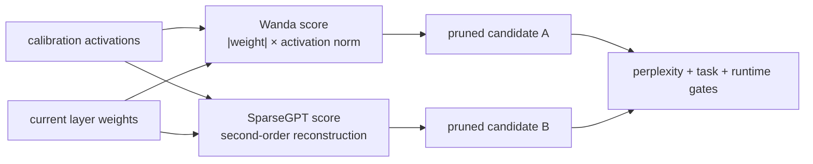

# Lesson 23 — One-shot LLM Pruning: SparseGPT and Wanda Mechanisms

> **Puzzle:** Why should calibration activations change which LLM weights survive?

[← Chapter 02](../README.md) · [Project homepage](../../../README.md) · [Executed notebook](lab.ipynb) · [RTX 5090 result](artifacts/rtx5090-result.json)

## Why this puzzle matters

One-shot LLM pruning must choose a support without full retraining. Magnitude ignores
input usage; Wanda combines weight magnitude with activation norms; SparseGPT uses
second-order reconstruction information and sequential compensation. A small layer can
expose these objectives without pretending to reproduce a 70B run.

## Predict before reading the result

1. Predict how rescaling one input feature changes Wanda but not magnitude ranking.
2. Explain what the diagonal-curvature proxy omits from SparseGPT.
3. Choose calibration and held-out splits for a fair one-shot comparison.

## 1. Start from concrete tensors and state

A wide linear projection, calibration tokens with deliberately uneven feature scales,
held-out tokens, magnitude scores, Wanda scores, a diagonal-curvature proxy, and
equal-sparsity reconstructed outputs form the lab.

### Three reasoning anchors

| # | Lesson-specific claim to keep visible |
|---:|---|
| 1 | Calibration activations define feature importance for one-shot pruning. |
| 2 | Wanda scoring and SparseGPT compensation are not the same algorithm. |
| 3 | Toy layer reconstruction cannot establish 70B perplexity or speed. |

## 2. Derive the mechanism

For `Y=XW^T`, Wanda scores weight `w_ij` by `|w_ij| ||X_:j||`, so a modest weight on a
frequently excited feature may outrank a larger unused weight. SparseGPT instead
minimizes layer reconstruction with an approximate Hessian and updates remaining weights
as columns are pruned. A diagonal `X^T X` proxy can illustrate sensitivity but omits the
inverse-Hessian sequential algorithm. Equal sparsity and held-out output error are
required for comparison.

### Mechanism at a glance



### Walk it step by step

1. **Freeze a representative calibration set.** Both methods depend on the activations seen during layer-wise pruning.
2. **Compute method-specific scores.** Wanda combines weight magnitude and activation norms; SparseGPT uses a second-order reconstruction approximation.
3. **Prune one layer and propagate activations.** Later layers must receive outputs from the already-pruned prefix.
4. **Evaluate beyond perplexity.** Compare sparsity, perplexity, zero-shot tasks, runtime representation, and actual inference performance separately.

## 3. Translate the theory into an experiment

**Experiment:** Compare magnitude, Wanda, and diagonal-curvature masks at identical 50% sparsity on held-out layer outputs.

| Experimental role | Frozen definition |
|---|---|
| Baseline | plain magnitude one-shot pruning |
| Candidate | Wanda activation-aware scoring and a diagonal-curvature sensitivity proxy |
| Held constant | weights, calibration tokens, held-out tokens, sparsity, grouping policy, and seed |
| Measurements | held-out RMSE, cosine similarity, support overlap, sparsity, and calibration feature scales |
| Evidence label | `numerical-model` |

### Code walk-through

The notebook constructs calibration features with unequal energy so activation-aware
methods have a measurable signal. Each scoring rule retains the same number of weights
per row. Output metrics are computed on separate held-out tokens. The artifact
explicitly labels the curvature route a proxy rather than SparseGPT.

## 4. Read the checked-in RTX 5090 result

**Recorded environment:** NVIDIA GeForce RTX 5090; compute capability 12.0; PyTorch 2.12.0; CUDA runtime 13.0.

| Measured field | Checked-in value |
|---|---:|
| Magnitude RMSE | 20.097502 |
| Wanda RMSE | 4.029922 |
| Curvature-proxy RMSE | 6.004300 |
| Magnitude cosine | 0.962958 |
| Wanda cosine | 0.998537 |
| Support overlap | 66.47% |

### What the numbers mean

At 50.0% sparsity, magnitude/Wanda/curvature-proxy held-out RMSE values were
20.097502/4.029922/6.004300. Magnitude and Wanda retained-support overlap was 66.5%
under a 100x calibration feature-scale range. The curvature score is a diagonal
OBS-style proxy, not SparseGPT's sequential algorithm.

## 5. Solve the puzzle and make a decision

> Activation-aware support selection can reduce one-shot reconstruction error, but official algorithms and full-model evidence remain separate gates.

### Acceptance and rollback gate

Accept an LLM pruning method only after frozen calibration, full-model
perplexity/zero-shot gates, serialization, and a supported sparse inference path are
measured.

### How this conclusion can fail

Calibration domains can bias activation norms, and per-row toy masks omit blockwise
sequential compensation. Lower layer RMSE may not preserve generation, rare
capabilities, or safety. Unstructured zeros may still run dense.

## Reproduce

From the repository root:

```bash
python3 -m venv .venv
source .venv/bin/activate
pip install torch jupyterlab nbclient nbformat
jupyter lab chapters/02-sparsity-structured-pruning/23-sparsegpt-wanda/lab.ipynb
```

## Extend the experiment

Run official SparseGPT and Wanda implementations on a pinned open model, sweep
calibration domains and sparsity patterns, then benchmark a named sparse runtime
separately from quality.

## Evidence boundary

**Evidence label:** [`numerical-model`](../README.md#evidence-labels).

## References

- [SparseGPT](https://arxiv.org/abs/2301.00774)
- [Wanda](https://arxiv.org/abs/2306.11695)
