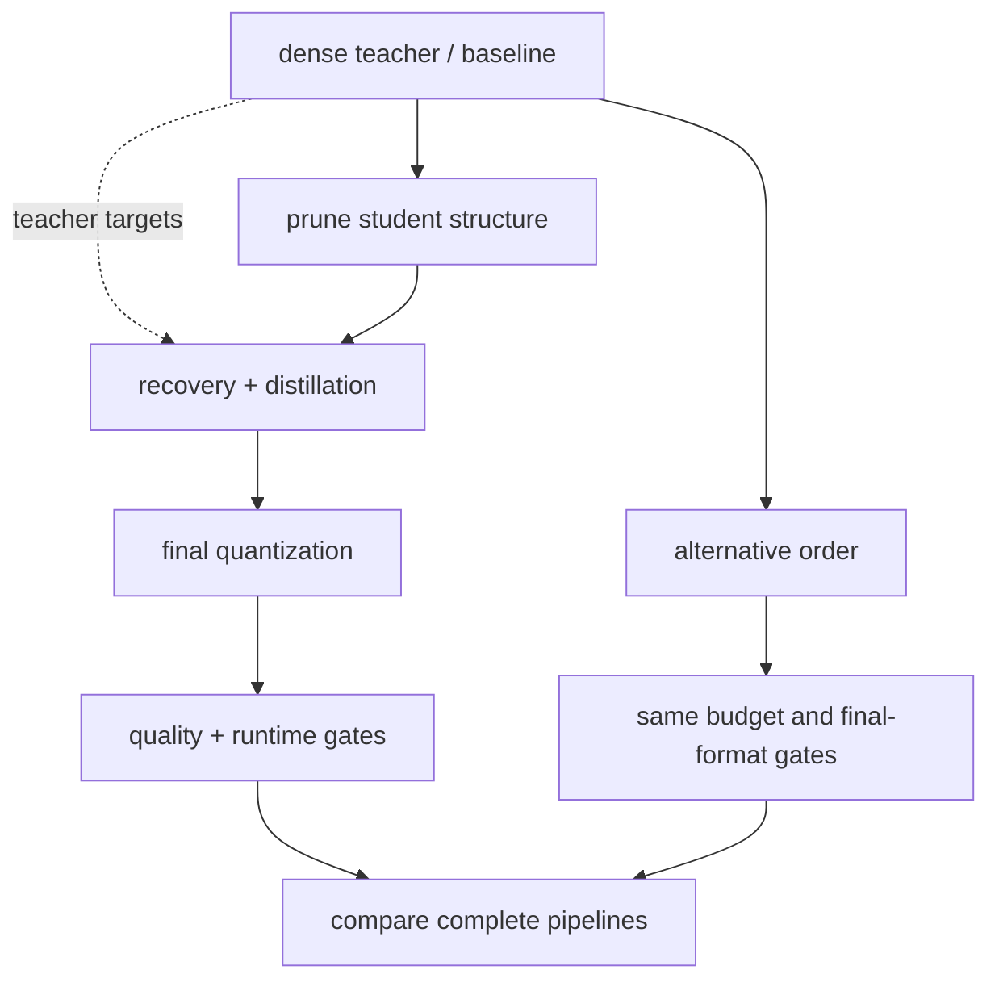

<!-- ai-infra-puzzles-header:start -->
<p align="center">
  
</p>

<h1 align="center">AI Infra Puzzles</h1>

<p align="center">
  <strong>Learn CUDA optimization and LLM inference through hands-on puzzles.</strong>
</p>
<!-- ai-infra-puzzles-header:end -->

# Lesson 24 — Ordering Distillation, Quantization, and Pruning

> **Puzzle:** Does pruning before calibration produce the same quantized model as pruning after calibration?

[← Chapter 02](../README.md) · [Project homepage](../../../README.md) · [Executed notebook](lab.ipynb) · [RTX 5090 result](artifacts/rtx5090-result.json)

## Why this puzzle matters

Compression operators do not generally commute. Pruning changes distributions and
structure; quantization freezes scales or codebooks; distillation changes the recovery
objective. A combination roadmap should compare explicit orders at the same
storage/compute budget rather than concatenating technique names.

## Predict before reading the result

1. Predict whether dense-calibrated and prune-calibrated INT8 scales match.
2. Write the two operator compositions and identify their different state.
3. Choose when a teacher loss should observe the compressed student.

## 1. Start from concrete tensors and state

A linear teacher, student weight, calibration inputs, held-out inputs, magnitude
pruning, symmetric INT8 fake quantization, two operator orders, and an optional short
distillation recovery are compared.

### Three reasoning anchors

| # | Lesson-specific claim to keep visible |
|---:|---|
| 1 | Pruning and calibrated quantization are generally non-commutative. |
| 2 | Every order needs its own calibration and recovery protocol. |
| 3 | Combination fairness requires equal final budgets and held-out metrics. |

## 2. Derive the mechanism

Let P be pruning and Q_s quantization under scale s. If s is calibrated on dense W, then
`P(Q_s(W))` uses a range influenced by values later deleted. `Q_{s'}(P(W))` recalibrates
after pruning and can use a different step. They are equal only under special masks and
scales. Distillation adds a loss on teacher outputs and should occur while the student's
actual compression constraints are active if it is meant to recover that candidate.

### Mechanism at a glance



### Walk it step by step

1. **Name the role of each method.** Distillation transfers behavior, pruning removes capacity, and quantization changes numerical representation.
2. **Choose an order from constraints.** If retraining is available, prune before final quantization; if a teacher is fixed, distillation can accompany recovery.
3. **Freeze an intermediate checkpoint.** Evaluate quality after every transformation so the source of a regression remains localizable.
4. **Compare complete pipelines.** Hold total training budget, final format, runtime, and evaluation suite fixed when testing alternative orders.

## 3. Translate the theory into an experiment

**Experiment:** Compare prune-then-quantize, quantize-then-prune, and constrained distillation recovery at one final sparsity/bit budget.

| Experimental role | Frozen definition |
|---|---|
| Baseline | quantize dense weights with a dense-calibrated scale, then prune |
| Candidate | prune first, recalibrate INT8, and optionally recover under teacher outputs |
| Held constant | teacher, starting student, calibration/held-out tensors, sparsity, quantizer, recovery steps, and seed |
| Measurements | quantization scales, held-out RMSE/cosine, final sparsity, and recovery improvement |
| Evidence label | `numerical-model` |

### Code walk-through

The notebook stores both scales and masks so the order is auditable. The short recovery
optimizes the materialized pruned/quantized simulation against teacher outputs and
reapplies the mask. This illustrates a combination dependency, not full QAT or
production distillation.

## 4. Read the checked-in RTX 5090 result

**Recorded environment:** NVIDIA GeForce RTX 5090; compute capability 12.0; PyTorch 2.12.0; CUDA runtime 13.0.

| Measured field | Checked-in value |
|---|---:|
| Quantize-first scale | 0.107549 |
| Prune-first scale | 0.107549 |
| Quantize-first RMSE | 10.841832 |
| Prune-first RMSE | 10.841832 |
| Recovered RMSE | 11.202020 |
| Final sparsity | 60.00% |

### What the numbers mean

Dense-calibrated quantization used scale 0.107549; recalibration after pruning used
0.107549. Held-out RMSE was 10.841832 for quantize-then-prune and 10.841832 for
prune-then-quantize. A 35-step constrained teacher recovery reached 11.202020 at 60.0%
sparsity.

## 5. Solve the puzzle and make a decision

> Compression order is part of the model recipe because pruning, calibration, and recovery state do not commute.

### Acceptance and rollback gate

Accept a compression order only after its calibration data, recovery objective, final
representation, quality, and runtime are tested as one immutable recipe.

### How this conclusion can fail

Allowing one route to recalibrate or recover while the other cannot makes the order
comparison unfair. Fake quantization does not establish an INT8 kernel. A tiny
teacher-student layer cannot predict end-to-end task accuracy.

## Reproduce

From the repository root:

```bash
python3 -m venv .venv
source .venv/bin/activate
pip install torch jupyterlab nbclient nbformat
jupyter lab chapters/02-sparsity-structured-pruning/24-compression-order/lab.ipynb
```

## Extend the experiment

Create a factorial experiment over order, calibration source, and recovery; then export
every final candidate to the same backend and compare storage, quality, latency, and
operational complexity.

## Evidence boundary

**Evidence label:** [`numerical-model`](../README.md#evidence-labels).

## References

- [Distilling the Knowledge in a Neural Network](https://arxiv.org/abs/1503.02531)
- [Deep Compression](https://arxiv.org/abs/1510.00149)
