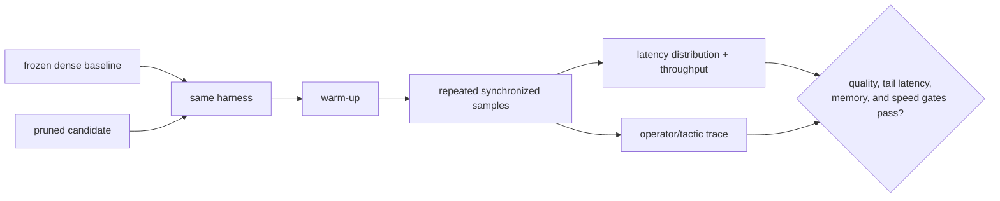

# Lesson 25 — Benchmarking Sparsity: Proving a Real Speedup

> **Puzzle:** Which benchmark prevents a lower mean from hiding an unchanged p99 or memory peak?

[← Chapter 02](../README.md) · [Project homepage](../../../README.md) · [Executed notebook](lab.ipynb) · [RTX 5090 result](artifacts/rtx5090-result.json)

## Why this puzzle matters

Sparse acceleration is a runtime claim. The protocol must freeze shapes, batches, dtype,
warm-up, synchronization, sample window, power state, and backend. It should report a
distribution and throughput, plus memory and operator evidence, rather than a single
average.

## Predict before reading the result

1. Predict which candidate changes dense operator dimensions.
2. Explain why 20 samples are weak evidence for p99.
3. Choose a warm-up and sampling protocol before reading results.

## 1. Start from concrete tensors and state

Dense, same-shape masked, and physically narrowed linear blocks are timed with retained
per-iteration CUDA-event samples at batch 1 and batch 64. Median, p95, p99, throughput,
and peak memory are computed.

### Three reasoning anchors

| # | Lesson-specific claim to keep visible |
|---:|---|
| 1 | Benchmark identity includes workload, backend, and timing semantics. |
| 2 | Mean, median, and tail latency can rank candidates differently. |
| 3 | Masked dense and physically narrow controls distinguish zeros from less work. |

## 2. Derive the mechanism

GPU work is asynchronous, so host timing without synchronization measures enqueue cost.
Warm-up absorbs initialization and algorithm selection. Percentiles require sorted
repeated samples; `p99` is unstable with too few points. Throughput is workload
completed per unit time and should be measured at the serving batch, not derived from
peak FLOPs. Peak memory must be reset around each candidate.

### Mechanism at a glance



### Walk it step by step

1. **Freeze benchmark identity.** Pin model, runtime, hardware, input shapes, batch/concurrency, threads, warm-up, and sampling window.
2. **Prove operator identity.** Capture graph or tactic evidence showing that the intended sparse or smaller operator actually ran.
3. **Measure distributions.** Retain repeated samples and report p50, p95, p99, throughput, memory, and initialization separately.
4. **Require a margin above noise.** Accept only when the confidence interval or repeated-run spread is smaller than the claimed improvement.

## 3. Translate the theory into an experiment

**Experiment:** Benchmark dense, masked, and narrowed candidates across latency and throughput batches with retained samples.

| Experimental role | Frozen definition |
|---|---|
| Baseline | dense full-width and same-shape 75%-masked dense execution |
| Candidate | physically quarter-width dense execution |
| Held constant | GPU, clocks as observed, shapes, weights, dtype, batches, warm-up, samples, and synchronization |
| Measurements | p50/p95/p99 latency, throughput, peak memory, shape, and speedup |
| Evidence label | `pytorch-gpu` |

### Code walk-through

The timing helper allocates tensors before measurement, warms each candidate, and
records individual CUDA-event durations. Summary functions preserve raw samples in the
JSON artifact. A separate large batch prevents single-request latency from masquerading
as service throughput.

## 4. Read the checked-in RTX 5090 result

**Recorded environment:** NVIDIA GeForce RTX 5090; compute capability 12.0; PyTorch 2.12.0; CUDA runtime 13.0.

| Measured field | Checked-in value |
|---|---:|
| Dense p50 | 0.017056 ms |
| Dense p99 | 0.022265 ms |
| Masked p50 | 0.017136 ms |
| Narrow p50 | 0.013856 ms |
| Narrow p99 | 0.015994 ms |
| Batch-64 speedup | 0.982x |
| Samples | 80 |

### What the numbers mean

At batch 1, dense p50/p99 were 0.017056/0.022265 ms, the same-shape masked candidate was
0.017136/0.018128 ms, and the physical narrow candidate was 0.013856/0.015994 ms. At
batch 64 the narrow/full median ratio was 0.982x.

## 5. Solve the puzzle and make a decision

> A sparsity speedup is a distribution measured on the intended execution path, not a zero count or a best-case sample.

### Acceptance and rollback gate

Accept a speedup only when the matched baseline, tail gate, throughput gate, memory
gate, and operator/shape evidence all meet the frozen protocol.

### How this conclusion can fail

Shared GPU load, dynamic clocks, allocator history, and insufficient samples can move
tails. Microbenchmarks omit data movement and service queues. A narrower toy layer
cannot prove an end-to-end model gain.

## Reproduce

From the repository root:

```bash
python3 -m venv .venv
source .venv/bin/activate
pip install torch jupyterlab nbclient nbformat
jupyter lab chapters/02-sparsity-structured-pruning/25-sparsity-benchmarking/lab.ipynb
```

## Extend the experiment

Repeat in an isolated process, capture Nsight or profiler operator names, add confidence
intervals, and run a representative end-to-end service load with request arrivals.

## Evidence boundary

**Evidence label:** [`pytorch-gpu`](../README.md#evidence-labels).

## References

- [PyTorch benchmark utilities](https://docs.pytorch.org/docs/stable/benchmark_utils.html)
- [PyTorch profiler documentation](https://docs.pytorch.org/docs/stable/profiler.html)
