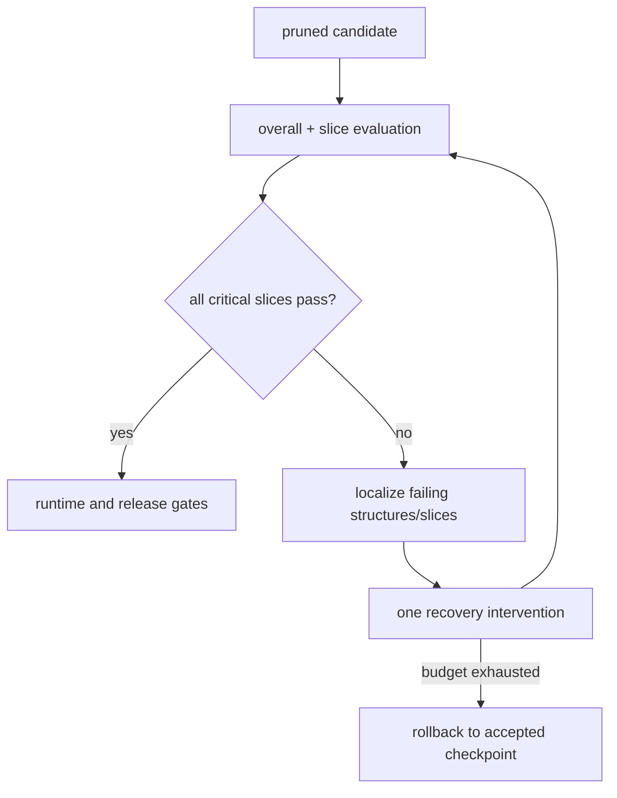

<!-- ai-infra-puzzles-header:start -->
<p align="center">
  
</p>

<h1 align="center">AI Infra Puzzles</h1>

<p align="center">
  <strong>Learn CUDA optimization and LLM inference through hands-on puzzles.</strong>
</p>
<!-- ai-infra-puzzles-header:end -->

# Lesson 26 — Accuracy Recovery, Rollback, and Slice Error Analysis

> **Puzzle:** What should happen when overall accuracy recovers but one long-tail class remains below its rollback threshold?

[← Chapter 02](../README.md) · [Project homepage](../../../README.md) · [Executed notebook](lab.ipynb) · [RTX 5090 result](artifacts/rtx5090-result.json)

## Why this puzzle matters

Recovery is not one scalar. A pruned model may recover aggregate accuracy by favoring
common classes while a rare or high-risk class remains degraded. The release artifact
must preserve the dense baseline, pruned checkpoint identity, confusion matrix, slice
deltas, acceptance thresholds, and deterministic rollback decision.

## Predict before reading the result

1. Predict which class contributes least to aggregate accuracy.
2. Compute recall from one confusion-matrix row.
3. Write a two-part acceptance rule that protects the tail.

## 1. Start from concrete tensors and state

An imbalanced three-class CUDA classification task, dense checkpoint, magnitude-pruned
candidate, short recovery, confusion matrices, per-class recall, aggregate accuracy, and
a frozen worst-class gate form the experiment.

### Three reasoning anchors

| # | Lesson-specific claim to keep visible |
|---:|---|
| 1 | Aggregate recovery can conceal minority-class regression. |
| 2 | Thresholds must be frozen before the candidate is evaluated. |
| 3 | Rollback is a derived decision linked to an immutable baseline. |

## 2. Derive the mechanism

Accuracy weights each example equally, so a 5% class can fall sharply while changing the
aggregate by less than one point. Per-class recall `TP_c/(TP_c+FN_c)` and a confusion
matrix expose the shift. The gate can require both `accuracy_drop <= a` and `min
recall_drop >= -r`. Recovery selects the best checkpoint only on validation criteria;
the rollback revision remains immutable.

### Mechanism at a glance



### Walk it step by step

1. **Compare the same evaluation slices.** Overall accuracy can hide regressions in rare classes, long inputs, or safety-critical cohorts.
2. **Localize the error.** Use confusion matrices, per-slice deltas, and representative failures to identify where pruning changed behavior.
3. **Apply one recovery intervention.** Fine-tuning, distillation, a lower pruning target, or selective restoration should be tested separately.
4. **Rollback on predeclared thresholds.** Keep the dense checkpoint and the last accepted sparse checkpoint loadable throughout recovery.

## 3. Translate the theory into an experiment

**Experiment:** Prune and recover an imbalanced classifier, then derive release or rollback from aggregate and per-class gates.

| Experimental role | Frozen definition |
|---|---|
| Baseline | dense checkpoint with frozen validation confusion matrix |
| Candidate | 70%-pruned recovered checkpoint evaluated under the same split |
| Held constant | dataset, imbalance, checkpoint, mask, recovery steps, seed, thresholds, and evaluation code |
| Measurements | aggregate accuracy, per-class recall, worst recall drop, confusion matrices, and rollback decision |
| Evidence label | `pytorch-gpu` |

### Code walk-through

The notebook trains a compact baseline, freezes it, prunes a clone, and records both
immediate and recovered metrics. Confusion matrices are computed explicitly on GPU
predictions and stored as lists. The final decision is programmatically derived from the
predeclared aggregate and tail thresholds.

## 4. Read the checked-in RTX 5090 result

**Recorded environment:** NVIDIA GeForce RTX 5090; compute capability 12.0; PyTorch 2.12.0; CUDA runtime 13.0.

| Measured field | Checked-in value |
|---|---:|
| Dense accuracy | 100.00% |
| Pruned immediate accuracy | 99.19% |
| Recovered accuracy | 100.00% |
| Worst recall drop | 0.00% |
| Rollback required | no |
| Final sparsity | 70.02% |

### What the numbers mean

Dense, immediate-pruned, and recovered aggregate accuracies were 100.0%, 99.2%, and
100.0%. The worst class-recall change after recovery was 0.0%; under the frozen 3-point
aggregate and 10-point recall gates, rollback_required=False.

## 5. Solve the puzzle and make a decision

> Recovery is complete only when aggregate and protected slices pass a predeclared gate with a tested rollback path.

### Acceptance and rollback gate

Release only when every frozen aggregate and critical-slice gate passes; otherwise
select the recorded dense revision as rollback.

### How this conclusion can fail

A toy class imbalance is not a production taxonomy, and recall alone ignores precision
or calibration. Choosing thresholds after seeing the candidate invalidates the gate.
Recovery on the final test split leaks evaluation.

## Reproduce

From the repository root:

```bash
python3 -m venv .venv
source .venv/bin/activate
pip install torch jupyterlab nbclient nbformat
jupyter lab chapters/02-sparsity-structured-pruning/26-accuracy-recovery-rollback/lab.ipynb
```

## Extend the experiment

Add precision, calibration, and domain slices; separate train/validation/test; rehearse
the actual model-registry rollback and monitor the same gates during canary.

## Evidence boundary

**Evidence label:** [`pytorch-gpu`](../README.md#evidence-labels).

## References

- [PyTorch reproducibility notes](https://docs.pytorch.org/docs/stable/notes/randomness.html)
- [Deep Compression](https://arxiv.org/abs/1510.00149)
