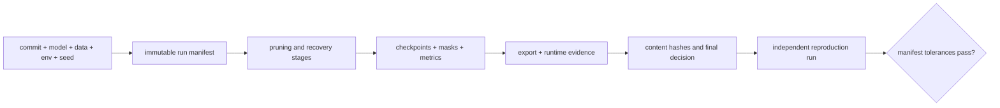

# Lesson 27 — Automated Experiment Management and Reproducible Pruning Records

> **Puzzle:** Which fields make a pruning mask reproducible by another person?

[← Chapter 02](../README.md) · [Project homepage](../../../README.md) · [Executed notebook](lab.ipynb) · [RTX 5090 result](artifacts/rtx5090-result.json)

## Why this puzzle matters

A sparsity number cannot identify a run. Reproduction needs data and model revisions,
seed, score rule, tie behavior, target, mask bytes or hash, optimizer/recovery schedule,
software, hardware, export command, and measured artifacts. Tracking systems help only
when these fields are logged.

## Predict before reading the result

1. Predict which hashes match across identical-seed runs.
2. Predict whether a different seed can preserve sparsity while changing the mask.
3. List the minimum fields another machine needs to repeat the result.

## 1. Start from concrete tensors and state

A deterministic pruning function is executed twice with one seed and once with another.
Configuration JSON, weight initialization, mask, output, and SHA-256 digests are
compared in a small run registry.

### Three reasoning anchors

| # | Lesson-specific claim to keep visible |
|---:|---|
| 1 | Sparsity equality is weaker than mask identity. |
| 2 | Canonical configuration and binary artifacts need separate hashes. |
| 3 | A tracking UI cannot compensate for missing provenance fields. |

## 2. Derive the mechanism

Random seed controls initialization and sampled data, but deterministic algorithms and
stable ordering also matter. Hashing canonical JSON catches configuration drift; hashing
contiguous mask bytes identifies the exact support. A code commit and environment
complete the provenance. Reproducing the same global sparsity with a different mask is
not the same experiment.

### Mechanism at a glance



### Walk it step by step

1. **Create an immutable run identity.** Bind code commit, model revision, data split, environment, seed, and configuration before execution.
2. **Record the pruning trajectory.** Store per-stage sparsity, masks or retained indices, recovery checkpoints, and evaluation slices.
3. **Attach deployment evidence.** Keep export logs, runtime versions, operator traces, raw timing samples, and memory measurements with the same run.
4. **Reproduce before promotion.** A second run should rebuild the same candidate and reach tolerances defined in the manifest, not merely produce a similar headline metric.

## 3. Translate the theory into an experiment

**Experiment:** Run a pruning pipeline twice identically and once with a changed seed, then compare config, mask, and output hashes.

| Experimental role | Frozen definition |
|---|---|
| Baseline | two executions with identical canonical configuration and seed |
| Candidate | one execution changing only the seed |
| Held constant | algorithm code, config schema, dimensions, target sparsity, dtype, hash method, and environment capture |
| Measurements | config hash, mask hash, output hash, sparsity, same-seed equality, and changed-seed difference |
| Evidence label | `pytorch-gpu` |

### Code walk-through

The notebook serializes configuration with sorted keys and compact separators before
hashing. Masks move to CPU as contiguous bytes for a stable digest. The registry rows
include environment and conclusion fields suitable for MLflow or W&B, but no external
service is required to reproduce the core evidence.

## 4. Read the checked-in RTX 5090 result

**Recorded environment:** NVIDIA GeForce RTX 5090; compute capability 12.0; PyTorch 2.12.0; CUDA runtime 13.0.

| Measured field | Checked-in value |
|---|---:|
| Same-seed config match | yes |
| Same-seed mask match | yes |
| Same-seed output match | yes |
| Different-seed mask differs | yes |
| Sparsity | 75.00% |
| Mask SHA-256 | `89bdaa05855b` |

### What the numbers mean

Identical-seed runs matched config/mask/output hashes=True/True/True at 75.0% sparsity.
Changing only the seed changed the mask=True. The recorded support digest begins
`89bdaa05855b`.

## 5. Solve the puzzle and make a decision

> Reproducible pruning identifies the exact configuration, support, environment, and outputs—not merely the final zero percentage.

### Acceptance and rollback gate

Accept a reproduction claim only when an independent rerun matches the declared
configuration, mask or bounded metrics, and environment-sensitive tolerances.

### How this conclusion can fail

Seeds do not guarantee bitwise equality across all devices, library versions, or
nondeterministic kernels. Hashing only a filename or sparsity misses content changes.
Private paths and credentials must never enter a public artifact.

## Reproduce

From the repository root:

```bash
python3 -m venv .venv
source .venv/bin/activate
pip install torch jupyterlab nbclient nbformat
jupyter lab chapters/02-sparsity-structured-pruning/27-reproducible-experiments/lab.ipynb
```

## Extend the experiment

Log the same schema to MLflow or W&B, rerun on a second machine, define which fields
must match exactly versus within tolerance, and add checkpoint/export hashes.

## Evidence boundary

**Evidence label:** [`pytorch-gpu`](../README.md#evidence-labels).

## References

- [PyTorch reproducibility notes](https://docs.pytorch.org/docs/stable/notes/randomness.html)
- [MLflow tracking documentation](https://mlflow.org/docs/latest/ml/tracking/)
