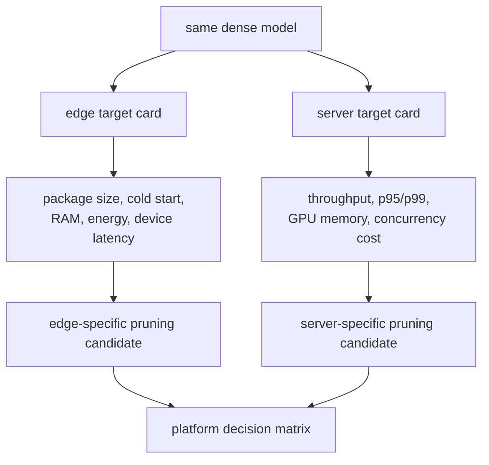

# Lesson 28 — Why Edge and Server Deployment Need Different Pruning Strategies

> **Puzzle:** Should one sparse checkpoint be expected to win on both a phone and a GPU service?

[← Chapter 02](../README.md) · [Project homepage](../../../README.md) · [Executed notebook](lab.ipynb) · [RTX 5090 result](artifacts/rtx5090-result.json)

## Why this puzzle matters

Edge devices often prioritize package bytes, cold start, peak memory, energy, and
standard mobile operators. GPU services prioritize batch throughput, tail latency,
concurrency, and kernel support. The same zeros can compress well for one platform and
execute as an unchanged dense operator on another.

## Predict before reading the result

1. Predict which candidate has the smallest compressed weight payload.
2. Predict which candidate changes GPU dense GEMM dimensions.
3. Write separate acceptance gates for an edge app and a batched GPU service.

## 1. Start from concrete tensors and state

The final lab combines measured RTX 5090 batch-1/batch-64 timing for dense, masked, and
physically narrowed candidates with a transparent storage ledger and a platform decision
matrix. Edge runtime numbers remain unmeasured.

### Three reasoning anchors

| # | Lesson-specific claim to keep visible |
|---:|---|
| 1 | Platform objectives weight storage, latency, throughput, and energy differently. |
| 2 | Compressed bytes do not predict GPU dense-path speed. |
| 3 | Unmeasured edge metrics must remain `not run` in the decision matrix. |

## 2. Derive the mechanism

A masked dense matrix can reduce compressed bytes because zeros have low entropy while
retaining M, N, and K on the GPU. A physically narrow model reduces dense arithmetic and
activation width but changes architecture and may need more recovery. On edge, supported
TFLite/OpenVINO operators and cold-start memory may dominate; on server, batching can
amortize launch overhead and expose GEMM efficiency. Each platform therefore has
distinct gates and can select a different candidate.

### Mechanism at a glance



### Walk it step by step

1. **Write one target card per platform.** Edge and server deployments have different workloads, runtimes, memory limits, energy constraints, and cost objectives.
2. **Select only supported structures.** A format useful to TensorRT on a GPU may have no benefit in TFLite or a mobile CPU runtime.
3. **Benchmark on each real path.** Measure cold start and energy on edge; measure concurrency, tail latency, and capacity on servers.
4. **Allow different winners.** Do not force one checkpoint to win both matrices when platform-specific candidates meet their objectives more honestly.

## 3. Translate the theory into an experiment

**Experiment:** Measure GPU candidates at interactive and throughput batches, calculate storage representations, and derive platform-specific decisions without inventing edge benchmarks.

| Experimental role | Frozen definition |
|---|---|
| Baseline | full-width dense and same-shape 75%-masked weight |
| Candidate | physically quarter-width dense candidate plus separate edge/server decision rows |
| Held constant | source weights, input widths, dtype, compression method, GPU timing, batches, and platform gate definitions |
| Measurements | raw/gzip bytes, batch-1 latency, batch-64 throughput, physical dimensions, edge evidence status, and platform decisions |
| Evidence label | `capacity-model` |

### Code walk-through

The notebook serializes identical candidate weights into raw in-memory payloads and
gzip-compresses them, then measures the CUDA operators. It populates the edge row with
storage facts but leaves device latency and energy unexecuted. The server row uses only
measured RTX 5090 evidence. This prevents cross-platform projection.

## 4. Read the checked-in RTX 5090 result

**Recorded environment:** NVIDIA GeForce RTX 5090; compute capability 12.0; PyTorch 2.12.0; CUDA runtime 13.0.

| Measured field | Checked-in value |
|---|---:|
| Dense gzip bytes | 6,646,281 bytes |
| Masked gzip bytes | 2,789,948 bytes |
| Narrow gzip bytes | 1,661,842 bytes |
| GPU batch-1 dense | 0.018304 ms |
| GPU batch-1 narrow | 0.014224 ms |
| GPU batch-64 speedup | 0.981x |
| Edge runtime measured | no |

### What the numbers mean

Dense/masked/narrow gzip payloads were 6,646,281/2,789,948/1,661,842 bytes. On RTX 5090,
batch-1 medians were 0.018304/0.017760/0.014224 ms and the batch-64 physical-width ratio
was 0.981x. Edge latency and energy remain unmeasured, so the edge decision is
explicitly pending.

## 5. Solve the puzzle and make a decision

> Sparsity strategy is platform-specific: storage evidence, edge execution, and server execution must remain separate until each is measured.

### Acceptance and rollback gate

Choose a platform candidate only when every metric required by that platform has native
evidence; otherwise leave the decision pending and preserve the dense rollback.

### How this conclusion can fail

Gzip is not a TFLite sparse encoding, RTX timing is not phone timing, and one server
batch does not represent concurrency. A physically narrow shape can also be unsupported
by a fixed mobile graph or misaligned on a GPU kernel.

## Reproduce

From the repository root:

```bash
python3 -m venv .venv
source .venv/bin/activate
pip install torch jupyterlab nbclient nbformat
jupyter lab chapters/02-sparsity-structured-pruning/28-edge-vs-server/lab.ipynb
```

## Extend the experiment

Export all candidates to TFLite/OpenVINO and a server backend, benchmark the actual
phone/CPU/GPU targets including energy and concurrency, then compare total cost rather
than transferring proxy results.

## Evidence boundary

**Evidence label:** [`capacity-model`](../README.md#evidence-labels).

## References

- [TensorFlow Lite model optimization](https://www.tensorflow.org/lite/performance/model_optimization)
- [TensorRT sparsity requirements](https://docs.nvidia.com/deeplearning/tensorrt/latest/inference-library/data-formats-tensors.html)
