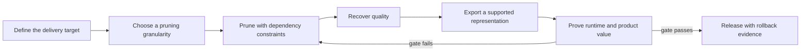

<!-- ai-infra-puzzles-header:start -->
<p align="center">
  
</p>

<h1 align="center">AI Infra Puzzles</h1>

<p align="center">
  <strong>Learn CUDA optimization and LLM inference through hands-on puzzles.</strong>
</p>
<!-- ai-infra-puzzles-header:end -->

# Chapter 02 — Sparsity and Structured Pruning

This chapter turns model sparsity from a zero-count exercise into a chain of testable
decisions. Its 28 lessons cover objectives, granularities, masks, physical channel
deletion, dependency graphs, recovery schedules, N:M constraints, framework lifecycles,
ONNX/TensorRT boundaries, CNN/Transformer/LLM cases, benchmarking, rollback,
reproducibility, and platform-specific deployment.

Every lesson follows one delivery contract:

```text
Concrete tensors/state → mechanism or equation → frozen comparison
                       → retained RTX 5090 evidence → acceptance/rollback
```

The notes are independently written from the ideas and engineering problems in the study
material. The source HTML is not copied into this repository. Numerical models,
compatibility probes, native backends, and performance runs carry different evidence
labels so a package check or zero-rate calculation cannot be mistaken for acceleration.

## Delivery loop at a glance



## How to read a lesson

1. Make the prediction before opening the retained result.
2. Map the diagram and derivation to the baseline and candidate in `lab.ipynb`.
3. Verify the environment and frozen variables before comparing metrics.
4. Reconcile notebook output with the JSON artifact, then apply the acceptance gate.

## Evidence labels

| Label | What it establishes |
|---|---|
| `pytorch-gpu` | CUDA execution through PyTorch, without inferring an unnamed native sparse kernel |
| `numerical-model` | A controlled mechanism, not a full paper or production reproduction |
| `compatibility-probe` | Package or API availability and its exact success/failure boundary |
| `native-backend` | Execution through the named backend for the recorded model and workload |
| `capacity-model` | Transparent planning arithmetic anchored by measured CUDA facts |

## Phase I — Objectives and pruning mechanics

| Lesson | Core decision | Lab |
|---:|---|---|
| 01 | [Pruning Objectives, Constraints, and Delivery Boundaries](01-pruning-objectives/README.md) | [notebook](01-pruning-objectives/lab.ipynb) |
| 02 | [The Sparsity Granularity Spectrum: Weights, Channels, Blocks, and N:M](02-sparsity-granularity/README.md) | [notebook](02-sparsity-granularity/lab.ipynb) |
| 03 | [Baseline Measurement: Parameters, FLOPs, Latency, and Throughput](03-baseline-measurement/README.md) | [notebook](03-baseline-measurement/lab.ipynb) |
| 04 | [Closing the Loop: Train, Prune, Recover, and Re-evaluate](04-prune-finetune-loop/README.md) | [notebook](04-prune-finetune-loop/lab.ipynb) |
| 05 | [Unstructured Magnitude Pruning Without Storage Myths](05-unstructured-magnitude-pruning/README.md) | [notebook](05-unstructured-magnitude-pruning/lab.ipynb) |
| 06 | [Global Sparsity and Layer-wise Budget Allocation](06-global-layerwise-budgets/README.md) | [notebook](06-global-layerwise-budgets/lab.ipynb) |
| 07 | [Filter Pruning: Making Convolution Physically Narrower](07-filter-pruning/README.md) | [notebook](07-filter-pruning/lab.ipynb) |

## Phase II — Dependencies, schedules, and framework lifecycles

| Lesson | Core decision | Lab |
|---:|---|---|
| 08 | [BatchNorm Scale Factors and Network Slimming](08-network-slimming/README.md) | [notebook](08-network-slimming/lab.ipynb) |
| 09 | [Residual, Concat, and Dependency-Graph Pruning](09-dependency-graph-pruning/README.md) | [notebook](09-dependency-graph-pruning/lab.ipynb) |
| 10 | [Taylor Importance: Ranking Channels by Loss Change](10-taylor-importance/README.md) | [notebook](10-taylor-importance/lab.ipynb) |
| 11 | [Gradual Pruning Schedules and Recovery Training](11-gradual-pruning-schedule/README.md) | [notebook](11-gradual-pruning-schedule/lab.ipynb) |
| 12 | [Sparse Regularization and Learnable Structural Gates](12-sparse-regularization-gates/README.md) | [notebook](12-sparse-regularization-gates/lab.ipynb) |
| 13 | [N:M Semi-structured Sparsity and the 2:4 Contract](13-nm-2-4-sparsity/README.md) | [notebook](13-nm-2-4-sparsity/lab.ipynb) |
| 14 | [PyTorch Pruning API and the Complete Mask Lifecycle](14-pytorch-mask-lifecycle/README.md) | [notebook](14-pytorch-mask-lifecycle/lab.ipynb) |

## Phase III — Native toolchains and model families

| Lesson | Core decision | Lab |
|---:|---|---|
| 15 | [Torch-Pruning DepGraph: A Structured-Pruning Compatibility Lab](15-depgraph-structured-pruning/README.md) | [notebook](15-depgraph-structured-pruning/lab.ipynb) |
| 16 | [TensorFlow MOT and the Keras Pruning/Export Lifecycle](16-keras-pruning-lifecycle/README.md) | [notebook](16-keras-pruning-lifecycle/lab.ipynb) |
| 17 | [OpenVINO, NNCF, and Intel Runtime Sparsity](17-cpu-runtime-sparsity/README.md) | [notebook](17-cpu-runtime-sparsity/lab.ipynb) |
| 18 | [TensorRT Sparse Deployment and Polygraphy Evidence](18-tensorrt-sparsity-gates/README.md) | [notebook](18-tensorrt-sparsity-gates/lab.ipynb) |
| 19 | [ONNX Export, Graph Repair, and Shape Consistency](19-onnx-shape-consistency/README.md) | [notebook](19-onnx-shape-consistency/lab.ipynb) |
| 20 | [CNN Case Study: ResNet Channel Pruning](20-resnet-channel-pruning/README.md) | [notebook](20-resnet-channel-pruning/lab.ipynb) |
| 21 | [Safe Pruning for Detection and Segmentation](21-detection-segmentation-safety/README.md) | [notebook](21-detection-segmentation-safety/lab.ipynb) |

## Phase IV — Transformers, production evidence, and platform decisions

| Lesson | Core decision | Lab |
|---:|---|---|
| 22 | [Pruning Transformer Heads, FFN Neurons, and Layers](22-transformer-structure-pruning/README.md) | [notebook](22-transformer-structure-pruning/lab.ipynb) |
| 23 | [One-shot LLM Pruning: SparseGPT and Wanda Mechanisms](23-sparsegpt-wanda/README.md) | [notebook](23-sparsegpt-wanda/lab.ipynb) |
| 24 | [Ordering Distillation, Quantization, and Pruning](24-compression-order/README.md) | [notebook](24-compression-order/lab.ipynb) |
| 25 | [Benchmarking Sparsity: Proving a Real Speedup](25-sparsity-benchmarking/README.md) | [notebook](25-sparsity-benchmarking/lab.ipynb) |
| 26 | [Accuracy Recovery, Rollback, and Slice Error Analysis](26-accuracy-recovery-rollback/README.md) | [notebook](26-accuracy-recovery-rollback/lab.ipynb) |
| 27 | [Automated Experiment Management and Reproducible Pruning Records](27-reproducible-experiments/README.md) | [notebook](27-reproducible-experiments/lab.ipynb) |
| 28 | [Why Edge and Server Deployment Need Different Pruning Strategies](28-edge-vs-server/README.md) | [notebook](28-edge-vs-server/lab.ipynb) |

## Reproduce and validate

Execute all labs from the repository root on a CUDA GPU:

```bash
python3 scripts/execute_chapter_notebooks.py --chapter 02 --start 1 --end 28
python3 scripts/build_chapter02_lessons.py
python3 scripts/validate_chapter.py 02
python3 scripts/audit_chapter02_delivery.py
```

Optional framework lessons retain a bounded compatibility result when their native
package is absent. Install the named backend and rerun that notebook before making a
backend-performance claim.
