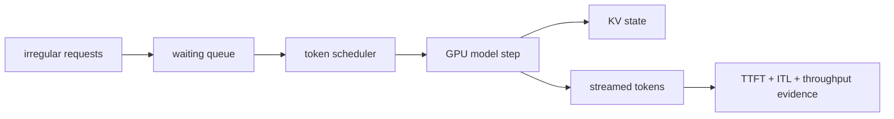

# Lesson 01 — The Inference Service Bottleneck

> **Puzzle:** Why can a fast single prompt still become an unreliable concurrent service?

[← Chapter 03](../README.md) · [Project homepage](../../../README.md) · [Executed notebook](lab.ipynb) · [RTX 5090 result](artifacts/rtx5090-result.json)

## Why this puzzle matters

A model demo measures one request after warm-up. A service owns a queue, admission
policy, cache budget, batching policy, and latency objective. The relevant question is
not whether the model can generate text, but whether the serving layer can convert
irregular arrivals into useful GPU work without sacrificing tail latency.

## Predict before reading the result

1. Predict the output-token throughput for four short prompts.
2. Name one conclusion that an offline batch cannot establish.
3. Choose the additional trace needed before setting an online SLO.

## 1. Start from concrete requests and state

The lab uses the installed vLLM engine, a local Qwen2.5 checkpoint, four prompts,
generated-token counts, elapsed wall time, and CUDA memory observations. It records one
native batch instead of inferring service behavior from a framework name.

### Three reasoning anchors

| # | Lesson-specific claim to keep visible |
|---:|---|
| 1 | Single-request latency is not a concurrency result. |
| 2 | Scheduling creates opportunities; workload shape determines whether they exist. |
| 3 | A service decision needs both useful-token throughput and a tail-latency gate. |

## 2. Derive the mechanism

Autoregressive inference alternates a compute-heavy prompt pass with repeated one-token
steps. Independent requests reach those phases at different times. A serving engine can
schedule ready token steps together and manage their KV state, but no scheduler can
remove model work or guarantee an SLO without an arrival model. Throughput, latency, and
queueing therefore form separate evidence axes.

### Mechanism at a glance



### Walk it step by step

1. **Separate the phases.** Treat prompt processing and token generation as different workloads.
2. **Make requests schedulable.** Expose ready work to one engine rather than isolated model loops.
3. **Measure useful work.** Count prompt and generated tokens beside elapsed time and memory.
4. **Bound the claim.** Add online queueing evidence before promising a service objective.

## 3. Translate the theory into an experiment

**Experiment:** Run one real vLLM offline batch and retain engine version, token counts, wall time, and GPU memory.

| Experimental role | Frozen definition |
|---|---|
| Baseline | one frozen Qwen2.5 model and four independent prompts |
| Candidate | vLLM native offline batching for those prompts |
| Held constant | model path, sampling, prompt set, maximum output, seed, and GPU |
| Measurements | requests, prompt/output tokens, elapsed seconds, output tokens/s, and memory |
| Evidence label | `native-backend` |

### Code walk-through

The experiment loads the checkpoint once, generates all requests in one call, and reads
token IDs from each RequestOutput. It deliberately reports batch elapsed time rather
than inventing per-request TTFT from an offline API.

## 4. Read the checked-in RTX 5090 result

**Recorded environment:** NVIDIA GeForce RTX 5090; compute capability 12.0; PyTorch 2.13.0+cu130; CUDA runtime 13.0; vLLM 0.27.1.

| Measured field | Checked-in value |
|---|---:|
| vLLM version | 0.27.1 |
| Requests | 4 |
| Prompt tokens | 29 |
| Output tokens | 96 |
| Elapsed | 0.225945 |
| Output throughput | 424.9/s |
| Peak allocated | 0.000 MiB |

### What the numbers mean

vLLM 0.27.1 completed 4 requests and 96 output tokens in 0.226 s (424.9 output
tokens/s). This is native offline execution, not online queue or network evidence.

## 5. Solve the puzzle and make a decision

> The native run proves that this vLLM build serves the frozen batch on the RTX 5090; it does not prove a production concurrency SLO.

### Acceptance and rollback gate

Adopt vLLM as the measured serving candidate only after online arrival tests also
satisfy TTFT, ITL, error-rate, and memory gates.

### How this conclusion can fail

Warm-up, compilation, prompt length, sampling, and model size can reverse the observed
rate. An offline batch does not contain network, tokenizer, queue, or streaming latency.

## Reproduce

The checked-in run pins vLLM 0.27.1 and a local Qwen2.5-1.5B-Instruct checkpoint. On a
Linux CUDA host, create a clean environment and point `CH3_MODEL` at your local
checkpoint:

```bash
uv venv .venv --python 3.12
source .venv/bin/activate
uv pip install vllm==0.27.1 nbclient nbformat ipykernel requests pyyaml --torch-backend=auto
export CH3_MODEL=/path/to/Qwen2.5-1.5B-Instruct
jupyter lab chapters/03-vllm-inference-serving/01-inference-service-bottleneck/lab.ipynb
```

## Extend the experiment

Replay a timestamped production-like arrival trace against the OpenAI endpoint and
compare p50/p95 TTFT and ITL with the same model revision.

## Evidence boundary

**Evidence label:** [`native-backend`](../README.md#evidence-labels). The named vLLM runtime executed on the recorded GPU/model/workload. The result does not transfer to another version, model, endpoint, or traffic distribution.

## References

- [vLLM documentation](https://docs.vllm.ai/en/latest/)
- [vLLM quickstart](https://docs.vllm.ai/en/latest/getting_started/quickstart/)
