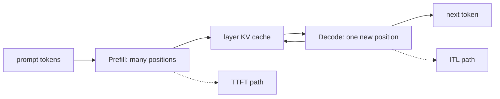

<!-- ai-infra-puzzles-header:start -->
<p align="center">
  
</p>

<h1 align="center">AI Infra Puzzles</h1>

<p align="center">
  <strong>Learn CUDA optimization and LLM inference through hands-on puzzles.</strong>
</p>
<!-- ai-infra-puzzles-header:end -->

# Lesson 02 — Prefill, Decode, and the KV Cache

> **Puzzle:** Which phase owns TTFT, which phase owns ITL, and why does context remain resident?

[← Chapter 03](../README.md) · [Project homepage](../../../README.md) · [Executed notebook](lab.ipynb) · [RTX 5090 result](artifacts/rtx5090-result.json)

## Why this puzzle matters

A long prompt and a long answer stress different parts of the engine. Collapsing them
into one requests-per-second number hides whether attention over the prompt, repeated
Decode steps, or KV capacity is the limiting factor.

## Predict before reading the result

1. Rank the four workload cells by expected elapsed time.
2. Calculate which cells reserve the most KV positions.
3. State whether offline RequestOutput metrics expose true network-observed TTFT.

## 1. Start from concrete requests and state

The experiment creates short- and long-prompt requests with short and long output
limits, runs them through one native engine, and retains request metrics when exposed by
the installed API. Token counts provide the fallback ledger.

### Three reasoning anchors

| # | Lesson-specific claim to keep visible |
|---:|---|
| 1 | Prompt length primarily changes the initial compute and cache allocation. |
| 2 | Output length repeats Decode and grows the cache one token at a time. |
| 3 | Aggregate elapsed time cannot identify TTFT without first-token timing. |

## 2. Derive the mechanism

Prefill maps all prompt tokens through the model and materializes key/value vectors for
every layer. Decode reuses that state and appends one position per step. For a standard
decoder, KV bytes scale approximately with `2 × layers × tokens × kv_heads × head_dim ×
bytes_per_element`. TTFT contains queue plus prompt work; ITL reflects the sequence of
Decode scheduling and execution events.

### Mechanism at a glance



### Walk it step by step

1. **Tokenize first.** The prompt-token count defines initial work and cache positions.
2. **Materialize reusable state.** Prefill writes keys and values for every layer.
3. **Append during Decode.** Each generated token extends that state and triggers another model step.
4. **Attach the right metric.** Use TTFT for initial work and ITL for repeated generation.

## 3. Translate the theory into an experiment

**Experiment:** Measure a 2×2 prompt/output grid through vLLM and retain token and request timing fields.

| Experimental role | Frozen definition |
|---|---|
| Baseline | short prompt with an eight-token answer |
| Candidate | long prompt and/or a 32-token answer |
| Held constant | engine, model, dtype, seed, sampling mode, and GPU |
| Measurements | prompt tokens, output tokens, elapsed time, and available request metrics |
| Evidence label | `native-backend` |

### Code walk-through

Each workload runs as a separate native request after one warm-up. The code introspects
the metrics object instead of assuming version-specific attributes, so absent fields
remain explicit rather than fabricated.

## 4. Read the checked-in RTX 5090 result

**Recorded environment:** NVIDIA GeForce RTX 5090; compute capability 12.0; PyTorch 2.13.0+cu130; CUDA runtime 13.0; vLLM 0.27.1.

| Measured field | Checked-in value |
|---|---:|
| Short/short elapsed | 0.084925 |
| Long/short elapsed | 54.500730 |
| Short/long elapsed | 0.255930 |
| Long/long elapsed | 0.268379 |
| Longest prompt tokens | 914 |
| Longest output tokens | 32 |

### What the numbers mean

The long prompt used 914 tokens versus 8 short; the long answer produced 32 tokens.
Elapsed time combines phases, and only non-null native request fields count as phase
timing evidence.

## 5. Solve the puzzle and make a decision

> Prefill, Decode, and KV growth are distinct mechanisms; this run measures their combined native request cost and exposes only the timing fields the API actually returns.

### Acceptance and rollback gate

Use phase-specific optimization only after the metric that corresponds to that phase
moves under a representative workload.

### How this conclusion can fail

Wall-clock measurements include Python and scheduler overhead. Repeated prose may
tokenize differently than expected, and an offline first-token timestamp is not
client-observed streaming latency.

## Reproduce

The checked-in run pins vLLM 0.27.1 and a local Qwen2.5-1.5B-Instruct checkpoint. On a
Linux CUDA host, create a clean environment and point `CH3_MODEL` at your local
checkpoint:

```bash
uv venv .venv --python 3.12
source .venv/bin/activate
uv pip install vllm==0.27.1 nbclient nbformat ipykernel requests pyyaml --torch-backend=auto
export CH3_MODEL=/path/to/Qwen2.5-1.5B-Instruct
jupyter lab chapters/03-vllm-inference-serving/02-prefill-decode-kv-cache/lab.ipynb
```

## Extend the experiment

Run the same grid over the streaming API, timestamp every chunk at the client, and
compare engine timestamps with network observations.

## Evidence boundary

**Evidence label:** [`native-backend`](../README.md#evidence-labels). The named vLLM runtime executed on the recorded GPU/model/workload. The result does not transfer to another version, model, endpoint, or traffic distribution.

## References

- [PagedAttention paper](https://arxiv.org/abs/2309.06180)
- [Production metrics](https://docs.vllm.ai/en/latest/usage/metrics/)
