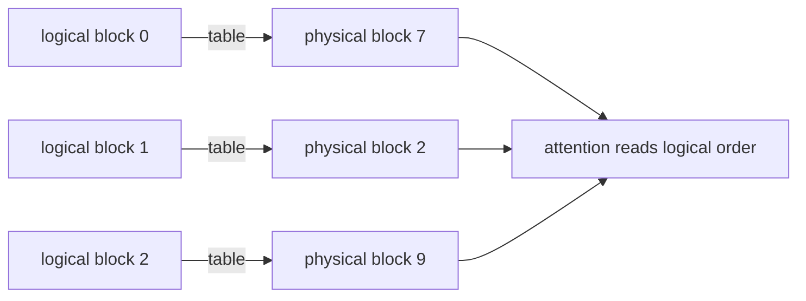

# Lesson 03 — PagedAttention and Block Tables

> **Puzzle:** How can non-contiguous KV blocks reduce waste without changing attention semantics?

[← Chapter 03](../README.md) · [Project homepage](../../../README.md) · [Executed notebook](lab.ipynb) · [RTX 5090 result](artifacts/rtx5090-result.json)

## Why this puzzle matters

Requests end at unpredictable lengths. Reserving one contiguous maximum-length slab per
request strands memory, while moving live cache entries to repair fragmentation is
expensive. PagedAttention introduces an indirection that lets logical token positions
map to physical blocks.

## Predict before reading the result

1. Compute slab waste for the supplied length distribution.
2. Predict how block size changes waste and metadata.
3. Verify reconstruction after random physical placement.

## 1. Start from concrete requests and state

The notebook runs a deterministic allocator model for a mixed-length batch. It compares
maximum-length slabs, exact variable allocations, and fixed-size blocks, then verifies
that a shuffled block table reconstructs the same logical sequence.

### Three reasoning anchors

| # | Lesson-specific claim to keep visible |
|---:|---|
| 1 | Internal fragmentation is bounded by one partial block per sequence. |
| 2 | External fragmentation is handled by assigning any free physical block. |
| 3 | Block tables preserve logical order even when physical IDs are shuffled. |

## 2. Derive the mechanism

For block size `B`, a request of length `L` owns `ceil(L/B)` blocks and wastes fewer
than `B` token slots. The block table maps each logical block number to a physical
block. Attention follows that mapping when reading keys and values; physical adjacency
is unnecessary. This changes allocation and addressing, not the mathematical attention
weights.

### Mechanism at a glance



### Walk it step by step

1. **Partition logical positions.** Group token positions into equal-size logical blocks.
2. **Allocate from a pool.** Assign each logical block any available physical block.
3. **Follow the table.** Gather physical blocks in logical order inside attention.
4. **Account for the tail.** Only the last block of each request can be partially unused.

## 3. Translate the theory into an experiment

**Experiment:** Simulate slab and block allocation, then reconstruct logical token IDs through a randomized block table.

| Experimental role | Frozen definition |
|---|---|
| Baseline | one max-sequence contiguous reservation per request |
| Candidate | fixed-size paged blocks assigned from a shared pool |
| Held constant | request lengths, element footprint, seed, and logical payload |
| Measurements | reserved token slots, waste ratio, block count, and reconstruction equality |
| Evidence label | `numerical-model` |

### Code walk-through

The code treats every token slot as a visible integer, places blocks at non-contiguous
physical IDs, and gathers them through the table. This makes address translation
inspectable without claiming a CUDA kernel trace.

## 4. Read the checked-in RTX 5090 result

**Recorded environment:** NVIDIA GeForce RTX 5090; compute capability 12.0; PyTorch 2.13.0+cu130; CUDA runtime 13.0; vLLM 0.27.1.

| Measured field | Checked-in value |
|---|---:|
| Slab reserved tokens | 8,192 |
| Paged reserved tokens | 2,800 |
| Slab waste | 66.75% |
| Paged waste | 2.71% |
| Physical blocks | 175 |
| Reconstruction exact | yes |

### What the numbers mean

Slabs reserved 8,192 positions with 66.7% waste; 16-token pages reserved 2,800 with 2.7%
waste. Non-contiguous reconstruction was exact; this is an allocator model, not a kernel
benchmark.

## 5. Solve the puzzle and make a decision

> Paged blocks bound per-request tail waste and allow non-contiguous placement; the numerical reconstruction proves the mapping invariant, not native PagedAttention speed.

### Acceptance and rollback gate

Select a block size only after both fragmentation and scheduler/kernel constraints are
evaluated on the target distribution.

### How this conclusion can fail

The allocator model omits copy-on-write, prefix sharing, eviction, block metadata bytes,
alignment, and kernel execution. It teaches the invariant but cannot predict native
latency.

## Reproduce

The checked-in run pins vLLM 0.27.1 and a local Qwen2.5-1.5B-Instruct checkpoint. On a
Linux CUDA host, create a clean environment and point `CH3_MODEL` at your local
checkpoint:

```bash
uv venv .venv --python 3.12
source .venv/bin/activate
uv pip install vllm==0.27.1 nbclient nbformat ipykernel requests pyyaml --torch-backend=auto
export CH3_MODEL=/path/to/Qwen2.5-1.5B-Instruct
jupyter lab chapters/03-vllm-inference-serving/03-pagedattention-block-tables/lab.ipynb
```

## Extend the experiment

Collect live request lengths and engine cache metrics, sweep supported block sizes, and
add prefix-cache sharing plus eviction events.

## Evidence boundary

**Evidence label:** [`numerical-model`](../README.md#evidence-labels). A transparent allocator, scheduler, gateway, or policy model executed. It establishes the stated invariant, not native vLLM performance.

## References

- [PagedAttention paper](https://arxiv.org/abs/2309.06180)
- [vLLM engine arguments](https://docs.vllm.ai/en/latest/configuration/engine_args/)
