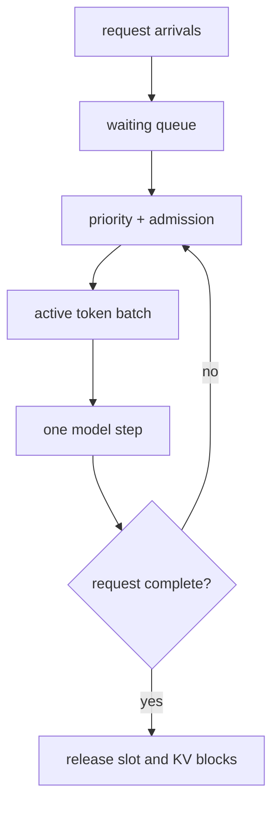

# Lesson 04 — Continuous Batching, Throughput, and Fairness

> **Puzzle:** When should a newly arrived short request enter a GPU batch?

[← Chapter 03](../README.md) · [Project homepage](../../../README.md) · [Executed notebook](lab.ipynb) · [RTX 5090 result](artifacts/rtx5090-result.json)

## Why this puzzle matters

Static batching waits for every sequence in a group to finish. Autoregressive sequences
rarely finish together, so completed rows become empty work while new arrivals remain
queued. Iteration-level scheduling can refill those slots, but an unconstrained
throughput policy can starve old or large requests.

## Predict before reading the result

1. Predict which scheduler minimizes makespan.
2. Identify which policy hurts the oldest long request.
3. Choose an observable starvation gate.

## 1. Start from concrete requests and state

A discrete-event scheduler replays the same arrivals and token demands under static
groups, shortest-remaining-token priority, and age-aware continuous batching. It retains
completion time for every request.

### Three reasoning anchors

| # | Lesson-specific claim to keep visible |
|---:|---|
| 1 | Batch membership can change after every model step. |
| 2 | The same token capacity can produce different tail latency under different priorities. |
| 3 | Fairness must be encoded as a scheduling rule and measured per request. |

## 2. Derive the mechanism

At each Decode tick, continuous batching chooses up to `C` active sequences, advances
each by one token, releases completed sequences, and admits more work.
Shortest-remaining-token priority lowers average latency but can postpone long jobs.
Adding an age term or service class changes the objective from pure token throughput to
a declared fairness policy.

### Mechanism at a glance



### Walk it step by step

1. **Observe arrivals.** Record when each request becomes eligible.
2. **Apply a named priority.** Select active work using remaining tokens, age, or class.
3. **Advance one iteration.** Generate one token for each scheduled sequence.
4. **Measure individuals.** Retain completion and waiting time instead of only aggregate tokens.

## 3. Translate the theory into an experiment

**Experiment:** Replay one arrival trace through three schedulers and compare makespan, p95 completion, and maximum wait.

| Experimental role | Frozen definition |
|---|---|
| Baseline | static groups that drain before admitting new work |
| Candidate | continuous shortest-remaining and age-aware scheduling |
| Held constant | arrival trace, per-request tokens, tick capacity, and tie-breaking |
| Measurements | makespan, mean/p95 latency, maximum wait, and completion order |
| Evidence label | `numerical-model` |

### Code walk-through

The simulation operates on explicit token quanta and keeps a per-request timeline. Its
purpose is to make policy consequences visible; it does not substitute for native
scheduler profiling.

## 4. Read the checked-in RTX 5090 result

**Recorded environment:** NVIDIA GeForce RTX 5090; compute capability 12.0; PyTorch 2.13.0+cu130; CUDA runtime 13.0; vLLM 0.27.1.

| Measured field | Checked-in value |
|---|---:|
| Static makespan | 28.000000 |
| Continuous makespan | 15.000000 |
| Age-aware makespan | 15.000000 |
| Static p95 | 22.500000 |
| Shortest max wait | 0.000000 |
| Age-aware max wait | 0.000000 |

### What the numbers mean

Static/shortest/age-aware makespan was 28/15/15 ticks. Priority changed per-request wait
even with identical capacity; tick duration is modeled.

## 5. Solve the puzzle and make a decision

> Continuous batching can reclaim finished slots immediately, while the priority rule—not batching alone—determines fairness.

### Acceptance and rollback gate

Choose the policy whose tail and starvation metrics meet service-class gates at an
acceptable throughput cost.

### How this conclusion can fail

Real Prefill steps have unequal cost, CUDA batches are not constant-duration ticks, and
memory pressure can block admission. The trace is illustrative rather than a capacity
prediction.

## Reproduce

The checked-in run pins vLLM 0.27.1 and a local Qwen2.5-1.5B-Instruct checkpoint. On a
Linux CUDA host, create a clean environment and point `CH3_MODEL` at your local
checkpoint:

```bash
uv venv .venv --python 3.12
source .venv/bin/activate
uv pip install vllm==0.27.1 nbclient nbformat ipykernel requests pyyaml --torch-backend=auto
export CH3_MODEL=/path/to/Qwen2.5-1.5B-Instruct
jupyter lab chapters/03-vllm-inference-serving/04-continuous-batching/lab.ipynb
```

## Extend the experiment

Replay production arrival timestamps with prompt lengths, streaming duration, priority
class, cancellations, and measured per-step costs from the real engine.

## Evidence boundary

**Evidence label:** [`numerical-model`](../README.md#evidence-labels). A transparent allocator, scheduler, gateway, or policy model executed. It establishes the stated invariant, not native vLLM performance.

## References

- [vLLM documentation](https://docs.vllm.ai/en/latest/)
- [PagedAttention paper](https://arxiv.org/abs/2309.06180)
