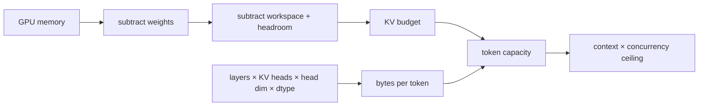

# Lesson 05 — A KV-Cache Memory Budget

> **Puzzle:** How many concurrent long-context requests fit after model weights and runtime reserve?

[← Chapter 03](../README.md) · [Project homepage](../../../README.md) · [Executed notebook](lab.ipynb) · [RTX 5090 result](artifacts/rtx5090-result.json)

## Why this puzzle matters

A model can load successfully and still fail when context accumulates. Capacity planning
must reserve space for weights, runtime workspace, non-torch allocations, and
uncertainty before assigning the remainder to KV cache.

## Predict before reading the result

1. Derive BF16 KV bytes per token for the local checkpoint.
2. Predict the capacity change from BF16 to FP8 cache.
3. State why theoretical concurrency exceeds an operational limit.

## 1. Start from concrete requests and state

The notebook reads the local model configuration and real GPU memory, derives KV bytes
per token from layer/head geometry, and computes conservative concurrency for several
context lengths and cache dtypes.

### Three reasoning anchors

| # | Lesson-specific claim to keep visible |
|---:|---|
| 1 | KV geometry comes from the model config. |
| 2 | Context and concurrency multiply the token footprint. |
| 3 | A safe budget subtracts weights, workspace, and headroom before division. |

## 2. Derive the mechanism

For grouped-query attention, one token stores keys and values for `num_key_value_heads`,
not all query heads. A first-order decoder cache uses `2 × layers × kv_heads × head_dim
× element_bytes` per token. Dividing a declared KV budget by that footprint gives token
capacity; dividing again by context length gives only a theoretical concurrency ceiling.

### Mechanism at a glance



### Walk it step by step

1. **Read model geometry.** Use KV heads and head dimension, not parameter count alone.
2. **Declare non-KV reserves.** Weights and workspace leave only part of VRAM for context state.
3. **Calculate token capacity.** Divide available bytes by the per-token footprint.
4. **Validate below the ceiling.** Native allocation and latency tests determine the operational limit.

## 3. Translate the theory into an experiment

**Experiment:** Combine measured GPU memory with model geometry and a declared reserve to calculate context/concurrency cells.

| Experimental role | Frozen definition |
|---|---|
| Baseline | BF16 KV storage under one fixed memory budget |
| Candidate | FP8 KV storage and multiple context lengths |
| Held constant | model config, GPU total, weight estimate, reserve fraction, and utilization cap |
| Measurements | KV bytes/token, token capacity, and theoretical concurrent sequences |
| Evidence label | `capacity-model` |

### Code walk-through

The code parses only local configuration fields, shows every subtraction, and emits the
full capacity table. No hidden allocator efficiency is inserted into the result.

## 4. Read the checked-in RTX 5090 result

**Recorded environment:** NVIDIA GeForce RTX 5090; compute capability 12.0; PyTorch 2.13.0+cu130; CUDA runtime 13.0; vLLM 0.27.1.

| Measured field | Checked-in value |
|---|---:|
| GPU total | 32,110.938 MiB |
| BF16 KV bytes/token | 28,672 bytes |
| FP8 KV bytes/token | 14,336 bytes |
| BF16 token capacity | 778,161 |
| FP8 token capacity | 1,556,323 |
| BF16 8K concurrency | 94 |

### What the numbers mean

Model geometry yields 28,672 BF16 and 14,336 FP8 KV bytes/token. The declared budget
gives a BF16 8K ceiling of 94 sequences; native allocation and latency must set the
operational limit.

## 5. Solve the puzzle and make a decision

> KV capacity is a budget equation anchored in model geometry; its result is a planning ceiling until native concurrency tests pass.

### Acceptance and rollback gate

Set admission limits below the calculated ceiling and validate them with native load,
fragmentation, and tail-latency tests.

### How this conclusion can fail

Sliding-window attention, hybrid state-space layers, cache alignment, CUDA graphs,
prefix sharing, and engine reservations can change the native allocation. Model-file
bytes are not identical to resident weight memory.

## Reproduce

The checked-in run pins vLLM 0.27.1 and a local Qwen2.5-1.5B-Instruct checkpoint. On a
Linux CUDA host, create a clean environment and point `CH3_MODEL` at your local
checkpoint:

```bash
uv venv .venv --python 3.12
source .venv/bin/activate
uv pip install vllm==0.27.1 nbclient nbformat ipykernel requests pyyaml --torch-backend=auto
export CH3_MODEL=/path/to/Qwen2.5-1.5B-Instruct
jupyter lab chapters/03-vllm-inference-serving/05-kv-memory-budget/lab.ipynb
```

## Extend the experiment

Start the engine at selected utilization limits, issue long-context concurrency sweeps,
and reconcile engine cache-block metrics with the first-order ledger.

## Evidence boundary

**Evidence label:** [`capacity-model`](../README.md#evidence-labels). Measured environment facts feed explicit planning arithmetic. Assumed topology, demand, bandwidth, and reserve fields remain assumptions until a native deployment test.

## References

- [vLLM engine arguments](https://docs.vllm.ai/en/latest/configuration/engine_args/)
- [Quantized KV cache](https://docs.vllm.ai/en/latest/features/quantization/quantized_kvcache/)
