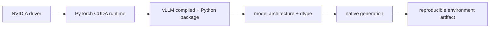

# Lesson 06 — Installing a Reproducible vLLM Environment

> **Puzzle:** What evidence shows that Python, PyTorch, CUDA, the driver, and vLLM agree?

[← Chapter 03](../README.md) · [Project homepage](../../../README.md) · [Executed notebook](lab.ipynb) · [RTX 5090 result](artifacts/rtx5090-result.json)

## Why this puzzle matters

A successful package installation is not a successful GPU runtime. vLLM ships compiled
components tied to platform and PyTorch choices, so the environment record must include
imports, binary version, CUDA availability, GPU capability, and a minimal native
operation.

## Predict before reading the result

1. Predict the compute capability and CUDA runtime reported remotely.
2. Check whether the vLLM CLI exposes serve and bench.
3. Name the minimal step beyond import needed for release confidence.

## 1. Start from concrete requests and state

The compatibility probe imports vLLM and PyTorch, captures exact versions, locates the
CLI, inspects selected engine arguments, and executes a CUDA tensor operation. It
records missing features as data.

### Three reasoning anchors

| # | Lesson-specific claim to keep visible |
|---:|---|
| 1 | Driver, wheel runtime, and compiler toolkit are different version fields. |
| 2 | Import success is weaker than native engine execution. |
| 3 | A pinned environment is part of every benchmark identity. |

## 2. Derive the mechanism

The NVIDIA driver provides the kernel-facing CUDA capability; a PyTorch wheel carries
its CUDA runtime; vLLM adds compiled extensions and generated kernels. These versions
need not have identical labels, but the installed combination must support the GPU
architecture and import without unresolved symbols. A clean environment prevents
unrelated packages from silently replacing that combination.

### Mechanism at a glance



### Walk it step by step

1. **Pin the interpreter.** Create an isolated Python environment.
2. **Install one coherent stack.** Let the selected vLLM wheel resolve its compatible PyTorch build.
3. **Probe the executable path.** Verify imports, CLI, GPU identity, and a CUDA operation.
4. **Prove model execution.** Treat later native generation as the final compatibility link.

## 3. Translate the theory into an experiment

**Experiment:** Collect the complete stack identity and run a real CUDA sanity operation inside the isolated environment.

| Experimental role | Frozen definition |
|---|---|
| Baseline | package metadata alone |
| Candidate | imports, CLI surface, compiled extension visibility, and CUDA execution |
| Held constant | isolated environment and one RTX 5090 |
| Measurements | versions, executable paths, CLI subcommands, tensor checksum, and feature flags |
| Evidence label | `compatibility-probe` |

### Code walk-through

The probe avoids network downloads and shell-specific environment assumptions. Every
field comes from the Python process that will execute the remaining labs.

## 4. Read the checked-in RTX 5090 result

**Recorded environment:** NVIDIA GeForce RTX 5090; compute capability 12.0; PyTorch 2.13.0+cu130; CUDA runtime 13.0; vLLM 0.27.1.

| Measured field | Checked-in value |
|---|---:|
| vLLM version | 0.27.1 |
| Python | 3.12.3 |
| PyTorch | 2.13.0+cu130 |
| CUDA runtime | 13.0 |
| CLI found | yes |
| Serve command | yes |
| CUDA checksum | 0.352565 |

### What the numbers mean

The isolated environment imported vLLM 0.27.1 with PyTorch 2.13.0+cu130 / CUDA 13.0,
found serve/bench=True/True, and completed a CUDA checksum of 0.352565. Native model
generation is the stronger final link.

## 5. Solve the puzzle and make a decision

> Compatibility is a chain of executable checks; this probe establishes the local stack identity and CUDA path, not every model feature.

### Acceptance and rollback gate

Proceed to model experiments only when the pinned interpreter imports the stack, sees
the GPU, and completes a CUDA operation.

### How this conclusion can fail

A small tensor operation exercises PyTorch rather than every vLLM kernel. Later model
loads can still fail because of architecture, dtype, memory, or compilation issues.

## Reproduce

The checked-in run pins vLLM 0.27.1 and a local Qwen2.5-1.5B-Instruct checkpoint. On a
Linux CUDA host, create a clean environment and point `CH3_MODEL` at your local
checkpoint:

```bash
uv venv .venv --python 3.12
source .venv/bin/activate
uv pip install vllm==0.27.1 nbclient nbformat ipykernel requests pyyaml --torch-backend=auto
export CH3_MODEL=/path/to/Qwen2.5-1.5B-Instruct
jupyter lab chapters/03-vllm-inference-serving/06-installation-compatibility/lab.ipynb
```

## Extend the experiment

Archive `pip freeze`, vLLM collect-env output, driver information, model hash, and one
completed model-generation artifact with the release.

## Evidence boundary

**Evidence label:** [`compatibility-probe`](../README.md#evidence-labels). The installed package/API/configuration surface was inspected. Availability or lint success is not equivalent to native feature execution.

## References

- [vLLM GPU installation](https://docs.vllm.ai/en/latest/getting_started/installation/gpu/)
- [vLLM engine arguments](https://docs.vllm.ai/en/latest/configuration/engine_args/)
