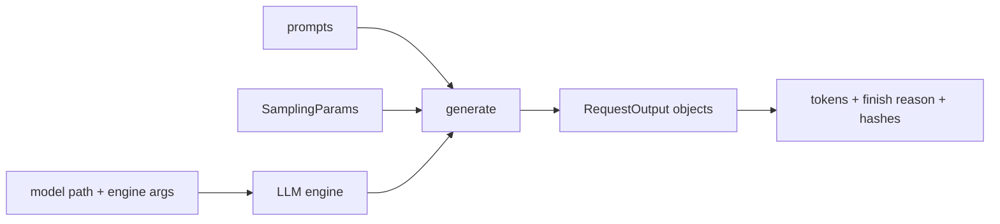

<!-- ai-infra-puzzles-header:start -->
<p align="center">
  
</p>

<h1 align="center">AI Infra Puzzles</h1>

<p align="center">
  <strong>Learn CUDA optimization and LLM inference through hands-on puzzles.</strong>
</p>
<!-- ai-infra-puzzles-header:end -->

# Lesson 07 — Offline Inference with LLM and SamplingParams

> **Puzzle:** What is the smallest reproducible vLLM generation program?

[← Chapter 03](../README.md) · [Project homepage](../../../README.md) · [Executed notebook](lab.ipynb) · [RTX 5090 result](artifacts/rtx5090-result.json)

## Why this puzzle matters

Offline inference removes HTTP and queueing from the first functional test. It is the
right place to pin model identity, tokenization, sampling, request ordering, and output
serialization before diagnosing a service layer.

## Predict before reading the result

1. Predict the finish reason under a small maximum-token limit.
2. Identify which request fields must be pinned.
3. Explain why a text hash does not establish semantic quality.

## 1. Start from concrete requests and state

The notebook initializes `LLM`, builds explicit `SamplingParams`, submits three prompts
in one call, and saves prompt/output token IDs, finish reasons, text hashes, and elapsed
time.

### Three reasoning anchors

| # | Lesson-specific claim to keep visible |
|---:|---|
| 1 | Model configuration and sampling configuration are separate inputs. |
| 2 | Token IDs are a more stable audit artifact than rendered whitespace alone. |
| 3 | Offline generation validates the model path without measuring HTTP behavior. |

## 2. Derive the mechanism

`LLM.generate` accepts a batch of prompts and schedules them through the engine.
`SamplingParams` is part of the output contract: temperature, top-p, stop rules, maximum
tokens, seed, and logprobs can all change observable results. Reproducibility therefore
requires both engine and request configuration.

### Mechanism at a glance



### Walk it step by step

1. **Freeze engine identity.** Pin model path, dtype, maximum length, and vLLM version.
2. **Make sampling explicit.** Avoid defaults that can change with a release.
3. **Read structured outputs.** Retain token IDs and finish reasons from the API object.
4. **Add quality separately.** Functional generation is only the first acceptance layer.

## 3. Translate the theory into an experiment

**Experiment:** Generate a three-prompt batch through the native offline API and retain a structured request/output record.

| Experimental role | Frozen definition |
|---|---|
| Baseline | implicit defaults and printed text |
| Candidate | explicit SamplingParams and token-level artifacts |
| Held constant | model, tokenizer, prompts, seed, maximum tokens, and GPU |
| Measurements | token counts, finish reasons, output hashes, elapsed time, and throughput |
| Evidence label | `native-backend` |

### Code walk-through

The code uses greedy decoding to make the first path easy to audit. It reads each output
object rather than parsing console logs and keeps only compact hashes plus short
previews in the artifact.

## 4. Read the checked-in RTX 5090 result

**Recorded environment:** NVIDIA GeForce RTX 5090; compute capability 12.0; PyTorch 2.13.0+cu130; CUDA runtime 13.0; vLLM 0.27.1.

| Measured field | Checked-in value |
|---|---:|
| Requests | 3 |
| Prompt tokens | 22 |
| Output tokens | 84 |
| Elapsed | 0.254779 |
| Throughput | 329.7/s |
| Unique output hashes | 3 |

### What the numbers mean

The explicit offline call completed 3 requests with 3 distinct hashes at 329.7 output
tokens/s. Functional generation is not task quality or HTTP evidence.

## 5. Solve the puzzle and make a decision

> An explicit offline program is the functional baseline for later service experiments; it proves native generation, not online performance.

### Acceptance and rollback gate

Treat the offline path as ready when all requests finish, identities match, and reruns
satisfy the declared token-level tolerance.

### How this conclusion can fail

GPU reductions and batching can introduce small numerical differences across versions.
Greedy output can diverge after a near-tie, and token equality does not prove task
correctness.

## Reproduce

The checked-in run pins vLLM 0.27.1 and a local Qwen2.5-1.5B-Instruct checkpoint. On a
Linux CUDA host, create a clean environment and point `CH3_MODEL` at your local
checkpoint:

```bash
uv venv .venv --python 3.12
source .venv/bin/activate
uv pip install vllm==0.27.1 nbclient nbformat ipykernel requests pyyaml --torch-backend=auto
export CH3_MODEL=/path/to/Qwen2.5-1.5B-Instruct
jupyter lab chapters/03-vllm-inference-serving/07-offline-llm-api/lab.ipynb
```

## Extend the experiment

Add task-specific evaluation, multiple prompt lengths, a streaming server comparison,
and model/tokenizer revision hashes.

## Evidence boundary

**Evidence label:** [`native-backend`](../README.md#evidence-labels). The named vLLM runtime executed on the recorded GPU/model/workload. The result does not transfer to another version, model, endpoint, or traffic distribution.

## References

- [vLLM quickstart](https://docs.vllm.ai/en/latest/getting_started/quickstart/)
- [vLLM SamplingParams API](https://docs.vllm.ai/en/latest/api/vllm/sampling_params/)
