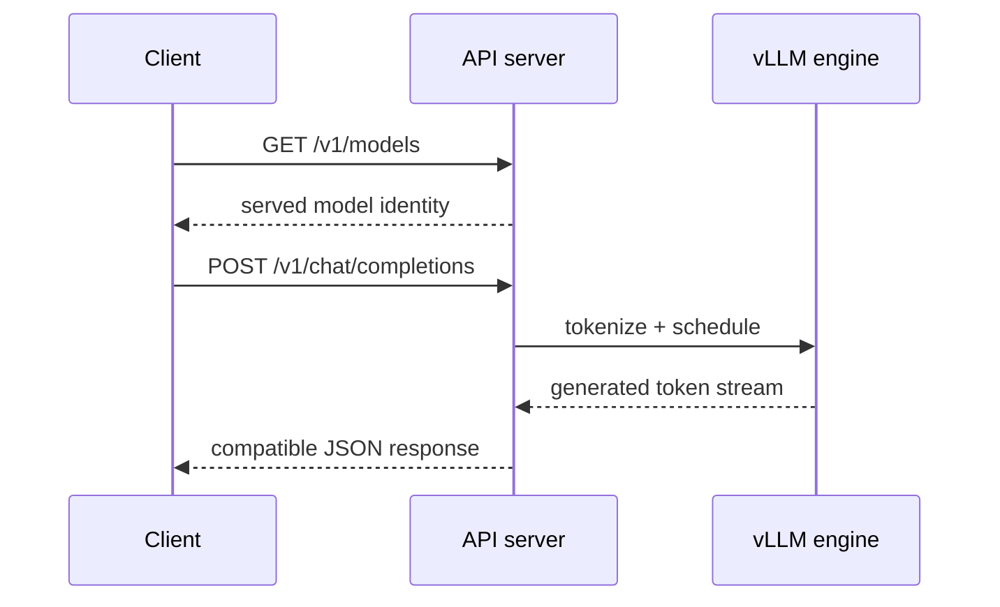

# Lesson 08 — The OpenAI-Compatible HTTP Service

> **Puzzle:** Does API compatibility mean every endpoint and field behaves identically?

[← Chapter 03](../README.md) · [Project homepage](../../../README.md) · [Executed notebook](lab.ipynb) · [RTX 5090 result](artifacts/rtx5090-result.json)

## Why this puzzle matters

A compatible endpoint lowers client migration cost, but it does not erase model
capabilities, server-specific fields, parser requirements, or release differences. The
contract must be tested against the exact server build and model.

## Predict before reading the result

1. Predict which endpoint will identify the served model.
2. List required Chat response fields.
3. Name one OpenAI feature that must be probed rather than assumed.

## 1. Start from concrete requests and state

The lab launches `vllm serve` as a child process, waits for readiness, calls
`/v1/models` and `/v1/chat/completions`, captures status and timing, then terminates the
server cleanly. Unsupported probes remain explicit.

### Three reasoning anchors

| # | Lesson-specific claim to keep visible |
|---:|---|
| 1 | HTTP 200 does not imply semantic correctness. |
| 2 | Endpoint availability depends on model task and server configuration. |
| 3 | Server startup, request latency, and engine execution need separate evidence. |

## 2. Derive the mechanism

The server translates an HTTP request into tokenizer, scheduler, sampling, and streaming
operations. Compatibility is endpoint- and field-level: a model may support Chat but not
embeddings, a tool parser may require flags, and extra vLLM parameters can extend the
schema. Readiness, request success, and response structure are separate checks.

### Mechanism at a glance



### Walk it step by step

1. **Wait for readiness.** Do not mix server startup time with request failure.
2. **Probe model identity.** Confirm which name clients must send.
3. **Validate required fields.** Check choices, message content, finish reason, and usage.
4. **Test the production path.** Repeat through authentication, TLS, gateway, and streaming layers.

## 3. Translate the theory into an experiment

**Experiment:** Start the real server on localhost, issue model and Chat requests, validate their JSON shape, and preserve a log tail.

| Experimental role | Frozen definition |
|---|---|
| Baseline | offline generation only |
| Candidate | localhost OpenAI-compatible HTTP serving |
| Held constant | model, port, sampling, prompt, timeout, and server arguments |
| Measurements | startup time, status codes, response schema, token usage, request latency, and shutdown |
| Evidence label | `native-backend` |

### Code walk-through

The subprocess receives an argument list rather than a shell command. The code polls
readiness with a deadline, records a bounded log tail, and always terminates the process
in a `finally` block.

## 4. Read the checked-in RTX 5090 result

**Recorded environment:** NVIDIA GeForce RTX 5090; compute capability 12.0; PyTorch 2.13.0+cu130; CUDA runtime 13.0; vLLM 0.27.1.

| Measured field | Checked-in value |
|---|---:|
| Server ready | yes |
| Startup | 20.045628 |
| Models status | 200 |
| Chat status | 200 |
| Chat latency | 0.100528 |
| Completion tokens | 7 |
| Schema valid | yes |

### What the numbers mean

The server became ready in 20.05 s; models/chat returned HTTP 200/200 and schema
valid=True. This covers one non-streaming localhost route.

## 5. Solve the puzzle and make a decision

> The localhost test proves the selected Chat route and response schema for this model/server pair; compatibility beyond that matrix remains unmeasured.

### Acceptance and rollback gate

Enable a client route only when required endpoints, fields, streaming behavior, errors,
and authentication controls pass contract tests.

### How this conclusion can fail

Loopback tests exclude proxies, TLS, network jitter, load balancing, and multi-tenant
controls. A single response cannot validate all compatibility or parser combinations.

## Reproduce

The checked-in run pins vLLM 0.27.1 and a local Qwen2.5-1.5B-Instruct checkpoint. On a
Linux CUDA host, create a clean environment and point `CH3_MODEL` at your local
checkpoint:

```bash
uv venv .venv --python 3.12
source .venv/bin/activate
uv pip install vllm==0.27.1 nbclient nbformat ipykernel requests pyyaml --torch-backend=auto
export CH3_MODEL=/path/to/Qwen2.5-1.5B-Instruct
jupyter lab chapters/03-vllm-inference-serving/08-openai-compatible-service/lab.ipynb
```

## Extend the experiment

Run a versioned contract suite for Chat, Responses, embeddings, streaming, errors,
cancellation, tools, and usage accounting through the production gateway.

## Evidence boundary

**Evidence label:** [`native-backend`](../README.md#evidence-labels). The named vLLM runtime executed on the recorded GPU/model/workload. The result does not transfer to another version, model, endpoint, or traffic distribution.

## References

- [OpenAI-compatible server](https://docs.vllm.ai/en/latest/serving/openai_compatible_server/)
- [vLLM quickstart](https://docs.vllm.ai/en/latest/getting_started/quickstart/)
