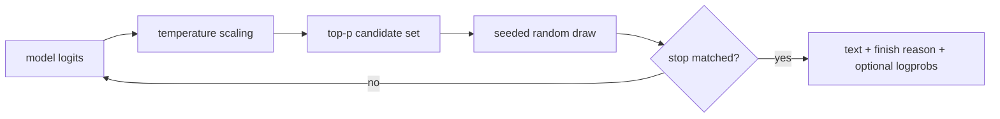

# Lesson 09 — Sampling and Output Control

> **Puzzle:** Which parameter changed the answer when two requests used the same model?

[← Chapter 03](../README.md) · [Project homepage](../../../README.md) · [Executed notebook](lab.ipynb) · [RTX 5090 result](artifacts/rtx5090-result.json)

## Why this puzzle matters

Sampling parameters are part of the public API, not harmless presentation options.
Temperature changes the logit scale; top-p truncates the candidate mass; stop rules can
remove suffixes; logprobs change response volume and observability.

## Predict before reading the result

1. Predict which cases are deterministic within one run.
2. Identify whether stop text appears in output.
3. State the extra payload cost of logprobs.

## 1. Start from concrete requests and state

One native engine executes greedy, seeded stochastic, top-p, stop-string, and logprob
cases. The result records token hashes and selected logprob metadata without treating
variation as model quality.

### Three reasoning anchors

| # | Lesson-specific claim to keep visible |
|---:|---|
| 1 | Temperature and top-p act at different stages of sampling. |
| 2 | A fixed seed is necessary but not a cross-version guarantee. |
| 3 | Stop rules affect both visible text and finish metadata. |

## 2. Derive the mechanism

Greedy decoding selects the maximum logit. Temperature divides logits before
normalization, while nucleus sampling keeps the smallest set whose cumulative
probability reaches `top_p`. A seed scopes pseudo-random choices, but numerical and
scheduling changes can still affect close probabilities. Stop conditions terminate
generation after a matched token or string according to API semantics.

### Mechanism at a glance



### Walk it step by step

1. **Freeze raw request settings.** Keep every sampling field beside the output.
2. **Separate selection stages.** Temperature rescales; top-p filters; the RNG draws.
3. **Inspect termination.** Read stop behavior and finish reason together.
4. **Evaluate quality elsewhere.** Variation is not evidence of improvement.

## 3. Translate the theory into an experiment

**Experiment:** Run five explicit SamplingParams cases and compare token sequences, finish reasons, and logprob availability.

| Experimental role | Frozen definition |
|---|---|
| Baseline | greedy decoding with no stop rule |
| Candidate | seeded sampling, top-p, stop, and logprob variants |
| Held constant | model, prompt, maximum tokens, engine, and GPU |
| Measurements | token hashes, token counts, finish reasons, stop inclusion, and logprob presence |
| Evidence label | `native-backend` |

### Code walk-through

The code constructs a fresh SamplingParams object for every case and stores the
effective settings next to its output. It never labels a different sample as better
without an evaluator.

## 4. Read the checked-in RTX 5090 result

**Recorded environment:** NVIDIA GeForce RTX 5090; compute capability 12.0; PyTorch 2.13.0+cu130; CUDA runtime 13.0; vLLM 0.27.1.

| Measured field | Checked-in value |
|---|---:|
| Cases | 5 |
| Unique token hashes | 5 |
| Greedy tokens | 24 |
| Sampled tokens | 24 |
| Stop finish reason | stop |
| Logprobs returned | yes |

### What the numbers mean

Five explicit configurations produced 5 hashes. Stop finished as stop and logprobs
returned=True. Variation is localized to request parameters, not ranked as quality.

## 5. Solve the puzzle and make a decision

> Sampling parameters define observable behavior; the experiment localizes output changes to explicit request configurations.

### Acceptance and rollback gate

Promote an API configuration only after deterministic, stochastic, stop, and
observability cases match the product contract.

### How this conclusion can fail

Tokenizer boundaries can make a string stop behave differently from a token stop.
Logprob structures and reproducibility guarantees can change across versions.

## Reproduce

The checked-in run pins vLLM 0.27.1 and a local Qwen2.5-1.5B-Instruct checkpoint. On a
Linux CUDA host, create a clean environment and point `CH3_MODEL` at your local
checkpoint:

```bash
uv venv .venv --python 3.12
source .venv/bin/activate
uv pip install vllm==0.27.1 nbclient nbformat ipykernel requests pyyaml --torch-backend=auto
export CH3_MODEL=/path/to/Qwen2.5-1.5B-Instruct
jupyter lab chapters/03-vllm-inference-serving/09-sampling-output-control/lab.ipynb
```

## Extend the experiment

Add streaming stops, bad-word filters, min-p, repetition controls, and statistical
distribution checks over many seeds.

## Evidence boundary

**Evidence label:** [`native-backend`](../README.md#evidence-labels). The named vLLM runtime executed on the recorded GPU/model/workload. The result does not transfer to another version, model, endpoint, or traffic distribution.

## References

- [vLLM SamplingParams API](https://docs.vllm.ai/en/latest/api/vllm/sampling_params/)
- [OpenAI-compatible server](https://docs.vllm.ai/en/latest/serving/openai_compatible_server/)
