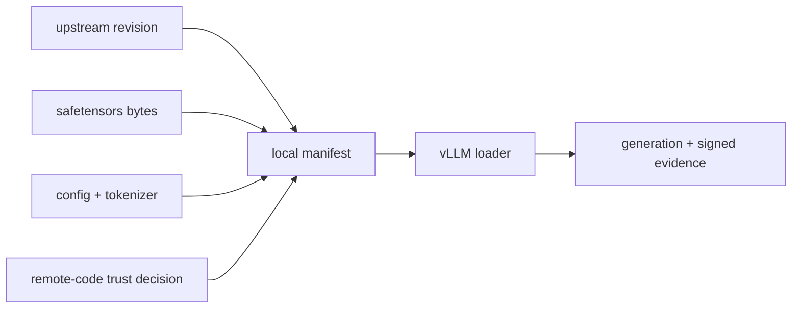

<!-- ai-infra-puzzles-header:start -->
<p align="center">
  
</p>

<h1 align="center">AI Infra Puzzles</h1>

<p align="center">
  <strong>Learn CUDA optimization and LLM inference through hands-on puzzles.</strong>
</p>
<!-- ai-infra-puzzles-header:end -->

# Lesson 10 — Model Loading, Formats, and Provenance

> **Puzzle:** Can a model name reproduce a deployment after its remote repository changes?

[← Chapter 03](../README.md) · [Project homepage](../../../README.md) · [Executed notebook](lab.ipynb) · [RTX 5090 result](artifacts/rtx5090-result.json)

## Why this puzzle matters

A serving manifest must identify weight files, configuration, tokenizer, code trust, and
revisions. A convenient repository name is mutable unless resolved to immutable content.

## Predict before reading the result

1. List the files required by this local checkpoint.
2. Predict whether one or multiple safetensors shards exist.
3. Choose the immutable identifiers for a release manifest.

## 1. Start from concrete requests and state

The lab audits the local checkpoint without network access: required files, safetensors
header, configuration fields, tokenizer metadata, file sizes, and SHA-256 digests. It
then confirms native loading in the pinned engine.

### Three reasoning anchors

| # | Lesson-specific claim to keep visible |
|---:|---|
| 1 | Model weights and tokenizer are separate versioned artifacts. |
| 2 | A format safety property is not a provenance record. |
| 3 | Remote code changes the supply-chain boundary. |

## 2. Derive the mechanism

vLLM combines a model configuration, tokenizer, weight loader, architecture
implementation, and optional remote code. Safetensors avoids pickle execution but does
not establish model license or semantic identity. Content hashes make local bytes
immutable; upstream commit revisions make remote retrieval repeatable.
`trust_remote_code` expands the executable trust boundary and must be an explicit
decision.

### Mechanism at a glance



### Walk it step by step

1. **Inventory artifacts.** Separate weights, config, tokenizer, and optional code.
2. **Resolve immutable identities.** Use commit revisions and content hashes.
3. **Declare trust.** Make remote-code and license decisions visible.
4. **Execute the manifest.** Prove the exact bytes load in the target engine.

## 3. Translate the theory into an experiment

**Experiment:** Hash the local model/config/tokenizer artifacts, inspect format metadata, and perform a native load/generation check.

| Experimental role | Frozen definition |
|---|---|
| Baseline | a mutable model name with implicit defaults |
| Candidate | a content-addressed local manifest plus native load |
| Held constant | checkpoint path, file bytes, offline mode, engine arguments, and prompt |
| Measurements | hashes, sizes, architecture, dtype, tokenizer class, trust setting, and load success |
| Evidence label | `native-backend` |

### Code walk-through

The code reads JSON and safetensors metadata without deserializing arbitrary Python
objects. Hashes are streamed so the 3 GB weight file does not enter host memory at once.

## 4. Read the checked-in RTX 5090 result

**Recorded environment:** NVIDIA GeForce RTX 5090; compute capability 12.0; PyTorch 2.13.0+cu130; CUDA runtime 13.0; vLLM 0.27.1.

| Measured field | Checked-in value |
|---|---:|
| Weight files | 1 |
| Weight bytes | 3,087,467,144 bytes |
| Config hash | `98d2ff8cc474` |
| Tokenizer hash | `c0382117ea32` |
| Weight hash | `dd924a11b4c2` |
| Architecture | Qwen2ForCausalLM |
| Native load | yes |

### What the numbers mean

The manifest covers 1 safetensors file(s), 3,087,467,144 bytes, three hashes, and
architecture Qwen2ForCausalLM. The exact bytes completed native generation.

## 5. Solve the puzzle and make a decision

> Reproducible loading requires immutable bytes and explicit trust decisions; a model alias alone is insufficient.

### Acceptance and rollback gate

Release only when model, tokenizer, config, code trust, license review, and native load
are bound to immutable identifiers.

### How this conclusion can fail

Local hashes cannot reveal the upstream commit if the directory lost repository
metadata. A successful generation does not validate the license, training provenance, or
every architecture feature.

## Reproduce

The checked-in run pins vLLM 0.27.1 and a local Qwen2.5-1.5B-Instruct checkpoint. On a
Linux CUDA host, create a clean environment and point `CH3_MODEL` at your local
checkpoint:

```bash
uv venv .venv --python 3.12
source .venv/bin/activate
uv pip install vllm==0.27.1 nbclient nbformat ipykernel requests pyyaml --torch-backend=auto
export CH3_MODEL=/path/to/Qwen2.5-1.5B-Instruct
jupyter lab chapters/03-vllm-inference-serving/10-model-loading-provenance/lab.ipynb
```

## Extend the experiment

Resolve the upstream commit, sign the manifest, verify it in image build and startup,
and test a representative prompt suite after every loader change.

## Evidence boundary

**Evidence label:** [`native-backend`](../README.md#evidence-labels). The named vLLM runtime executed on the recorded GPU/model/workload. The result does not transfer to another version, model, endpoint, or traffic distribution.

## References

- [Transformers model configuration](https://huggingface.co/docs/transformers/main_classes/configuration)
- [Supported models](https://docs.vllm.ai/en/latest/models/supported_models/)
