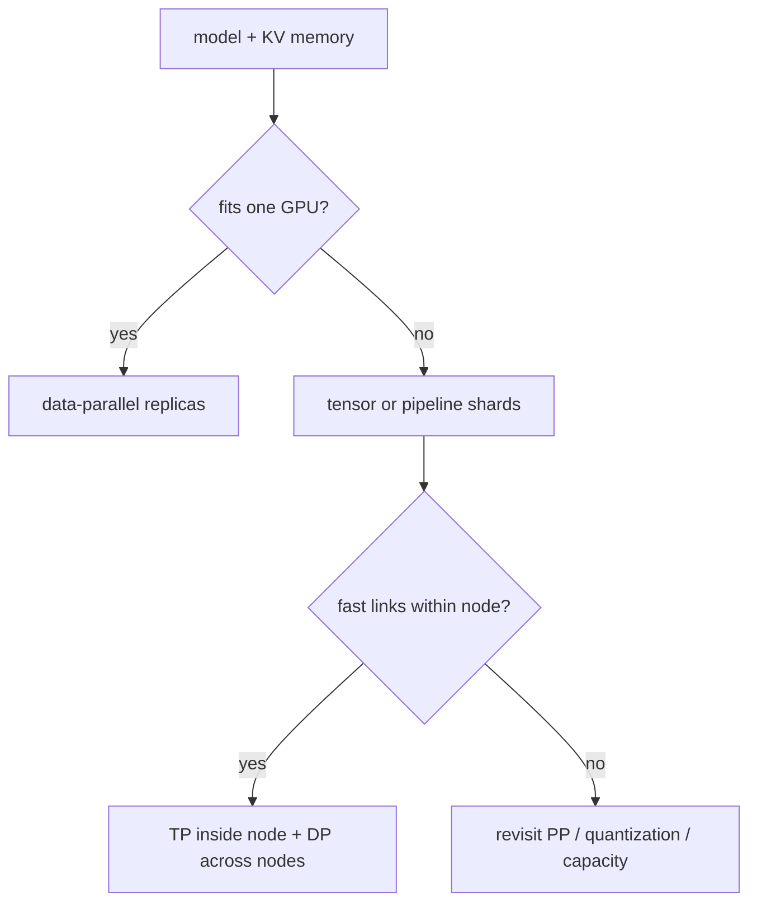

<!-- ai-infra-puzzles-header:start -->
<p align="center">
  
</p>

<h1 align="center">AI Infra Puzzles</h1>

<p align="center">
  <strong>Learn CUDA optimization and LLM inference through hands-on puzzles.</strong>
</p>
<!-- ai-infra-puzzles-header:end -->

# Lesson 11 — Tensor, Pipeline, Data, and Expert Parallelism

> **Puzzle:** How should a 70B service map onto eight GPUs when one RTX 5090 cannot reproduce that topology?

[← Chapter 03](../README.md) · [Project homepage](../../../README.md) · [Executed notebook](lab.ipynb) · [RTX 5090 result](artifacts/rtx5090-result.json)

## Why this puzzle matters

Parallelism is a placement decision constrained by model size, communication, request
isolation, and cluster topology. Choosing `tensor_parallel_size=8` because eight devices
exist can place collective traffic across a slow boundary and reduce useful throughput.

## Predict before reading the result

1. Eliminate layouts that cannot fit 70B BF16 weights.
2. Compare estimated cross-node bytes for TP8 and TP4×DP2.
3. Name the NCCL trace required before a native claim.

## 1. Start from concrete requests and state

The lab records the real single-GPU environment, reads the installed vLLM parallel CLI
surface, and evaluates a transparent eight-GPU placement model for TP, PP, DP, and
hybrid layouts across two four-GPU nodes.

### Three reasoning anchors

| # | Lesson-specific claim to keep visible |
|---:|---|
| 1 | Model fit is a hard constraint before throughput optimization. |
| 2 | TP communication happens inside the model step and is topology-sensitive. |
| 3 | DP increases replica concurrency only when each replica can fit the model. |

## 2. Derive the mechanism

Tensor parallelism shards layer operations and communicates on many layers. Pipeline
parallelism assigns layer stages and introduces bubbles or microbatch scheduling. Data
parallel replicas own separate request batches and normally duplicate weights. Expert
parallelism shards routed experts while preserving dense/shared components.
Communication frequency and link bandwidth must be matched to the topology.

### Mechanism at a glance



### Walk it step by step

1. **Solve memory fit.** Remove layouts that cannot hold weights, KV, and headroom.
2. **Map communication.** Mark which collectives cross NVLink, PCIe, or the network.
3. **Choose replication.** Use DP only after a complete replica fits.
4. **Prove natively.** Collect per-rank traces and throughput on the actual topology.

## 3. Translate the theory into an experiment

**Experiment:** Evaluate candidate placements with explicit weight, KV, link, and collective assumptions; probe available engine arguments.

| Experimental role | Frozen definition |
|---|---|
| Baseline | TP8 spanning two nodes |
| Candidate | TP4 within each node plus DP2, and PP alternatives |
| Held constant | eight-GPU topology, model bytes, per-GPU memory, link assumptions, and batch |
| Measurements | fit, replica count, cross-node communication estimate, and exposed CLI flags |
| Evidence label | `capacity-model` |

### Code walk-through

Every formula and assumed bandwidth is emitted in the artifact. The experiment does not
initialize distributed processes, so all multi-GPU performance rows remain planning
estimates.

## 4. Read the checked-in RTX 5090 result

**Recorded environment:** NVIDIA GeForce RTX 5090; compute capability 12.0; PyTorch 2.13.0+cu130; CUDA runtime 13.0; vLLM 0.27.1.

| Measured field | Checked-in value |
|---|---:|
| GPU count | 8 |
| GPUs per node | 4 |
| TP8 fits | yes |
| TP4-DP2 fits | no |
| TP8 cross-node bytes | 1.500000 |
| TP4-DP2 replicas | 2 |
| TP flag available | no |

### What the numbers mean

The ledger estimates 130.4 GiB BF16 weights. TP8/TP4×DP2 fit=True/False; only the
modeled TP8 collective crosses nodes. No distributed run occurred.

## 5. Solve the puzzle and make a decision

> The capacity model rejects impossible or topology-hostile layouts; it does not measure multi-GPU vLLM performance.

### Acceptance and rollback gate

Select only layouts that fit with headroom, keep frequent collectives on fast links, and
then pass a native multi-node benchmark.

### How this conclusion can fail

Collective algorithms, overlap, quantized weights, expert routing, uneven layers, and
scheduler behavior can dominate the simplified estimate. One RTX 5090 cannot validate
NCCL topology.

## Reproduce

The checked-in run pins vLLM 0.27.1 and a local Qwen2.5-1.5B-Instruct checkpoint. On a
Linux CUDA host, create a clean environment and point `CH3_MODEL` at your local
checkpoint:

```bash
uv venv .venv --python 3.12
source .venv/bin/activate
uv pip install vllm==0.27.1 nbclient nbformat ipykernel requests pyyaml --torch-backend=auto
export CH3_MODEL=/path/to/Qwen2.5-1.5B-Instruct
jupyter lab chapters/03-vllm-inference-serving/11-multi-gpu-parallelism/lab.ipynb
```

## Extend the experiment

Run the selected two-node layout with NCCL traces, per-rank memory, failure injection,
and identical request replay; compare against the best single-node baseline.

## Evidence boundary

**Evidence label:** [`capacity-model`](../README.md#evidence-labels). Measured environment facts feed explicit planning arithmetic. Assumed topology, demand, bandwidth, and reserve fields remain assumptions until a native deployment test.

## References

- [vLLM parallelism and scaling](https://docs.vllm.ai/en/latest/serving/parallelism_scaling/)
- [vLLM engine arguments](https://docs.vllm.ai/en/latest/configuration/engine_args/)
