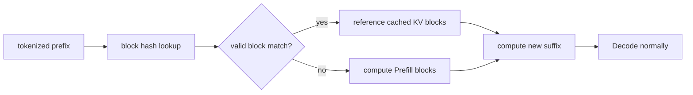

<!-- ai-infra-puzzles-header:start -->
<p align="center">
  
</p>

<h1 align="center">AI Infra Puzzles</h1>

<p align="center">
  <strong>Learn CUDA optimization and LLM inference through hands-on puzzles.</strong>
</p>
<!-- ai-infra-puzzles-header:end -->

# Lesson 12 — Automatic Prefix Caching

> **Puzzle:** When can a shared system prompt skip Prefill work, and when is the cache key different?

[← Chapter 03](../README.md) · [Project homepage](../../../README.md) · [Executed notebook](lab.ipynb) · [RTX 5090 result](artifacts/rtx5090-result.json)

## Why this puzzle matters

Chat, document analysis, and few-shot workloads often repeat a long prefix. Automatic
prefix caching can reuse KV blocks for exactly matching token prefixes, but it cannot
reuse new suffix computation and it is not a semantic similarity cache.

## Predict before reading the result

1. Predict which request reports cached tokens.
2. Explain why changing one early token destroys downstream prefix matches.
3. Choose a workload where APC should not be enabled solely for speed.

## 1. Start from concrete requests and state

A native engine with prefix caching enabled serves a cold shared prefix, a warm exact
prefix, and a one-token-mutated prefix. The lab retains cached-token fields exposed by
RequestOutput and elapsed time for each case.

### Three reasoning anchors

| # | Lesson-specific claim to keep visible |
|---:|---|
| 1 | Reuse requires token-exact prefix identity. |
| 2 | Only cached Prefill blocks are skipped; Decode is unchanged. |
| 3 | A hit-rate metric needs a request distribution and eviction window. |

## 2. Derive the mechanism

A cache key covers token content and additional factors that affect KV validity.
Matching full blocks can be referenced by another request; the final partial block and
new suffix still require work. Hash lookup changes scheduling cost but not output
semantics. Eviction and cache capacity determine whether a theoretical hit remains
resident.

### Mechanism at a glance



### Walk it step by step

1. **Tokenize deterministically.** Cache identity starts from exact token blocks.
2. **Look up full blocks.** Only valid resident matches can be referenced.
3. **Compute the remainder.** Unmatched suffix and partial blocks still run Prefill.
4. **Measure hit value.** Pair cached-token counters with latency and eviction behavior.

## 3. Translate the theory into an experiment

**Experiment:** Run cold, warm-exact, and mutated-prefix requests through one APC-enabled native engine.

| Experimental role | Frozen definition |
|---|---|
| Baseline | cold shared prefix |
| Candidate | warm exact reuse and a near-match control |
| Held constant | engine instance, prefix length, suffix, sampling, maximum output, and GPU |
| Measurements | cached tokens, prompt tokens, elapsed time, output identity, and cache configuration |
| Evidence label | `native-backend` |

### Code walk-through

The code keeps one engine alive so the second request can reuse resident blocks. It
introspects cache-related metrics and records `None` when the installed API does not
expose a field.

## 4. Read the checked-in RTX 5090 result

**Recorded environment:** NVIDIA GeForce RTX 5090; compute capability 12.0; PyTorch 2.13.0+cu130; CUDA runtime 13.0; vLLM 0.27.1.

| Measured field | Checked-in value |
|---|---:|
| Cold cached tokens | 0 |
| Warm cached tokens | 1,520 |
| Mutated cached tokens | 0 |
| Cold elapsed | 0.161883 |
| Warm elapsed | 0.079997 |
| Warm output tokens | 8 |

### What the numbers mean

Cold/warm/mutated requests reported 0/1520/0 cached tokens; warm/cold elapsed was
0.0800/0.1619 s. The cached-token field is the hit evidence.

## 5. Solve the puzzle and make a decision

> APC reuses exact, valid KV blocks; the retained native metadata distinguishes an observed hit from a timing guess.

### Acceptance and rollback gate

Enable APC for a route only when production prefixes repeat, correctness is unchanged,
and hit-rate/latency improve without harmful cache pressure.

### How this conclusion can fail

Very short prefixes, low repetition, eviction, multimodal hashes, LoRA identity, or
non-deterministic prompt construction can eliminate reuse. Elapsed time alone does not
prove a cache hit.

## Reproduce

The checked-in run pins vLLM 0.27.1 and a local Qwen2.5-1.5B-Instruct checkpoint. On a
Linux CUDA host, create a clean environment and point `CH3_MODEL` at your local
checkpoint:

```bash
uv venv .venv --python 3.12
source .venv/bin/activate
uv pip install vllm==0.27.1 nbclient nbformat ipykernel requests pyyaml --torch-backend=auto
export CH3_MODEL=/path/to/Qwen2.5-1.5B-Instruct
jupyter lab chapters/03-vllm-inference-serving/12-automatic-prefix-caching/lab.ipynb
```

## Extend the experiment

Instrument prefix-cache query/hit metrics under a real trace, then segment results by
prefix family, block alignment, eviction age, and tenant boundary.

## Evidence boundary

**Evidence label:** [`native-backend`](../README.md#evidence-labels). The named vLLM runtime executed on the recorded GPU/model/workload. The result does not transfer to another version, model, endpoint, or traffic distribution.

## References

- [Automatic prefix caching](https://docs.vllm.ai/en/latest/features/automatic_prefix_caching/)
- [PagedAttention paper](https://arxiv.org/abs/2309.06180)
