# Lesson 13 — Chunked Prefill and Decode Interference

> **Puzzle:** Should a long prompt monopolize one scheduling iteration while short requests wait?

[← Chapter 03](../README.md) · [Project homepage](../../../README.md) · [Executed notebook](lab.ipynb) · [RTX 5090 result](artifacts/rtx5090-result.json)

## Why this puzzle matters

Large Prefill batches improve compute utilization but can delay active Decode sequences.
Chunking divides prompt work into token budgets so the scheduler can interleave it with
latency-sensitive generation.

## Predict before reading the result

1. Predict short-request maximum delay without chunking.
2. Calculate the number of 512-token chunks.
3. Name the native trace needed to choose the budget.

## 1. Start from concrete requests and state

The lab replays a measured-cost scheduling model and probes installed chunked-prefill
arguments. It compares an unchunked 4096-token prompt with 512-token chunks while short
Decode jobs arrive.

### Three reasoning anchors

| # | Lesson-specific claim to keep visible |
|---:|---|
| 1 | Chunking changes when work is scheduled, not total prompt tokens. |
| 2 | Smaller chunks can lower blocking time while adding launch/scheduling overhead. |
| 3 | TTFT and ITL may move in opposite directions. |

## 2. Derive the mechanism

A scheduler with maximum batched-token budget `B` can consume a prompt in `ceil(L/B)`
chunks. Smaller chunks create more scheduling opportunities for Decode but may add
overhead and reduce Prefill efficiency. The correct chunk size is therefore an SLO
trade-off, not a universal minimum.

### Mechanism at a glance

```mermaid
gantt
  title Mixed prompt and Decode work
  dateFormat X
  axisFormat %L
  section Unchunked
  Long Prefill :0, 8
  Short Decode :8, 11
  section Chunked
  Prefill chunk 1 :0, 2
  Short Decode :2, 3
  Prefill chunk 2 :3, 5
```



### Walk it step by step

1. **Set a token budget.** Bound how much prompt work enters one scheduler iteration.
2. **Split the long prompt.** Create multiple resumable Prefill chunks.
3. **Admit Decode between chunks.** Give active requests opportunities to advance.
4. **Sweep the trade-off.** Measure TTFT, ITL, and throughput together on the native engine.

## 3. Translate the theory into an experiment

**Experiment:** Interleave one long Prefill with short Decode jobs in a cost-calibrated scheduler model and inspect CLI support.

| Experimental role | Frozen definition |
|---|---|
| Baseline | one monolithic long Prefill |
| Candidate | fixed-size chunked Prefill interleaved with Decode |
| Held constant | token demands, per-token cost assumptions, arrival times, priority, and GPU identity |
| Measurements | long TTFT proxy, short p95 delay, scheduling rounds, and CLI feature presence |
| Evidence label | `numerical-model` |

### Code walk-through

The simulation exposes its cost coefficients and full event timeline. It remains
separate from native vLLM timing because one GPU kernel does not have constant per-token
cost.

## 4. Read the checked-in RTX 5090 result

**Recorded environment:** NVIDIA GeForce RTX 5090; compute capability 12.0; PyTorch 2.13.0+cu130; CUDA runtime 13.0; vLLM 0.27.1.

| Measured field | Checked-in value |
|---|---:|
| Unchunked short p95 | 8.224000 |
| Chunked short p95 | 1.136000 |
| Unchunked long finish | 12.812000 |
| Chunked long finish | 13.452000 |
| Chunks | 8 |
| CLI support | no |

### What the numbers mean

512-token chunking created 8 chunks and changed short-job p95 delay from 8.224 to 1.136
modeled units. Native traffic is still required.

## 5. Solve the puzzle and make a decision

> Chunked Prefill creates scheduling opportunities; its production value must be selected from native mixed-traffic trade-offs.

### Acceptance and rollback gate

Choose a chunk budget only when native mixed-traffic replay meets both long-prompt TTFT
and active-request ITL gates.

### How this conclusion can fail

Attention kernels scale nonlinearly with sequence length; CUDA graphs, batching, prefix
hits, and compilation change step duration. Model results are directional only.

## Reproduce

The checked-in run pins vLLM 0.27.1 and a local Qwen2.5-1.5B-Instruct checkpoint. On a
Linux CUDA host, create a clean environment and point `CH3_MODEL` at your local
checkpoint:

```bash
uv venv .venv --python 3.12
source .venv/bin/activate
uv pip install vllm==0.27.1 nbclient nbformat ipykernel requests pyyaml --torch-backend=auto
export CH3_MODEL=/path/to/Qwen2.5-1.5B-Instruct
jupyter lab chapters/03-vllm-inference-serving/13-chunked-prefill/lab.ipynb
```

## Extend the experiment

Sweep `max_num_batched_tokens` on the real engine with concurrent streaming clients and
retain scheduler metrics, TTFT, ITL, throughput, and GPU utilization.

## Evidence boundary

**Evidence label:** [`numerical-model`](../README.md#evidence-labels). A transparent allocator, scheduler, gateway, or policy model executed. It establishes the stated invariant, not native vLLM performance.

## References

- [vLLM engine arguments](https://docs.vllm.ai/en/latest/configuration/engine_args/)
- [vLLM documentation](https://docs.vllm.ai/en/latest/)
