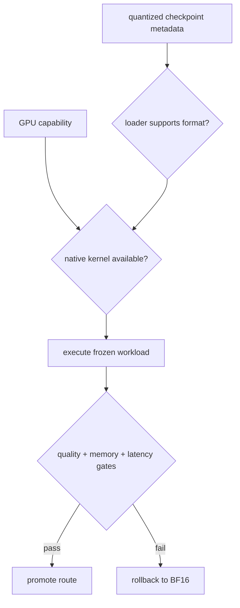

# Lesson 14 — Weight Quantization Deployment Contracts

> **Puzzle:** Why can an AWQ, GPTQ, or FP8 checkpoint fail even when vLLM supports that method?

[← Chapter 03](../README.md) · [Project homepage](../../../README.md) · [Executed notebook](lab.ipynb) · [RTX 5090 result](artifacts/rtx5090-result.json)

## Why this puzzle matters

A quantization label is only one field of a deployment contract. GPU capability, weight
layout, group size, activation dtype, model architecture, loader metadata, and kernel
availability must agree.

## Predict before reading the result

1. Identify the local checkpoint's declared quantization config.
2. Probe whether AWQ, GPTQ, and FP8 names are registered.
3. State why no latency comparison is made in this lesson.

## 1. Start from concrete requests and state

The compatibility lab inspects vLLM's registered quantization methods and engine CLI,
reads the unquantized local checkpoint metadata, and evaluates a declared RTX 5090
compatibility matrix without downloading substitute models.

### Three reasoning anchors

| # | Lesson-specific claim to keep visible |
|---:|---|
| 1 | Loader recognition is weaker than kernel dispatch. |
| 2 | Hardware support does not validate checkpoint metadata. |
| 3 | Memory, quality, and latency require separate gates. |

## 2. Derive the mechanism

Weight-only AWQ and GPTQ store codes plus scale metadata and depend on kernels that
understand their packing. FP8 may target weights and/or activations with
hardware-specific execution. A loader can recognize a format yet fall back, reject an
architecture, or execute with no speedup at the tested shape. Native model artifacts are
required for performance evidence.

### Mechanism at a glance



### Walk it step by step

1. **Inspect the checkpoint.** Read format, group, scale, and architecture metadata.
2. **Match the platform.** Verify the GPU and compiled kernel prerequisites.
3. **Prove dispatch.** Use native logs or traces, not a config label.
4. **Gate the product result.** Evaluate quality, memory, and service latency separately.

## 3. Translate the theory into an experiment

**Experiment:** Probe installed quantization registrations and evaluate checkpoint/hardware prerequisites for three deployment routes.

| Experimental role | Frozen definition |
|---|---|
| Baseline | local BF16 checkpoint |
| Candidate | AWQ, GPTQ, and FP8 candidate contracts |
| Held constant | vLLM build, GPU, local config, and no network download |
| Measurements | registered methods, checkpoint declaration, hardware capability, readiness fields, and missing evidence |
| Evidence label | `compatibility-probe` |

### Code walk-through

The notebook imports registries defensively because internal module paths can change. A
failed probe is retained as compatibility evidence rather than converted into a success
claim.

## 4. Read the checked-in RTX 5090 result

**Recorded environment:** NVIDIA GeForce RTX 5090; compute capability 12.0; PyTorch 2.13.0+cu130; CUDA runtime 13.0; vLLM 0.27.1.

| Measured field | Checked-in value |
|---|---:|
| Declared local quantization | none |
| AWQ registered | yes |
| GPTQ registered | yes |
| FP8 registered | yes |
| Compute capability | 12.0 |
| Native quantized benchmark | not measured |

### What the numbers mean

Local quantization=none; installed AWQ/GPTQ/FP8 vocabulary=True/True/True. Without
matching quantized bytes, memory, quality, and latency remain unmeasured.

## 5. Solve the puzzle and make a decision

> This probe maps available software vocabulary and missing prerequisites; it deliberately makes no quantized-performance claim.

### Acceptance and rollback gate

Benchmark a quantized route only after its exact checkpoint loads, a native trace
identifies the intended path, and output quality passes.

### How this conclusion can fail

Registry presence can outlive a deprecated path or omit platform-specific constraints.
This lab has no AWQ/GPTQ/FP8 weight artifact and therefore cannot measure their memory
or speed.

## Reproduce

The checked-in run pins vLLM 0.27.1 and a local Qwen2.5-1.5B-Instruct checkpoint. On a
Linux CUDA host, create a clean environment and point `CH3_MODEL` at your local
checkpoint:

```bash
uv venv .venv --python 3.12
source .venv/bin/activate
uv pip install vllm==0.27.1 nbclient nbformat ipykernel requests pyyaml --torch-backend=auto
export CH3_MODEL=/path/to/Qwen2.5-1.5B-Instruct
jupyter lab chapters/03-vllm-inference-serving/14-weight-quantization-deployment/lab.ipynb
```

## Extend the experiment

Pin one quantized checkpoint per route, hash it, run the same prompt grid, capture
kernel traces, and compare quality plus memory against BF16.

## Evidence boundary

**Evidence label:** [`compatibility-probe`](../README.md#evidence-labels). The installed package/API/configuration surface was inspected. Availability or lint success is not equivalent to native feature execution.

## References

- [vLLM quantization](https://docs.vllm.ai/en/latest/features/quantization/)
- [vLLM engine arguments](https://docs.vllm.ai/en/latest/configuration/engine_args/)
